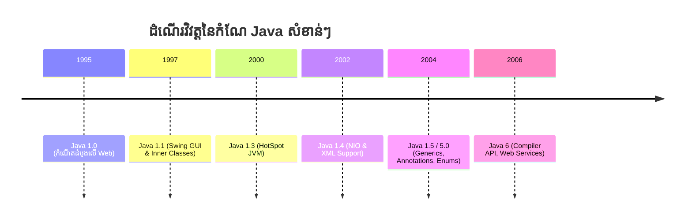

# មេរៀនទី ២៖ Version របស់ Java (Java Versions)

> **ដំណើរវិវត្តនៃកំណែ Java សំខាន់ៗ៖ ចាប់ពីការចាប់ផ្តើមដំបូងលើ Web រហូតដល់សម័យកាល Enterprise**

---

## 🗺️ ខ្សែបន្ទាត់ពេលវេលានៃការវិវត្ត Java (Java Evolution Timeline)

---

## 🚀 ១. ដំណាក់កាលដំបូងនៃ Java (Java 1.0 និង 1.1)

### 📅 ឆ្នាំ ១៩៩៥ — Java 1.0 (កំណើតដំបូងលើ World Wide Web)
* 🌐 ជា Version ដំបូងបង្អស់ដែលមានលក្ខណៈប្រសើរសម្រាប់ប្រើប្រាស់លើ **World Wide Web**។
* 📦 **ទំហំប្រព័ន្ធ:** មាន **៨ Packages** និង **២១២ Classes**។

### 📅 ឆ្នាំ ១៩៩៧ — Java 1.1 (ការវិវត្តនៃ User Interface)
* 🖥️ បង្កើនមធ្យោបាយបង្កើត **User Interface (UI)** ទំនើប ជាពិសេស **Events** និង **Inner Classes**។
* 🎨 **Swing Package:** ត្រូវបានបង្កើតឡើង ដែលបានកែលម្អលើផ្នែកក្រាហ្វិកយ៉ាងលើសលប់។
* 📦 **ទំហំប្រព័ន្ធ:** កើនឡើងដល់ **២៣ Packages** និង **៥០៤ Classes**។

---

## ⚡ ២. ការពង្រីកសមត្ថភាព Enterprise (Java 1.3 ដល់ 1.6)

### 📊 តារាងប្រៀបធៀបការវិវត្ត (Version Comparison Table)

| ឆ្នាំ | Version | ចំនួន Packages | ចំនួន Classes | លក្ខណៈពិសេសសំខាន់ៗ (Key Features) |
| :---: | :---: | :---: | :---: | :--- |
| **២០០០** | **Java 1.3** | **៧៦** | **១,៨៤២** | បង្កើតមុខងារឱ្យ **HotSpot Virtual Machine** |
| **២០០២** | **Java 1.4** | **១៣៥** | **២,៩៩១** | កែលម្អ **New I/O (NIO)** និងគាំទ្រ **XML Processing** |
| **២០០៤** | **Java 1.5** | **១៦៥** | **> ៣,០០០** | កែលម្អ **Multithreading**, **Metadata/Annotations**, និង **Generics** |

| **២០០៦** | **Java 1.6** | **២០០** | **> ៣,៧០០** | ពង្រឹង **Web Services**, **Scripting Engine**, និង Performance |

---

## 💡 ចំណុចចងចាំសំខាន់ (Key Takeaways)

> [!IMPORTANT]
> 1. **Java 1.0 (1995)** គឺជាកំណើតដំបូងដែលធ្វើឱ្យ Java ល្បីល្បាញដោយសារសមត្ថភាពដំណើរការលើ Web Browser តាមរយៈ Applets។
> 2. **Java 1.5 (2004)** គឺជាការផ្លាស់ប្តូរស្ថាបត្យកម្មដ៏ធំបំផុត ដោយបានបន្ថែម Generics, Autoboxing, Annotations, និង For-Each Loop។

---

← [មេរៀនមុន (០១៖ ប្រវត្តិនៃ Java)](../01-history-of-java/README.md) ｜ [មាតិការួម](../README.md) ｜ [មេរៀនបន្ទាប់ (០៣៖ លក្ខណៈរបស់ Java)](../03-features-of-java/README.md) →
