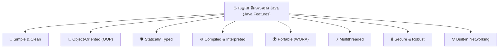
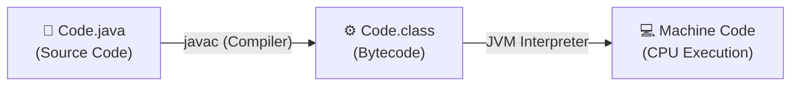

# មេរៀនទី ៣៖ លក្ខណៈរបស់ Java (Features of Java)

> **ស្វែងយល់ពីលក្ខណៈពិសេសចម្បងៗដែលធ្វើឱ្យ Java ក្លាយជាភាសា Programming ឈានមុខគេលើពិភពលោកអស់រយៈពេលជាង ៣ ទសវត្សរ៍**

---

## 🌟 ១. ទិដ្ឋភាពទូទៅនៃលក្ខណៈ Java (Overview)

Java ត្រូវបានគេប្រសិទ្ធនាមថាជាភាសាដែលមានលក្ខណៈសម្បត្តិពេញលេញរួមមាន៖ **Simple, Object-Oriented, Statically Typed, Compiled & Interpreted, Portable, Multithreaded, Robust, Secure និង Built-in Networking**។

---

## 🔍 ២. លក្ខណៈស្នូលទាំង ៨ នៃភាសា Java (Core Features Explained)

### 🎯 ១. Simple (ភាពសាមញ្ញ និងងាយយល់)
* អ្នកបង្កើត Java បានលុបបំបាត់ចោលនូវលក្ខណៈស្មុគស្មាញ និងគ្រោះថ្នាក់មួយចំនួនដែលមានក្នុងភាសា C/C++។
* Java **មិនប្រើ Pointers**, មិនប្រើ Header Files, មិនប្រើ Structs/Unions, មិនប្រើ Operator Overloading និងមិនគាំទ្រ Multiple Inheritance តាមរយៈ Class ឡើយ ដើម្បីកាត់បន្ថយ Bug និង Memory Leak។

### 🧱 ២. Object-Oriented (តម្រង់ទិសលើវត្ថុ)
* គ្រប់យ៉ាងក្នុង Java ត្រូវបានរៀបចំឡើងជា **Classes** និង **Objects**។
* ផ្តល់នូវរចនាសម្ព័ន្ធកូដច្បាស់លាស់ ងាយស្រួលពង្រីក (Maintainable) និងអាចយកកូដមកប្រើឡើងវិញបានខ្ពស់ (Reusable)។

### 🛡️ ៣. Statically Typed (ប្រភេទនៃទិន្នន័យច្បាស់លាស់)
* គ្រប់អថេរ និង Object ទាំងអស់ត្រូវតែប្រកាសប្រភេទ Data Type ឱ្យបានច្បាស់លាស់មុនពេលយកទៅប្រើប្រាស់។
* Java Compiler នឹងជួយចាប់ Error ខុសប្រភេទ Data Type តាំងពីពេល Compile (Compile-time checking) ជួយការពារមិនឱ្យដួលកម្មវិធីពេលកំពុង Run។

### ⚙️ ៤. Compiled and Interpreted (ការបកប្រែ ២ ដំណាក់កាល)
* មុនពេលដំណើរការ កូដ Java (`.java`) ត្រូវឆ្លងកាត់ Compiler (`javac`) ដើម្បីបង្កើតទៅជា **Bytecode (`.class`)**។
* បន្ទាប់មក **JVM (Java Virtual Machine)** នឹងដើរតួជា Interpreter និង JIT Compiler ដើម្បីបកប្រែ Bytecode ទៅជា Machine-Code ជាក់ស្តែងសម្រាប់ CPU ដំណើរការ។

### 🌍 ៥. Architecture Neutral & Portable (មិនប្រកាន់ Platform — WORA)
* គោលការណ៍ល្បីល្បាញបំផុតរបស់ Java គឺ **"Write Once, Run Anywhere" (WORA)**។
* ដោយសារតែ Bytecode មិនអាស្រ័យលើប្រភេទ Hardware ឬ OS ឡើយ ដូច្នេះឯកសារ `.class` តែមួយអាចយកទៅ Run លើ Windows, macOS, Linux ឬ Cloud Server បានទាំងអស់ ឱ្យតែម៉ាស៊ីននោះមានដំឡើង JVM។

### ⚡ ៦. Multithreaded (ដំណើរការការងារច្រើនដំណាលគ្នា)
* Java មានបំពាក់មកជាមួយស្រាប់នូវ Threads Management ដែលអនុញ្ញាតឱ្យកម្មវិធីអាចធ្វើការងារច្រើនក្នុងពេលតែមួយ (Concurrent Execution) ជួយបង្កើនល្បឿន និងប្រសិទ្ធភាព CPU។

### 🔒 ៧. Secure & Robust (សុវត្ថិភាព និងភាពរឹងមាំ)
* **មិនមាន Pointer ដោយផ្ទាល់:** ការពារមិនឱ្យកូដអាក្រក់ ឬ Virus អាចលួចចូលទៅកាន់ System Memory របស់ Computer បានឡើយ។
* **Garbage Collection:** Java គ្រប់គ្រង Memory ដោយស្វ័យប្រវត្តិ (Automatic Memory Management) ជួយលុបចោល Object ដែលលែងប្រើ ការពារបញ្ហា Memory Leak។
* **Exception Handling:** មានប្រព័ន្ធចាប់ និងគ្រប់គ្រងកំហុស (Error Handling) យ៉ាងរឹងមាំ។

### 🌐 ៨. Built-in Networking (គាំទ្រប្រព័ន្ធបណ្តាញស្រាប់)
* Java ត្រូវបានបង្កើតឡើងក្នុងយុគសម័យ Internet ដូច្នេះវាមានកញ្ចប់ Library ស្រាប់ (`java.net`) សម្រាប់បង្កើតកម្មវិធី Client-Server, Web Requests (TCP/UDP, Sockets, HTTP) ដោយមិនបាច់ពឹងផ្អែកលើបណ្ណាល័យក្រៅ។

---

## 💡 សេចក្តីសង្ខេប (Summary)

> [!TIP]
> * **WORA:** សរសេរកូដម្តង ដំណើរការបានគ្រប់ទីកន្លែង ដោយសារ **Bytecode + JVM**។
> * **Memory Safe:** គ្មាន Pointer ដោយផ្ទាល់ និងមាន **Garbage Collector** សម្អាត Memory ដោយស្វ័យប្រវត្តិ។
> * **Enterprise Standard:** ដោយសារតែលក្ខណៈ Robust, Secure និង Multithreaded នេះហើយ ទើប Java ក្លាយជាជម្រើសលេខមួយសម្រាប់ធនាគារ និងប្រព័ន្ធខ្នាតធំលើពិភពលោក។

---

← [មេរៀនមុន (០២៖ Version របស់ Java)](../02-java-versions/README.md) ｜ [មាតិការួម](../README.md) ｜ [មេរៀនបន្ទាប់ (០៤៖ ការចាប់ផ្តើមដំណើរការកម្មវិធី)](../04-first-program/README.md) →
