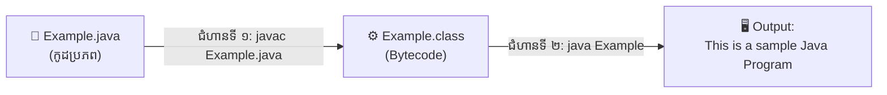

# មេរៀនទី ៤៖ ការចាប់ផ្តើមដំណើរការកម្មវិធី (First Java Program)

> **ការបង្កើត សរសេរ Compile និង Run កម្មវិធី Java ដំបូងបង្អស់ដោយប្រើប្រាស់ Terminal / Command Prompt**

[](#)
[](#)
[](#)

---

## 💻 ១. កូដកម្មវិធីដំបូង (Example.java)

ដើម្បីចាប់ផ្តើម សូមបង្កើតឯកសារមួយឈ្មោះថា **`Example.java`** រួចសរសេរកូដដូចខាងក្រោម៖

```java
// កម្មវិធីគំរូដំបូងបង្អស់ក្នុងភាសា Java៖ Example.java
class Example {
    // ចំណុចចាប់ផ្តើមដំណើរការកម្មវិធី (main method)
    public static void main(String[] args) {
        System.out.println("This is a sample Java Program");
    }
}
```

### 🔍 ការពន្យល់កូដ (Code Breakdown):
* **`class Example`**: នៅក្នុង Java គ្រប់កូដទាំងអស់ត្រូវតែស្ថិតនៅក្នុង Class។ ពាក្យ `Example` គឺជាឈ្មោះ Class (ត្រូវតែដូចនឹងឈ្មោះ File `Example.java`)។
* **`public static void main(String[] args)`**: គឺជា **Main Method** ដែលជាច្រកទ្វារដំបូងបង្អស់ដែល JVM ហៅមកដំណើរការកម្មវិធី (Entry Point)។
* **`System.out.println(...)`**: ជាបញ្ជាសម្រាប់បោះពុម្ព ឬបង្ហាញសារអក្សរចេញទៅកាន់ផ្ទាំង Console Screen។

---

## ⚙️ ២. ជំហាន Compile និង Run កម្មវិធីតាម Terminal



### ជំហានទី ១៖ ធ្វើការ Compile កូដ (Compile Source Code)
បើក Terminal ឬ Command Prompt ចូលទៅកាន់ទីតាំងដែលផ្ទុក File `Example.java` រួចវាយពាក្យបញ្ជា៖

```bash
javac Example.java
```

> [!NOTE]
> ក្រោយពី Compile ជោគជ័យ Java Compiler នឹងបង្កើត File ថ្មីមួយឈ្មោះថា **`Example.class`**។ File នេះផ្ទុកនូវកូដប្រភេទ **Bytecode** ដែល JVM អាចយល់បាន។

---

### ជំហានទី ២៖ ដំណើរការកម្មវិធី (Execute the Program)
បន្ទាប់ពីទទួលបាន File `.class` ហើយ សូមវាយពាក្យបញ្ជាដើម្បី Run៖

```bash
java Example
```

> [!IMPORTANT]
> នៅពេល Run ជាមួយពាក្យបញ្ជា `java` សូម**កុំដាក់កន្ទុយ `.java` ឬ `.class`** ឱ្យសោះ គឺសរសេរតែឈ្មោះ Class `Example` សុទ្ធប៉ុណ្ណោះ!

---

## 🖥️ ៣. លទ្ធផលលើអេក្រង់ (Program Output)

```text
This is a sample Java Program
```

---

## 💡 ចំណុចសំខាន់ៗដែលត្រូវចងចាំ (Key Takeaways)

> [!TIP]
> 1. **Case-Sensitive:** ឈ្មោះ File និងឈ្មោះ Class ត្រូវតែដូចគ្នាបេះបិទ ទាំងអក្សរតូចនិងធំ (`Example.java` និង `class Example`)។
> 2. **`javac` vs `java`:**
>    * `javac` (Java Compiler): ប្រើសម្រាប់បំប្លែង `.java` ទៅជា `.class` (Bytecode)
>    * `java` (Java Launcher): ប្រើសម្រាប់ដំណើរការ Bytecode លើ JVM

---

← [មេរៀនមុន (០៣៖ លក្ខណៈរបស់ Java)](../03-features-of-java/README.md) ｜ [មាតិការួម](../README.md) ｜ [មេរៀនបន្ទាប់ (០៥៖ ទម្រង់នៃកម្មវិធី Java)](../05-java-program-structure/README.md) →
