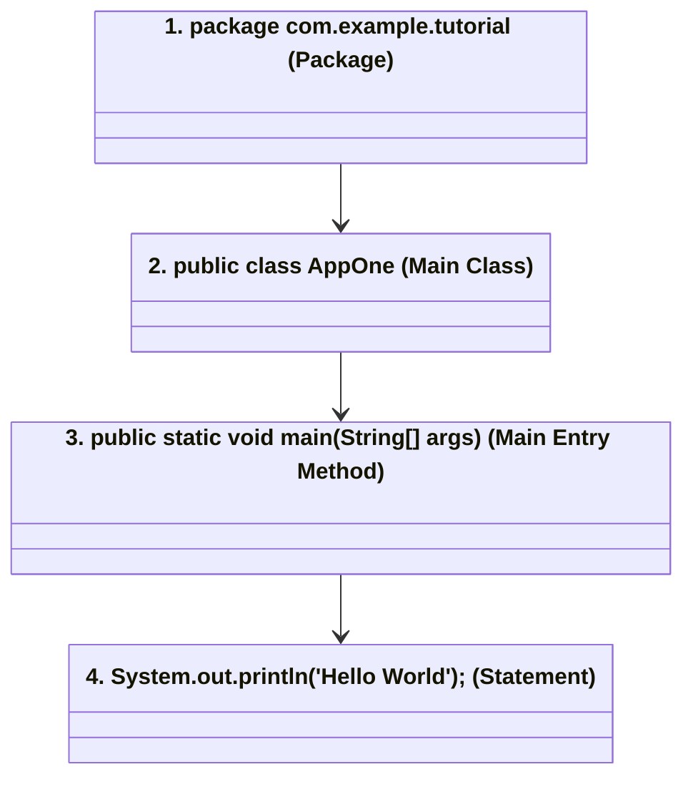

# មេរៀនទី ៥៖ ទម្រង់នៃកម្មវិធី Java (Java Program Structure)

> **ស្វែងយល់អំពីរចនាសម្ព័ន្ធកូដស្តង់ដារនៃភាសា Java៖ Package, Class, Main Method និង Statements**

[](#)
[](#)
[](#)

---

## 🏗️ ១. ទម្រង់ស្តង់ដារនៃកម្មវិធី Java (Program Anatomy)

នៅក្នុង IDE ទំនើប (ដូចជា IntelliJ IDEA, Eclipse, ឬ NetBeans) កម្មវិធី Java តែងតែមានរចនាសម្ព័ន្ធស្តង់ដារដូចខាងក្រោម៖

```java
package com.example.tutorial;

public class AppOne {
    public static void main(String[] args) {
        System.out.println("Hello World");
    }
}
```



---

## 🔍 ២. ការពន្យល់ធាតុផ្សំនីមួយៗ (Component Breakdown)

### 📦 ១. `package` (Package Namespace)
* បន្ទាត់ទី ១៖ `package com.example.tutorial;`
* ជា Folders ឬ Namespace សម្រាប់រៀបចំចាត់ថ្នាក់ឯកសារកូដឱ្យមានសណ្តាប់ធ្នាប់ ការពារការជាន់ឈ្មោះ Class គ្នាទៅវិញទៅមក។

### 🏛️ ២. `public class AppOne` (Class)
* បន្ទាត់ទី ៣៖ `public class AppOne`
* នៅក្នុង Java គ្រប់កូដទាំងអស់ត្រូវតែសរសេរនៅក្នុង **Class**។
* **`public`**: ជា Access Modifier អនុញ្ញាតឱ្យ Class នេះអាចហៅប្រើពីទីណាក៏បាន។
* **`AppOne`**: ជាឈ្មោះ Class ដែលត្រូវសរសេរតាមទម្រង់ **PascalCase** (អក្សរធំនៅដើមពាក្យនីមួយៗ)។

### 🚪 ៣. `public static void main(String[] args)` (Main Entry Method)
* បន្ទាត់ទី ៤៖ `public static void main(...)`
* គឺជា **Main Method** ដែលជាកន្លែងដែល JVM ចាប់ផ្តើម Execute កូដដំបូងបង្អស់។ កូដណាដែលយើងចង់ឱ្យដំណើរការ ត្រូវសរសេរនៅក្នុងប្លុក `{ }` នៃ main method នេះ។
* **`static`**: អនុញ្ញាតឱ្យ JVM ហៅ method នេះដំណើរការបានដោយមិនបាច់បង្កើត Object ឡើយ។
* **`void`**: មានន័យថា method នេះមិនបញ្ជូនតម្លៃត្រឡប់មកវិញទេ (No return value)។
* **`String[] args`**: ជា Parameters សម្រាប់ទទួល Command-line Arguments ពីខាងក្រៅ។

### 📢 ៤. `System.out.println(...)` (ការបញ្ចេញលទ្ធផល)
* បន្ទាត់ទី ៥៖ `System.out.println("Hello World");`
* ជាពាក្យបញ្ជាសម្រាប់បង្ហាញសារអក្សរទៅកាន់អេក្រង់ Console។ រាល់ Statement ក្នុង Java ត្រូវតែបញ្ចប់ដោយសញ្ញា **Semicolon (`;`)** ជាដាច់ខាត។

---

## 💡 សេចក្តីសង្ខេប (Summary)

> [!NOTE]
> * **Semicolon (`;`):** កុំភ្លេចដាក់ `;` នៅចុងបញ្ចប់នៃរាល់បន្ទាត់ពាក្យបញ្ជា។
> * **Curly Braces `{ }`:** បញ្ជាក់ពីវិសាលភាពនៃ Block កូដ (Scope)។
> * **Case Sensitivity:** Java ប្រកាន់អក្សរតូចធំខ្លាំងណាស់ (`main` មិនស្មើ `Main` ឡើយ)។

---

← [មេរៀនមុន (០៤៖ ការចាប់ផ្តើមដំណើរការកម្មវិធី)](../04-first-program/README.md) ｜ [មាតិការួម](../README.md) ｜ [មេរៀនបន្ទាប់ (០៦៖ Java Output)](../06-java-output/README.md) →
