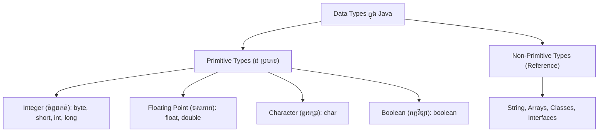

# មេរៀនទី ៩៖ Java Data Types (ប្រភេទនៃទិន្នន័យ)

> **ស្វែងយល់លម្អិតអំពីប្រភេទនៃទិន្នន័យក្នុងភាសា Java៖ Primitive Data Types ទាំង ៨ និង Reference Types**

[](#)
[](#)
[](#)

---

## 📊 ១. ទិដ្ឋភាពទូទៅនៃ Data Types ក្នុង Java

នៅក្នុងភាសា Java ប្រភេទនៃទិន្នន័យត្រូវបានបែងចែកជា **២ ក្រុមធំៗ**៖
1. **Primitive Data Types (ទិន្នន័យគ្រឹះទាំង ៨)**: ផ្ទុកតម្លៃជាក់ស្តែងក្នុង Memory (Stack)។
2. **Non-Primitive / Reference Types (ទិន្នន័យយោង)**: ដូចជា `String`, `Arrays`, និង `Classes` ដែលផ្ទុកអាសយដ្ឋានចង្អុលទៅកាន់ Object ក្នុង Heap Memory។



---

## 📋 ២. តារាង Primitive Data Types ទាំង ៨ យ៉ាងលម្អិត

| Data Type | ទំហំ Memory | ដែនកំណត់តម្លៃ (Range / Capacity) | តម្លៃលំនាំដើម (Default) |
| :---: | :---: | :--- | :---: |
| **`byte`** | 1 byte (8 bits) | -១២៨ ទៅ ១២៧ | `0` |
| **`short`** | 2 bytes (16 bits) | -៣២,៧៦៨ ទៅ ៣២,៧៦៧ | `0` |
| **`int`** | 4 bytes (32 bits) | -២,១៤៧,៤៨៣,៦៤៨ ទៅ ២,១៤៧,៤៨៣,៦៤៧ | `0` |
| **`long`** | 8 bytes (64 bits) | -៩,២២៣,៣៧២,០៣៦,៨៥៤,៧៧៥,៨០៨ ទៅ ៩,២២៣,៣៧២,០៣៦,៨៥៤,៧៧៥,៨០៧ | `0L` |
| **`float`** | 4 bytes (32 bits) | លេខទសភាគ ផ្ទុកបាន ៦ ទៅ ៧ ខ្ទង់ | `0.0f` |
| **`double`** | 8 bytes (64 bits) | លេខទសភាគ ផ្ទុកបាន ១៥ ទៅ ១៦ ខ្ទង់ | `0.0d` |
| **`boolean`** | 1 bit | `true` (ពិត) ឬ `false` (មិនពិត) | `false` |
| **`char`** | 2 bytes (16 bits) | តួអក្សរតែមួយគត់ (Unicode: `\u0000` ទៅ `\uffff`) | `'\u0000'` |

---

## 🔍 ៣. ការពន្យល់លម្អិតតាមផ្នែកនីមួយៗ

### 🔢 ៣.១ ចំនួនគត់ (Integer Types: `int` និង `long`)
* ក្នុងចំណោមប្រភេទចំនួនគត់ទាំង ៤ (`byte`, `short`, `int`, `long`) គឺ **`int` ត្រូវបានប្រើច្រើនជាងគេបំផុត** សម្រាប់ចំនួនគត់ទូទៅ។
* ប្រសិនបើលេខមានតម្លៃធំលើសពី ២ ពាន់លាន យើងត្រូវប្រើ **`long`** ហើយត្រូវដាក់កន្ទុយ **`L`** នៅចុងលេខ (ឧទាហរណ៍ `long distance = 15000000000L;`)។

### 🌊 ៣.២ លេខទសភាគ (Floating Point: `float` និង `double`)
* **`float`**: ត្រូវដាក់អក្សរ **`f`** ឬ **`F`** នៅចុងបញ្ចប់ (ឧទាហរណ៍ `float pi = 3.14f;`)។
* **`double`**: ជាជម្រើសស្តង់ដារដែលប្រើញឹកញាប់បំផុតក្នុង Java ព្រោះវាមានភាពសុក្រឹតខ្ពស់ (១៥ ខ្ទង់)។
* យើងក៏អាចប្រើតួអក្សរ **`e`** ឬ **`E`** សម្រាប់សរសេរលេខស្វ័យគុណដប់ (Scientific Notation) បានផងដែរ (ឧទាហរណ៍ `double myNum = 12E4d; // 12 x 10^4 = 120000.0`)។

### ⚖️ ៣.៣ Boolean Types
* ផ្ទុកតម្លៃតែពីរគត់គឺ **`true`** (ពិត) ឬ **`false`** (មិនពិត)។
* ប្រើប្រាស់ញឹកញាប់បំផុតនៅក្នុងលក្ខខណ្ឌវិនិច្ឆ័យ `if..else` និង Loops។

### 🔤 ៣.៤ Characters (`char`) និង Strings (`String`)
* **`char`**: ផ្ទុកតួអក្សរទោលតែមួយគត់ ដោយព័ទ្ធជុំវិញដោយ Single Quote (`' '`) ដូចជា `char grade = 'A';`។
* **`String`**: មិនមែនជា Primitive Type ទេ តែជា **Object Reference Type** ដែលប្រើសម្រាប់ផ្ទុកពាក្យ ឬប្រយោគវែងៗ ដោយព័ទ្ធជុំវិញដោយ Double Quotes (`" "`) ដូចជា `String message = "Hello Java";`។

---

## 💻 ៤. កូដគំរូអនុវត្តជាក់ស្តែង (Practical Code Example)

```java
public class DataTypesDemo {
    public static void main(String[] args) {
        // Integer Types
        byte myByte = 100;
        short myShort = 5000;
        int myInt = 100000;
        long myLong = 15000000000L;

        // Floating Point Types
        float myFloat = 5.75f;
        double myDouble = 19.99d;

        // Scientific Notation (E)
        double myScientific = 35e3d; // 35000.0

        // Boolean & Character
        boolean isJavaFun = true;
        char myGrade = 'A';

        // String (Reference Type)
        String myText = "Hello Java Learners";

        // បង្ហាញលទ្ធផល
        System.out.println("Integer: " + myInt);
        System.out.println("Double: " + myDouble);
        System.out.println("Scientific (35e3): " + myScientific);
        System.out.println("Is Java Fun? " + isJavaFun);
        System.out.println("Grade: " + myGrade);
        System.out.println("Message: " + myText);
    }
}
```

**Output:**
```text
Integer: 100000
Double: 19.99
Scientific (35e3): 35000.0
Is Java Fun? true
Grade: A
Message: Hello Java Learners
```

---

## 💡 សេចក្តីសង្ខេប (Summary)

> [!TIP]
> * សម្រាប់ចំនួនគត់ទូទៅ: ជ្រើសរើស **`int`** (ឬ **`long`** បើលេខធំខ្លាំង)។
> * សម្រាប់លេខទសភាគ: ជ្រើសរើស **`double`** ព្រោះមានភាពច្បាស់លាស់ខ្ពស់។
> * សម្រាប់តួអក្សរទោល: ប្រើ **`char`** ជាមួយសញ្ញា `' '`។ សម្រាប់ពាក្យ/ប្រយោគ: ប្រើ **`String`** ជាមួយសញ្ញា `" "`។

---

← [មេរៀនមុន (០៨៖ Java Variables)](../08-java-variables/README.md) ｜ [មាតិការួម](../README.md) ｜ [មេរៀនបន្ទាប់ (១០៖ Java Type Casting)](../10-java-type-casting/README.md) →
