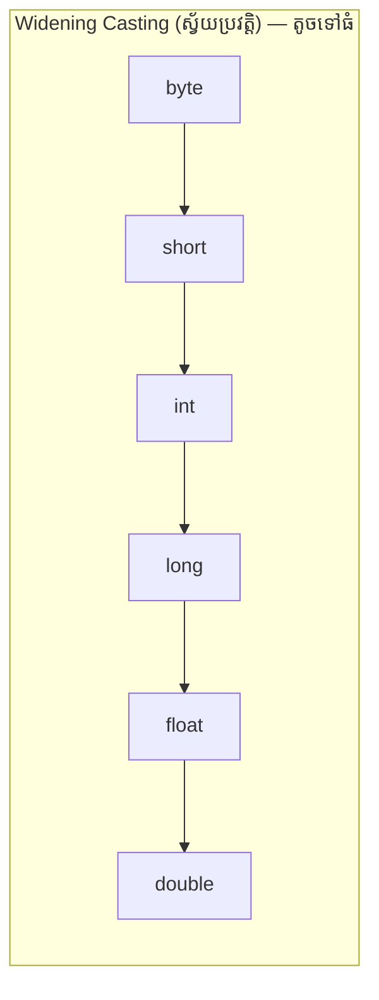
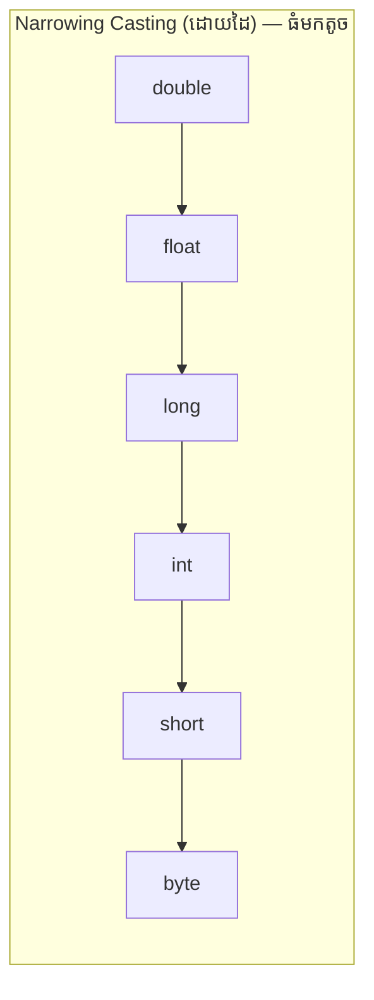

# មេរៀនទី ១០៖ Java Type Casting (ការបំប្លែងប្រភេទនៃទិន្នន័យ)

> **ការបំប្លែងតម្លៃពីប្រភេទ Data Type មួយទៅកាន់ប្រភេទមួយទៀត៖ Widening Casting, Narrowing Casting និងការបំប្លែង String**

[](#)
[](#)
[](#)

---

## 🔄 ១. អ្វីជា Type Casting ក្នុងភាសា Java?

**Type Casting** គឺជាដំណើរការនៃការបំប្លែងតម្លៃពីប្រភេទ Primitive Data Type មួយទៅកាន់ Primitive Data Type មួយទៀត។

នៅក្នុង Java ការធ្វើ Type Casting ត្រូវបែងចែកជា **២ ប្រភេទធំៗ**៖





---

## 📈 ២. Widening Casting (ការបំប្លែងស្វ័យប្រវត្តិ — Automatic)

* កើតឡើងនៅពេលយើងបំប្លែងពី **ប្រភេទតូច ទៅកាន់ប្រភេទធំជាង** (ឧទាហរណ៍ `int` ទៅជា `double`)។
* ដំណើរការនេះកើតឡើងដោយ**ស្វ័យប្រវត្តិ** (Implicit) ព្រោះមិនមានហានិភ័យនៃការបាត់បង់ទិន្នន័យឡើយ។

```java
public class WideningDemo {
    public static void main(String[] args) {
        int myInt = 9;
        
        // Automatic casting: int to double
        double myDouble = myInt;

        System.out.println("Integer value: " + myInt);       // 9
        System.out.println("Double value: " + myDouble);     // 9.0
    }
}
```

---

## 📉 ៣. Narrowing Casting (ការបំប្លែងដោយដៃ — Manual)

* កើតឡើងនៅពេលយើងបំប្លែងពី **ប្រភេទធំ មកកាន់ប្រភេទតូចជាង** (ឧទាហរណ៍ `double` មកជា `int`)។
* ត្រូវធ្វើឡើង**ដោយដៃ (Explicit)** ដោយដាក់ឈ្មោះ Type ដែលចង់បានក្នុងរង្វង់ក្រចក `(type)` នៅពីមុខតម្លៃ។

> [!WARNING]
> **ការបាត់បង់ទិន្នន័យ (Data Loss):** នៅពេលបំប្លែងពី `double` ទៅជា `int` ខ្ទង់ទសភាគនឹងត្រូវកាត់ចោលទាំងស្រុង (មិនមែនបង្គត់លេខទេ)!

```java
public class NarrowingDemo {
    public static void main(String[] args) {
        double myDouble = 9.78d;
        
        // Manual casting: double to int
        int myInt = (int) myDouble;

        System.out.println("Double value: " + myDouble);     // 9.78
        System.out.println("Integer value: " + myInt);       // 9 (បាត់បង់ .78)
    }
}
```

---

## 🔀 ៤. ការបំប្លែងរវាង Primitive Types និង String

### ៤.១ បំប្លែងពីលេខ/Boolean ទៅជា String (Primitive ➔ String)
យើងអាចប្រើប្រាស់ `String.valueOf(...)` ឬ Wrapper Method ដូចជា `Integer.toString(...)`៖

```java
int myNumber = 123;
double myDouble = 15.55;
boolean myBoolean = true;

String strNum = String.valueOf(myNumber);       // "123"
String strDouble = Double.toString(myDouble);   // "15.55"
String strBool = Boolean.toString(myBoolean);   // "true"
```

### ៤.២ បំប្លែងពី String មកជាលេខវិញ (String ➔ Primitive)
យើងប្រើប្រាស់ Method `parseXxx()` នៃ Wrapper Classes៖

```java
String strScore = "95";
String strPrice = "19.99";

int score = Integer.parseInt(strScore);         // 95
double price = Double.parseDouble(strPrice);    // 19.99
```

> [!NOTE]
> ប្រសិនបើ String មិនមែនជាទម្រង់លេខត្រឹមត្រូវ (ឧទាហរណ៍ `"abc"`) ការហៅ `Integer.parseInt()` នឹងបណ្តាលឱ្យកើតមាន **`NumberFormatException`**។

---

## 💡 សេចក្តីសង្ខេប (Summary)

> [!TIP]
> * **Widening (តូច ➔ ធំ):** ដំណើរការស្វ័យប្រវត្តិ មិនបាត់បង់ទិន្នន័យ។
> * **Narrowing (ធំ ➔ តូច):** ត្រូវដាក់ `(type)` ដោយដៃ និងត្រូវប្រយ័ត្នការបាត់បង់ខ្ទង់ទសភាគ។
> * **String Parsing:** ប្រើ `Integer.parseInt(str)` និង `Double.parseDouble(str)` សម្រាប់បំប្លែង String ទៅជាលេខ។

---

← [មេរៀនមុន (០៩៖ Java Data Types)](../09-java-data-types/README.md) ｜ [មាតិការួម](../README.md) ｜ [មេរៀនបន្ទាប់ (១១៖ Java User Input)](../11-java-user-input/README.md) →
