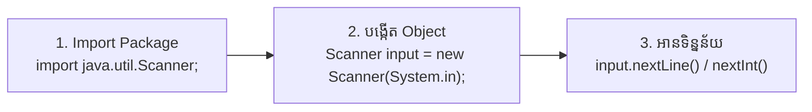

# មេរៀនទី ១១៖ Java User Input (ការទទួលទិន្នន័យពី Keyboard)

> **ការប្រើប្រាស់ Class `Scanner` ក្នុងភាសា Java ដើម្បីទទួលទិន្នន័យអន្តរកម្មពីអ្នកប្រើប្រាស់តាមរយៈ Keyboard**

[](#)
[](#)
[](#)

---

## ⌨️ ១. ស្វែងយល់អំពី Scanner Class ក្នុង Java

ដើម្បីអាចឱ្យអ្នកប្រើប្រាស់ (User) វាយបញ្ចូលទិន្នន័យពី Keyboard ចូលទៅក្នុង Program ភាសា Java បានផ្តល់នូវ Class មួយឈ្មោះថា **`Scanner`** ដែលស្ថិតនៅក្នុង Package `java.util`។

### ជំហានទាំង ៣ ក្នុងការប្រើប្រាស់ Scanner៖



1. **Import Package:** ដាក់នៅខាងលើបង្អស់នៃកូដ៖
   ```java
   import java.util.Scanner;
   ```
2. **បង្កើត Scanner Object:**
   ```java
   Scanner input = new Scanner(System.in);
   ```
   *(បញ្ជាក់៖ `System.in` សម្គាល់លើ Standard Input Device ពោលគឺ Keyboard)*
3. **ហៅប្រើ Method ទៅតាមប្រភេទ Data Type** ដែលចង់ទទួល។

---

## 📋 ២. តារាង Methods សំខាន់ៗរបស់ Scanner

| Method | ប្រភេទ Data Type ដែលទទួល | ឧទាហរណ៍នៃការប្រើប្រាស់ |
| :--- | :---: | :--- |
| **`nextBoolean()`** | `boolean` | ទទួលតម្លៃ `true` ឬ `false` |
| **`nextByte()`** | `byte` | ទទួលចំនួនគត់តូច |
| **`nextShort()`** | `short` | ទទួលចំនួនគត់មធ្យម |
| **`nextInt()`** | `int` | ទទួលចំនួនគត់ស្តង់ដារ |
| **`nextLong()`** | `long` | ទទួលចំនួនគត់ធំ |
| **`nextFloat()`** | `float` | ទទួលលេខទសភាគ |
| **`nextDouble()`** | `double` | ទទួលលេខទសភាគសុក្រឹតខ្ពស់ |
| **`next()`** | `String` | ទទួលពាក្យតែមួយគត់ (ដាច់ត្រឹម Space) |
| **`nextLine()`** | `String` | ទទួលប្រយោគមួយបន្ទាត់ពេញ (រហូតដល់ចុច Enter) |

---

## 💻 ៣. កូដគំរូអនុវត្តជាក់ស្តែង (Practical Code Examples)

### ឧទាហរណ៍ទី ១៖ ការចុះឈ្មោះព័ត៌មានផ្ទាល់ខ្លួន (User Profile Input)

```java
import java.util.Scanner;

public class UserInputDemo {
    public static void main(String[] args) {
        // បង្កើត Scanner object
        Scanner scanner = new Scanner(System.in);

        // ទទួលឈ្មោះ (String)
        System.out.print("Enter your Name: ");
        String name = scanner.nextLine();

        // ទទួលអាយុ (int)
        System.out.print("Enter your Age: ");
        int age = scanner.nextInt();

        // ទទួលពិន្ទុមធ្យមភាគ (double)
        System.out.print("Enter your GPA: ");
        double gpa = scanner.nextDouble();

        // បង្ហាញព័ត៌មានដែល User បានបញ្ចូល
        System.out.println("\n--- Student Profile ---");
        System.out.println("Name: " + name);
        System.out.println("Age: " + age + " years old");
        System.out.println("GPA: " + gpa);

        scanner.close(); // បិទ Scanner ពេលឈប់ប្រើ
    }
}
```

**ផ្ទាំងអន្តរកម្មលើ Console:**
```text
Enter your Name: Meng Sreang
Enter your Age: 21
Enter your GPA: 3.85

--- Student Profile ---
Name: Meng Sreang
Age: 21 years old
GPA: 3.85
```

---

### ឧទាហរណ៍ទី ២៖ ម៉ាស៊ីនគិតលេខសាមញ្ញ (Simple Addition Calculator)

```java
import java.util.Scanner;

public class CalculatorInput {
    public static void main(String[] args) {
        Scanner input = new Scanner(System.in);

        System.out.print("Enter Number A: ");
        int a = input.nextInt();

        System.out.print("Enter Number B: ");
        int b = input.nextInt();

        int sum = a + b;
        System.out.println("Result (A + B) = " + sum);

        input.close();
    }
}
```

---

## 💡 ចំណុចត្រូវប្រុងប្រយ័ត្ន (Common Gotcha)

> [!WARNING]
> **បញ្ហា `nextInt()` រួចហៅ `nextLine()` ភ្លាម:**
> នៅពេល User វាយលេខរួចចុច **Enter** Method `nextInt()` នឹងអានតែលេខទេ ប៉ុន្តែបន្សល់ទុកសញ្ញា Enter (`\n`) នៅក្នុង Buffer។ ប្រសិនបើបន្ទាត់បន្ទាប់យើងហៅ `nextLine()` វានឹងរំលងមិនឱ្យយើងវាយអក្សរឡើយ!
> 
> **ដំណោះស្រាយ:** ត្រូវហៅ `scanner.nextLine();` មួយបន្ទាត់ទទេរបន្ថែម ដើម្បីសម្អាត Buffer មុននឹងទទួល String បន្ទាប់។

---

← [មេរៀនមុន (១០៖ Java Type Casting)](../10-java-type-casting/README.md) ｜ [មាតិការួម](../README.md) ｜ [មេរៀនបន្ទាប់ (១២៖ Java Operators)](../12-java-operators/README.md) →
