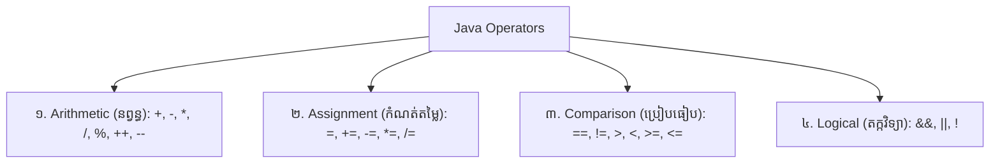

# មេរៀនទី ១២៖ Java Operators (ប្រមាណវិធីក្នុង Java)

> **ការប្រើប្រាស់សញ្ញាប្រមាណវិធីក្នុងភាសា Java៖ Arithmetic, Assignment, Comparison និង Logical Operators**

[](#)
[](#)
[](#)

---

## ⚙️ ១. ទិដ្ឋភាពទូទៅនៃ Operators ក្នុង Java

**Operator (សញ្ញាប្រមាណវិធី)** គឺជានិមិត្តសញ្ញាពិសេសដែលប្រើសម្រាប់អនុវត្តការគណនា បំប្លែង និងវិនិច្ឆ័យតម្លៃនៅលើអថេរ (Operands)។ ក្នុង Java មាន ៤ ក្រុមចម្បង៖



---

## ➕ ២. Arithmetic Operators (ប្រមាណវិធីនព្វន្ធ)

ប្រើសម្រាប់គណនាគណិតវិទ្យាលើទិន្នន័យជាលេខ៖

| Operator | ឈ្មោះ | ការពិពណ៌នា | ឧទាហរណ៍ | លទ្ធផល (បើ `a=10, b=3`) |
| :---: | :--- | :--- | :---: | :---: |
| `+` | Addition | បូកតម្លៃចូលគ្នា (ឬភ្ជាប់ String) | `a + b` | `13` |
| `-` | Subtraction | ដកតម្លៃ | `a - b` | `7` |
| `*` | Multiplication | គុណតម្លៃ | `a * b` | `30` |
| `/` | Division | ចែកតម្លៃ (យកផលចែក) | `a / b` | `3` (បើរវាង int) |
| `%` | Modulus | ចែករកសំណល់ (Remainder) | `a % b` | `1` (10 ចែក 3 សល់ 1) |
| `++` | Increment | បន្ថែមតម្លៃ ១ ឯកតា | `a++` ឬ `++a` | `11` |
| `--` | Decrement | បន្ថយតម្លៃ ១ ឯកតា | `a--` ឬ `--a` | `9` |

```java
public class ArithmeticDemo {
    public static void main(String[] args) {
        int a = 10, b = 3;
        System.out.println("a + b = " + (a + b)); // 13
        System.out.println("a - b = " + (a - b)); // 7
        System.out.println("a * b = " + (a * b)); // 30
        System.out.println("a / b = " + (a / b)); // 3
        System.out.println("a % b = " + (a % b)); // 1 (សំណល់)
    }
}
```

---

## 📝 ៣. Assignment Operators (ប្រមាណវិធីចាត់តាំងតម្លៃ)

ប្រើសម្រាប់កំណត់ ឬកែប្រែតម្លៃទៅក្នុងអថេរ៖

| Operator | ឧទាហរណ៍ | សមមូលនឹង (Equivalent to) |
| :---: | :---: | :--- |
| `=` | `x = 5` | `x = 5` |
| `+=` | `x += 3` | `x = x + 3` |
| `-=` | `x -= 3` | `x = x - 3` |
| `*=` | `x *= 3` | `x = x * 3` |
| `/=` | `x /= 3` | `x = x / 3` |
| `%=` | `x %= 3` | `x = x % 3` |

---

## ⚖️ ៤. Comparison Operators (ប្រមាណវិធីប្រៀបធៀប)

ប្រើសម្រាប់ប្រៀបធៀបតម្លៃពីរ ដោយផ្តល់លទ្ធផលជា **`boolean` (`true` ឬ `false`)**៖

| Operator | ឈ្មោះ | ឧទាហរណ៍ | លទ្ធផល (បើ `x=5, y=3`) |
| :---: | :--- | :---: | :---: |
| `==` | ស្មើគ្នា (Equal to) | `x == y` | `false` |
| `!=` | មិនស្មើគ្នា (Not equal) | `x != y` | `true` |
| `>` | ធំជាង (Greater than) | `x > y` | `true` |
| `<` | តូចជាង (Less than) | `x < y` | `false` |
| `>=` | ធំជាង ឬស្មើ | `x >= y` | `true` |
| `<=` | តូចជាង ឬស្មើ | `x <= y` | `false` |

---

## 🧠 ៥. Logical Operators (ប្រមាណវិធីតក្កវិទ្យា)

ប្រើសម្រាប់ភ្ជាប់ ឬវិនិច្ឆ័យលក្ខខណ្ឌច្រើនចូលគ្នា៖

| Operator | ឈ្មោះ | លក្ខខណ្ឌពិត (`true`) | ឧទាហរណ៍ |
| :---: | :--- | :--- | :---: |
| `&&` | Logical AND | ពិត លុះត្រាតែ **លក្ខខណ្ឌទាំងពីរពិត** | `(x > 3 && x < 10)` |
| `\|\|` | Logical OR | ពិត ប្រសិនបើ **លក្ខខណ្ឌណាមួយពិត** | `(x > 3 \|\| x < 2)` |
| `!` | Logical NOT | បញ្ច្រាសតម្លៃ (ពិត ទៅជា មិនពិត) | `!(x == 5)` |

---

## 💡 សេចក្តីសង្ខេប (Summary)

> [!TIP]
> * ប្រមាណវិធីចែករកសំណល់ **`%` (Modulus)** មានប្រយោជន៍ខ្លាំងក្នុងការពិនិត្យមើលលេខគូ ឬលេខសេស (`n % 2 == 0`)។
> * ប្រយ័ត្នសញ្ញា **`=` (Assign តម្លៃ)** និង **`==` (ប្រៀបធៀបស្មើ)** មិនដូចគ្នាឡើយ!

---

← [មេរៀនមុន (១១៖ Java User Input)](../11-java-user-input/README.md) ｜ [មាតិការួម](../README.md) ｜ [មេរៀនបន្ទាប់ (១៣៖ Java Mathematic)](../13-java-mathematic/README.md) →
