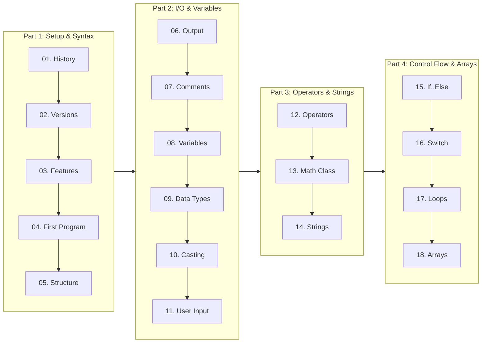

# Basic Java for Developers (Khmer Edition)

> **A comprehensive software engineering fundamentals course on Java (18 Complete Lessons + 87 Presentation Slides + Full Stack Roadmap) transcribed from lecture slides with practical, executable code examples.**

> 🌐 **Language / ភាសា:** 🇬🇧 **[English](README.md)** | [ភាសាខ្មែរ (Khmer)](README.kh.md)

---

## 📖 About This Course

**Java** remains one of the world's most widely used, reliable, and high-performance enterprise programming languages. This course establishes the foundational building blocks every software engineer needs before advancing to Object-Oriented Programming (OOP), Spring Framework, and Spring Boot Microservices.

> [!TIP]
> 🗺️ **Looking for the Full Stack Journey?**  
> Check out the complete [Java Full Stack Web Development Roadmap](ROADMAP.md) detailing the step-by-step master plan from zero to professional enterprise software engineer!

---

## 🧭 Learning Path Flowchart

---

## 📚 Table of Contents

| Lesson | Topic | Key Highlights & Concepts | Link |
| :---: | :--- | :--- | :---: |
| **01** | **History of Java** | James Gosling, Sun Microsystems, Green Project, Oak to Java, WWW (1993) | [Read Lesson](01-history-of-java/README.md) |
| **02** | **Java Versions & Ecosystem** | Version timeline, LTS (8, 11, 17, 21), JDK vs JRE vs JVM internals | [Read Lesson](02-java-versions/README.md) |
| **03** | **Features of Java** | Simple, Object-Oriented, Platform Independent (WORA), Secure, Robust | [Read Lesson](03-features-of-java/README.md) |
| **04** | **First Java Program** | `Example.java`, source compilation (`javac`), execution (`java`), bytecode | [Read Lesson](04-first-program/README.md) |
| **05** | **Program Structure** | Class declaration, `main()` method anatomy, keywords, packages | [Read Lesson](05-java-program-structure/README.md) |
| **06** | **Java Output** | `System.out.print()` vs `println()`, string concatenation, escape chars | [Read Lesson](06-java-output/README.md) |
| **07** | **Java Comments** | Single-line (`//`), Multi-line (`/* */`), Javadoc (`/** */`), Clean code rules | [Read Lesson](07-java-comments/README.md) |
| **08** | **Java Variables** | Memory variables, declaration syntax, naming rules, `final` constants | [Read Lesson](08-java-variables/README.md) |
| **09** | **Data Types** | 8 Primitive types (byte to double, boolean, char) vs Reference types | [Read Lesson](09-java-data-types/README.md) |
| **10** | **Type Casting** | Widening Casting (automatic) vs Narrowing Casting (manual), conversions | [Read Lesson](10-java-type-casting/README.md) |
| **11** | **User Input (Scanner)** | Keyboard input with `java.util.Scanner`, input methods, newline gotchas | [Read Lesson](11-java-user-input/README.md) |
| **12** | **Java Operators** | Arithmetic, Assignment, Relational/Comparison, Logical operators | [Read Lesson](12-java-operators/README.md) |
| **13** | **Java Mathematic (Math)** | Built-in `java.lang.Math` class (`max`, `min`, `sqrt`, `abs`, `random`) | [Read Lesson](13-java-mathematic/README.md) |
| **14** | **Java Strings** | String methods (`length`, `toUpperCase`, `indexOf`), immutability, escape | [Read Lesson](14-java-strings/README.md) |
| **15** | **If..Else Control Flow** | `if`, `else`, `else if`, short-hand Ternary Operator (`? :`) | [Read Lesson](15-java-if-else/README.md) |
| **16** | **Switch Statement** | Multi-branch conditions, `case`, `break`, `default`, fall-through rules | [Read Lesson](16-java-switch/README.md) |
| **17** | **Java Loops** | `while`, `do-while`, `for`, `for-each`, loop control (`break`, `continue`) | [Read Lesson](17-java-loops/README.md) |
| **18** | **Java Arrays** | 1D arrays, indexing, `.length`, traversal with for-each, 2D matrices | [Read Lesson](18-java-arrays/README.md) |

---

## 📽️ Lecture Slide Presentations

The course includes 87 high-quality presentation slide decks transcribed and archived for instructors and self-learners:
* 📊 **[87 Lecture Slide Decks Catalog](slides/README.md)**

---

## 🗺️ Career Roadmap

This course forms Phase 1 of our master engineering path:
* 🚀 **[Complete Java Full Stack Developer Roadmap](ROADMAP.md)**

---

## 🔗 Sister Repositories in the Curriculum

| Track | Repository | Focus Areas | Status |
| :--- | :--- | :--- | :---: |
| **01. Basic Java** | [java-basic-for-developers-khmer](https://github.com/sakousa856-sketch/java-basic-for-developers-khmer) | Fundamentals, Syntax, Types, Flow, Arrays | ✅ Active |
| **02. Advance Java** | [java-advance-for-developers-khmer](https://github.com/sakousa856-sketch/java-advance-for-developers-khmer) | OOP (Inheritance, Polymorphism, Abstraction) | ✅ Complete |
| **03. Spring Framework** | [spring-framework-for-developers-khmer](https://github.com/sakousa856-sketch/spring-framework-for-developers-khmer) | IoC Container, DI, Bean Scopes, AOP | ✅ Complete |
| **04. Spring Boot** | [spring-boot-for-developers-khmer](https://github.com/sakousa856-sketch/spring-boot-for-developers-khmer) | RESTful APIs, Spring Data JPA, Microservices | ✅ Complete |
| **05. Interview Prep** | [java-spring-interview-handbook-khmer](https://github.com/sakousa856-sketch/java-spring-interview-handbook-khmer) | 12 Technical Pillars, System Design, Coding | ✅ Complete |
