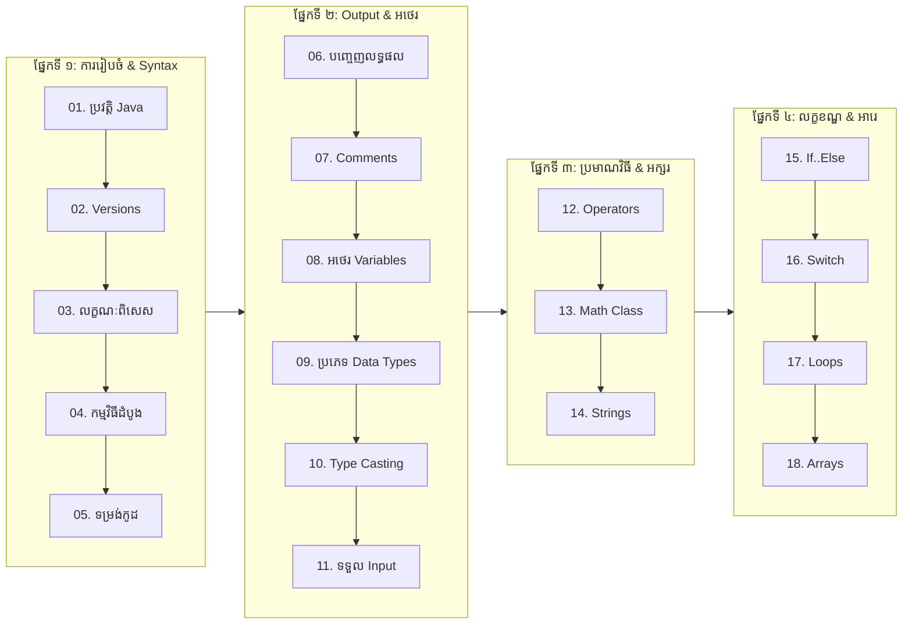

# មូលដ្ឋានគ្រឹះ Java (Basic Java for Developers)

> **វគ្គសិក្សាមូលដ្ឋានគ្រឹះភាសា Java កម្រិតវិស្វកម្មសូហ្វវែរ (១៨ មេរៀនពេញលេញ + ៨៧ ស្លាយបង្រៀន + ផែនទីបង្ហាញផ្លូវ Full Stack) ចម្លងចេញពីស្លាយ និងមានកូដអនុវត្តជាក់ស្តែង។**

---

## 📖 អំពីវគ្គសិក្សានេះ

**Java** នៅតែជាភាសាសរសេរកម្មវិធីដ៏ពេញនិយម អាចទុកចិត្តបាន និងមានប្រសិទ្ធភាពខ្ពស់បំផុតលំដាប់ពិភពលោកសម្រាប់ប្រព័ន្ធសហគ្រាស (Enterprise Systems)។ វគ្គសិក្សានេះរៀបចំឡើងដើម្បីកសាងគ្រឹះយ៉ាងរឹងមាំសម្រាប់អ្នកអភិវឌ្ឍន៍សូហ្វវែរ មុននឹងបន្តទៅកាន់កម្រិត Object-Oriented Programming (OOP), Spring Framework និង Spring Boot Microservices។

> [!TIP]
> 🗺️ **ចង់ឃើញផែនទីបង្ហាញផ្លូវពេញលេញ?**  
> សូមចូលទៅកាន់ [Java Full Stack Web Development Roadmap](ROADMAP.md) ដើម្បីមើលជំហានលម្អិតទាំង ៦ ចាប់ពីកម្រិតដំបូងរហូតដល់ក្លាយជា Senior Full Stack Engineer!

---

## 🧭 គំនូសបំព្រួញលំដាប់លំដោយនៃការរៀន (Learning Path)

---

## 📚 មាតិកាវគ្គសិក្សា (Table of Contents)

| មេរៀន | ប្រធានបទ (Topic) | ខ្លឹមសារ និងចំណុចសំខាន់ៗ | តំណភ្ជាប់ (Link) |
| :---: | :--- | :--- | :---: |
| **01** | **ប្រវត្តិនៃ Java (History of Java)** | លោក James Gosling, Sun Microsystems, Green Project, Oak ទៅ Java, WWW (1993) | [អានមេរៀន](01-history-of-java/README.md) |
| **02** | **Version របស់ Java (Java Versions)** | បន្ទាត់ពេលវេលា Version, LTS (8, 11, 17, 21), យន្តការ JDK vs JRE vs JVM | [អានមេរៀន](02-java-versions/README.md) |
| **03** | **លក្ខណៈពិសេសរបស់ Java (Features)** | សាមញ្ញ, OOP, មិនអាស្រ័យលើ Platform (WORA), សុវត្ថិភាពខ្ពស់, រឹងមាំ | [អានមេរៀន](03-features-of-java/README.md) |
| **04** | **កម្មវិធីដំបូង (First Java Program)** | `Example.java`, ការ Compile (`javac`), ការ Run (`java`), Bytecode | [អានមេរៀន](04-first-program/README.md) |
| **05** | **ទម្រង់នៃកម្មវិធី (Program Structure)** | ការបង្កើត Class, រចនាសម្ព័ន្ធ `main()` method, ពាក្យគន្លឹះ Keywords, Packages | [អានមេរៀន](05-java-program-structure/README.md) |
| **06** | **ការបញ្ចេញលទ្ធផល (Java Output)** | ប្រៀបធៀប `print()` vs `println()`, ការភ្ជាប់អក្សរ, Escape Sequences | [អានមេរៀន](06-java-output/README.md) |
| **07** | **កំណត់សម្គាល់កូដ (Java Comments)** | Single-line (`//`), Multi-line (`/* */`), Javadoc (`/** */`), វិធាន Clean Code | [អានមេរៀន](07-java-comments/README.md) |
| **08** | **អថេរក្នុង Java (Java Variables)** | និយមន័យអថេរក្នុង Memory, Syntax ប្រកាសអថេរ, ក្បួនដាក់ឈ្មោះ, ពាក្យ `final` | [អានមេរៀន](08-java-variables/README.md) |
| **09** | **ប្រភេទនៃទិន្នន័យ (Data Types)** | ៨ ប្រភេទ Primitive types (byte ដល់ double, boolean, char) និង Reference types | [អានមេរៀន](09-java-data-types/README.md) |
| **10** | **ការបំប្លែងប្រភេទ (Type Casting)** | Widening Casting (ស្វ័យប្រវត្ត) vs Narrowing Casting (ដោយដៃ), ការបំប្លែង String | [អានមេរៀន](10-java-type-casting/README.md) |
| **11** | **ការទទួលទិន្នន័យពី Keyboard (Scanner)** | Class `java.util.Scanner`, Input methods នីមួយៗ, ដំណោះស្រាយបញ្ហា Newline | [អានមេរៀន](11-java-user-input/README.md) |
| **12** | **ប្រមាណវិធីក្នុង Java (Operators)** | ប្រមាណវិធីនព្វន្ធ, ការផ្តល់តម្លៃ, ប្រៀបធៀប, និងតក្កវិទ្យា | [អានមេរៀន](12-java-operators/README.md) |
| **13** | **Java Math Class** | Class `java.lang.Math` ដែលមានស្រាប់ (`max`, `min`, `sqrt`, `abs`, `random`) | [អានមេរៀន](13-java-mathematic/README.md) |
| **14** | **ខ្សែអក្សរក្នុង Java (Java Strings)** | String methods (`length`, `toUpperCase`, `indexOf`), លក្ខណៈ Immutability, Escape | [អានមេរៀន](14-java-strings/README.md) |
| **15** | **លក្ខខណ្ឌសម្រេចចិត្ត (If..Else)** | `if`, `else`, `else if`, និង Short-hand Ternary Operator (`? :`) មួយបន្ទាត់ | [អានមេរៀន](15-java-if-else/README.md) |
| **16** | **ការសម្រេចចិត្តតាមជម្រើស (Switch)** | លក្ខខណ្ឌច្រើនជម្រើស, `case`, សារៈសំខាន់នៃ `break`, `default`, Fall-through | [អានមេរៀន](16-java-switch/README.md) |
| **17** | **រង្វិលជុំ (Java Loops)** | `while`, `do-while`, `for`, `for-each`, ការបញ្ឈប់ និងរំលង (`break`, `continue`) | [អានមេរៀន](17-java-loops/README.md) |
| **18** | **អារេក្នុង Java (Java Arrays)** | អារេទោល, លេខរៀង Index, `.length`, Loop តាម for-each, អារេ ២ វិមាត្រ (2D) | [អានមេរៀន](18-java-arrays/README.md) |

---

## 📽️ ស្លាយមេរៀនបង្រៀន (Slide Presentations)

វគ្គសិក្សានេះមានភ្ជាប់មកជាមួយនូវស្លាយបង្រៀនចំនួន ៨៧ ស្លាយ ដែលបានរៀបចំចងក្រងយ៉ាងផ្ចិតផ្ចង់៖
* 📊 **[កាតាឡុកស្លាយបង្រៀន ៨៧ ស្លាយ (87 Lecture Slides Catalog)](slides/README.md)**

---

## 🗺️ ផែនទីបង្ហាញផ្លូវអាជីព (Career Roadmap)

វគ្គសិក្សានេះគឺជាជំហានដំបូងគេ (Phase 1) នៃមាគ៌ាវិស្វករសូហ្វវែរសហគ្រាស៖
* 🚀 **[ផែនទីបង្ហាញផ្លូវពេញលេញ Java Full Stack Web Development](ROADMAP.md)**

---

## 🔗 ស៊េរីវគ្គសិក្សាពាក់ព័ន្ធ (Sister Repositories)

| វគ្គសិក្សា | ឃ្លាំងកូដ (Repository) | ខ្លឹមសារសំខាន់ៗ | ស្ថានភាព |
| :--- | :--- | :--- | :---: |
| **01. Basic Java** | [java-basic-for-developers-khmer](https://github.com/sakousa856-sketch/java-basic-for-developers-khmer) | មូលដ្ឋានគ្រឹះ, Syntax, Types, Flow, Arrays | ✅ Active |
| **02. Advance Java** | [java-advance-for-developers-khmer](https://github.com/sakousa856-sketch/java-advance-for-developers-khmer) | Object-Oriented Programming (OOP) ស៊ីជម្រៅ | ✅ ពេញលេញ |
| **03. Spring Framework** | [spring-framework-for-developers-khmer](https://github.com/sakousa856-sketch/spring-framework-for-developers-khmer) | IoC Container, Dependency Injection, Bean, AOP | ✅ ពេញលេញ |
| **04. Spring Boot** | [spring-boot-for-developers-khmer](https://github.com/sakousa856-sketch/spring-boot-for-developers-khmer) | RESTful APIs, Spring Data JPA, Microservices | ✅ ពេញលេញ |
| **05. Interview Prep** | [java-spring-interview-handbook-khmer](https://github.com/sakousa856-sketch/java-spring-interview-handbook-khmer) | ១២ មូលដ្ឋានត្រៀមសម្ភាសន៍ការងារសហគ្រាស | ✅ ពេញលេញ |
