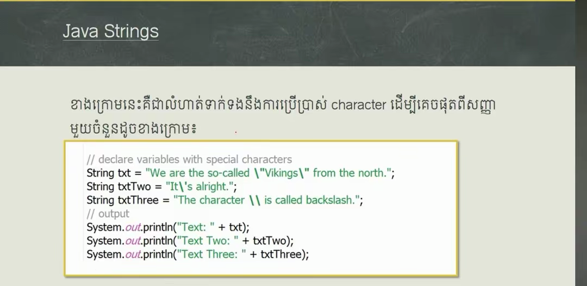

# Basic Java (Slide Presentations) 🇬🇧

> 🎓 **Basic Java Slide Presentation Series (87 Slides)** for teaching, presentation, and self-study, from introductory concepts to strong Java foundations.

> 🌐 **Language / ភាសា:** [Khmer (ភាសាខ្មែរ)](README.kh.md) | 🇬🇧 **English (README.md)**

[](#-table-of-contents)
[](#)
[](../../../01-books-and-handbooks/05-java-and-spring/README.md)

---

## 📑 Table of Contents

- [1. History of Java](#1-history-of-java) *(Slides 01 - 02)*
- [2. Java Versions](#2-java-versions) *(Slides 03 - 04)*
- [3. Features of Java](#3-features-of-java) *(Slides 05 - 09)*
- [4. First Java Program](#4-first-java-program) *(Slides 10 - 11)*
- [5. How Java Works & Runs](#5-how-java-works--runs) *(Slides 12 - 13)*
- [6. Java Output & Print Methods](#6-java-output--print-methods) *(Slide 14)*
- [7. Java Comments](#7-java-comments) *(Slides 15 - 16)*
- [8. Java Variables](#8-java-variables) *(Slides 17 - 24)*
- [9. Java Data Types](#9-java-data-types) *(Slides 25 - 34)*
- [10. Java Type Casting](#10-java-type-casting) *(Slides 35 - 38)*
- [11. Java User Input](#11-java-user-input) *(Slides 39 - 47)*
- [12. Java Operators](#12-java-operators) *(Slides 48 - 53)*
- [13. Java Mathematics](#13-java-mathematics) *(Slides 54 - 59)*
- [14. Java Strings](#14-java-strings) *(Slides 60 - 65)*
- [15. Java If...Else](#15-java-ifelse) *(Slides 66 - 71)*
- [16. Java Switch Statement](#16-java-switch-statement) *(Slides 72 - 76)*
- [17. Java Loops](#17-java-loops) *(Slides 77 - 83)*
- [18. Java Arrays](#18-java-arrays) *(Slides 84 - 87)*

---

## 1. History of Java


### Slide 1 Summary:
- **Java** was conceived by **James Gosling** at **Sun Microsystems** in a research effort called the **Green Project** in **1991**.
- The project was based on C and C++. It was originally named **Oak** after an oak tree outside Gosling's office window.
- The name was later changed to **Java** following coffee break discussions among colleagues.


### Slide 2 Summary:
- Green Project initially faced severe headwinds.
- In **1993**, the explosion of the **World Wide Web (WWW)** showed the Sun team the tremendous power of Java in driving dynamic web applets and pages, reviving the project with great momentum.

---

## 2. Java Versions


### Slide 3 Summary:
- **1995:** Release of **Java 1.0** for the World Wide Web (8 packages, 212 classes).
- **1997:** Release of **Java 1.1** adding UI improvements, event handling, inner classes, and Swing (23 packages, 504 classes).


### Slide 4 Summary:
- **2000:** Java 1.3 introduced the HotSpot Virtual Machine (76 packages, 1,842 classes).
- **2002:** Java 1.4 improved I/O and added XML parsing (135 packages, 2,991 classes).
- **2004:** Java 1.5 (Java 5) brought major language upgrades: generics, enhanced for-loop, annotations, and multithreading improvements (165 packages, 3,000+ classes).
- Subsequent releases like Java 1.6 expanded further to 200+ packages.

---

## 3. Features of Java


### Summary of Slides 5 to 9:
- **Simple:** Cleaned up C++ complexities; eliminates explicit pointers, unions, header files, and multiple class inheritance.
- **Object Oriented:** Encapsulates state and behavior in classes and objects.
- **Statically Typed:** Variables must have explicit types, verified at compile time.
- **Compiled and Interpreted:** Compiled by `javac` into bytecode (`.class`), executed on any JVM ("Write Once, Run Anywhere").
- **Multithreaded:** Native support for concurrent execution.
- **Garbage Collected:** Automated memory reclamation via the Garbage Collector (GC).
- **Robust & Secure:** Strong type safety, exception handling, and JVM sandbox protection.

---

## 4. First Java Program


### Code Example:
```java
// This is the first example java program. Save file as "Example.java"
class Example {
    // A Java program begins with a call to main().
    public static void main(String[] args) {
        System.out.println("Java drives the Web.");
    }
}
```

---

## 5. How Java Works & Runs


```bash
# 1. Compile source code to bytecode (.class)
javac Example.java

# 2. Run bytecode on JVM
java Example
```

---

## 6. Java Output & Print Methods


```java
System.out.println("Hello World"); // Prints with newline
System.out.print("Hello ");        // Prints on same line
System.out.print("World!");        // Continues on same line
```

---

## 7. Java Comments


```java
// Single-line comment

/*
  Multi-line comment
  spans multiple lines
*/

/**
 * Javadoc documentation comment
 */
```

---

## 8. Java Variables


```java
String name = "Dara";
final double PI = 3.14159; // Constant (immutable)
int x = 5, y = 10, z = 15;
System.out.println("Hello " + name);
```

---

## 9. Java Data Types


---

## 10. Java Type Casting


```java
// Widening (Automatic): byte -> short -> char -> int -> long -> float -> double
int myInt = 9;
double myDouble = myInt; // 9.0

// Narrowing (Manual): double -> float -> long -> int -> char -> short -> byte
double d = 9.78;
int i = (int) d; // 9
```

---

## 11. Java User Input


")
")
")
")
")


```java
import java.util.Scanner;

public class Main {
    public static void main(String[] args) {
        Scanner scanner = new Scanner(System.in);
        System.out.print("Enter username: ");
        String userName = scanner.nextLine();
        System.out.print("Enter age: ");
        int age = scanner.nextInt();
        System.out.println("Username: " + userName + ", Age: " + age);
    }
}
```

---

## 12. Java Operators


---

## 13. Java Mathematics


```java
Math.max(5, 10);     // 10
Math.min(5, 10);     // 5
Math.sqrt(64);       // 8.0
Math.abs(-4.7);      // 4.7
int randomNum = (int)(Math.random() * 101); // 0 to 100
```

---

## 14. Java Strings


")

")



---

## 15. Java If...Else


---

## 16. Java Switch Statement


---

## 17. Java Loops


---

## 18. Java Arrays


---

## 🎯 Related Resources
- 📖 [Core Java Curriculum (Full 18 Lessons)](../../../01-books-and-handbooks/05-java-and-spring/01-course-curriculum/01-basic-java/README.md)
- 💼 [Java & Spring Interview Handbook](../../../01-books-and-handbooks/05-java-and-spring/02-interview-handbook/README.md)
