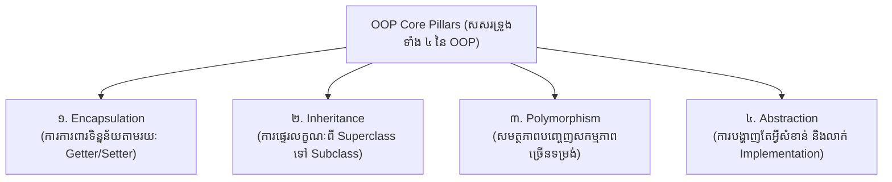

# មេរៀនទី ១៖ សេចក្តីផ្តើមអំពី Java OOP (Java OOP Introduction)

> **ស្វែងយល់ពីមូលដ្ឋានគ្រឹះនៃ Object-Oriented Programming (OOP)៖ និយមន័យ គុណសម្បត្តិ និងសសរទ្រូងទាំង ៤ នៃស្ថាបត្យកម្ម OOP ក្នុង Java**

[](#)
[](#)
[](#)

---

## ☕ ១. អ្វីជា OOP? (What is Object-Oriented Programming?)

**OOP (Object-Oriented Programming)** គឺជាទម្រង់ស្ថាបត្យកម្មនៃការសរសេរកម្មវិធី (Programming Paradigm) ដែលរៀបចំរចនាសម្ព័ន្ធ Software ផ្អែកលើ **Objects** ជាជាង Actions ឬ Logic ដាច់ដោយឡែក។ នៅក្នុងពិភពពិត អ្វីៗទាំងអស់សុទ្ធតែជា Object (ដូចជា មនុស្ស, ឡាន, គណនីធនាគារ) ដែលមាន **លក្ខណៈសម្បត្តិ (Attributes/State)** និង **សកម្មភាព (Methods/Behaviors)**។

Java គឺជាភាសា OOP សុទ្ធសាធស្ទើរតែទាំងស្រុង ដែលគ្រប់កូដទាំងអស់ត្រូវតែស្ថិតនៅក្នុង **Class**។

---

## 🔄 ២. ការប្រៀបធៀប៖ Procedural vs Object-Oriented Programming

| លក្ខណៈវិនិច្ឆ័យ (Feature) | Procedural Programming (ឧ. C, Pascal) | Object-Oriented Programming (Java, C++) |
| :--- | :--- | :--- |
| **ការផ្តោតសំខាន់** | ផ្តោតលើ Functions និងលំដាប់លំដោយនៃការអនុវត្ត | ផ្តោតលើ Objects និងទិន្នន័យ (Data) |
| **រចនាសម្ព័ន្ធកម្មវិធី** | បែងចែកកម្មវិធីជា Functions តូចៗ | បែងចែកកម្មវិធីជា Classes និង Objects |
| **សុវត្ថិភាពទិន្នន័យ** | ទិន្នន័យពិបាកលាក់បាំង (Global Data ងាយរងការប៉ះពាល់) | សុវត្ថិភាពខ្ពស់តាមរយៈ Data Hiding (Encapsulation) |
| **ការប្រើប្រាស់កូដឡើងវិញ** | កម្រិតទាប (ពិបាក Reuse កូដស្មុគស្មាញ) | ខ្ពស់ខ្លាំងតាមរយៈ Inheritance និង Polymorphism |
| **ការថែទាំកូដ (Maintenance)** | កូដកាន់តែធំ កាន់តែពិបាកកែសម្រួល | ងាយស្រួល Debug, Scale, និងបន្ថែម Feature ថ្មី |

---

## 🌟 ៣. អត្ថប្រយោជន៍ចម្បងៗនៃ OOP (Advantages of OOP)

> [!NOTE]
> ហេតុអ្វីបានជាស្ថាប័នធំៗ និងប្រព័ន្ធ Enterprise ជ្រើសរើសស្ថាបត្យកម្ម OOP?
> 1. ⚡ **ល្បឿន និងប្រសិទ្ធភាព:** មានភាពច្បាស់លាស់ក្នុងការ Execute និងងាយស្រួលយល់តាមលំនាំជីវិតពិត។
> 2. 🧱 **កូដមិនច្រំដែល (DRY - Don't Repeat Yourself):** ការប្រើប្រាស់ Inheritance និង Polymorphism ជួយកាត់បន្ថយកូដដដែលៗ។
> 3. 🛡️ **សុវត្ថិភាពខ្ពស់:** Encapsulation ការពារកុំឱ្យទិន្នន័យខាងក្រៅចូលមកកែប្រែដោយគ្មានការអនុញ្ញាត។
> 4. 🔧 **ងាយស្រួលថែទាំ និងពង្រីក (Maintainable & Scalable):** កូដមានលក្ខណៈ Modular ពេលមាន Bug ងាយស្រួលកំណត់ទីតាំង និងដោះស្រាយ។

---

## 🏛️ ៤. សសរទ្រូងទាំង ៤ នៃ OOP (Four Pillars of OOP)

OOP ឈរលើគ្រឹះដ៏រឹងមាំនៃគោលការណ៍ទាំង ៤ ដូចខាងក្រោម៖



1. 🔒 **Encapsulation:** ការចងក្រងទិន្នន័យ (Attributes) និង Method ចូលគ្នាក្នុង Unit តែមួយ និងការពារទិន្នន័យដោយកំណត់ Access Modifier ជា `private`។
2. 🧬 **Inheritance:** យន្តការដែល Class ថ្មី (Subclass) អាចស្នងយក Attributes និង Methods ពី Class ចាស់ (Superclass) ដោយប្រើពាក្យគន្លឹះ `extends`។
3. 🎭 **Polymorphism:** សមត្ថភាពរបស់ Method ឬ Object ដែលអាចមានសកម្មភាពច្រើនទម្រង់ តាមរយៈ Method Overloading (Compile-time) និង Method Overriding (Runtime)។
4. 🎭 **Abstraction:** ការបង្ហាញជូនតែមុខងារស្នូលសំខាន់ៗដែលចាំបាច់ដល់អ្នកប្រើប្រាស់ និងលាក់បាំងនូវភាពស្មុគស្មាញនៃ Implementation ខាងក្នុង (តាមរយៈ Abstract Class និង Interface)។

---

## 💻 ៥. កូដគំរូសាមញ្ញដំបូងនៃ OOP (First OOP Example)

ខាងក្រោមនេះជាគំរូសាមញ្ញនៃការបង្កើត Class `Car` និងការបង្កើត Object ចេញពី Class នោះ៖

```java
// ១. បង្កើត Class
class Car {
    // Attributes (លក្ខណៈសម្បត្តិ)
    String brand;
    String color;

    // Method (សកម្មភាព)
    void drive() {
        System.out.println(brand + " ពណ៌ " + color + " កំពុងបើកបរ... 🚗💨");
    }
}

public class Main {
    public static void main(String[] args) {
        // ២. បង្កើត Object ចេញពី Class Car
        Car myCar = new Car();
        myCar.brand = "Toyota";
        myCar.color = "ក្រហម";

        // ៣. ហៅ Method របស់ Object
        myCar.drive();
    }
}
```

**Output:**
```text
Toyota ពណ៌ ក្រហម កំពុងបើកបរ... 🚗💨
```

---

## 💡 សេចក្តីសង្ខេបសំខាន់ (Key Takeaways)

> [!TIP]
> 1. **OOP** រៀបចំកូដជាទម្រង់ Objects ដែលស្រដៀងនឹងវត្ថុពិតក្នុងលោក។
> 2. **៤ សសរទ្រូង** គឺ `Encapsulation`, `Inheritance`, `Polymorphism`, និង `Abstraction`។
> 3. **អត្ថប្រយោជន៍ចម្បង** រួមមាន ការកាត់បន្ថយកូដច្រំដែល (Reusability), សុវត្ថិភាពទិន្នន័យ (Security) និងភាពងាយស្រួលក្នុងការថែទាំ (Maintainability)។

---

← ចាប់ផ្តើម ｜ [មាតិការួម](../README.md) ｜ [មេរៀនបន្ទាប់ (០២៖ Java Class និង Object)](../02-classes-and-objects/README.md) →
