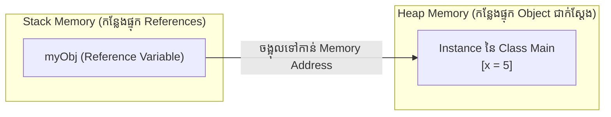

# មេរៀនទី ២៖ Java Class និង Object (Java Classes and Objects)

> **ស្វែងយល់ស៊ីជម្រៅអំពី Class និង Object៖ និយមន័យ ប្លង់មេ (Blueprint) ការ Instantiate តាមរយៈពាក្យគន្លឹះ new និងការគ្រប់គ្រង Multiple Classes ក្នុង Java**

[](#)
[](#)
[](#)

---

## 🏗️ ១. អ្វីជា Class និង Object? (Class vs Object)

នៅក្នុង OOP, **Class** និង **Object** គឺជាគំនិតស្នូលពីរដែលមិនអាចខ្វះគ្នាបាន៖
* 📐 **Class (ប្លង់មេ / Blueprint):** គឺជាទម្រង់គំរូ ឬ User-defined Data Type ដែលកំណត់ថាតើ Object ដែលនឹងត្រូវបង្កើតមកនោះមាន Attributes (ទិន្នន័យ) អ្វីខ្លះ និង Methods (សកម្មភាព) អ្វីខ្លះ។
* 🧱 **Object (វត្ថុជាក់ស្តែង / Instance):** គឺជា Instance ជាក់ស្តែងដែលត្រូវបានបង្កើតឡើងចេញពី Class និងត្រូវបានផ្ទុកនៅក្នុង **Heap Memory**។

### 📊 ឧទាហរណ៍ប្រៀបធៀបក្នុងជីវិតពិត

| Class (ប្លង់មេ) | Objects ជាក់ស្តែង (Instances) |
| :--- | :--- |
| **Fruit** | Apple, Banana, Mango |
| **Car** | Volvo, BMW, Ford, Mazda |
| **BankAccount** | គណនីរបស់ សុខ, គណនីរបស់ ចិន្តា |
| **Student** | សិស្ស A (ID: 101), សិស្ស B (ID: 102) |

---

## 📝 ២. របៀបបង្កើត Class ក្នុង Java (Create a Class)

ដើម្បីបង្កើត Class យើងប្រើប្រាស់ពាក្យគន្លឹះ **`class`**:

```java
public class Main {
    int x = 5; // Attribute / Field
}
```

> [!NOTE]
> តាមស្តង់ដារ Java Convention ឈ្មោះ Class ត្រូវតែចាប់ផ្តើមដោយ **អក្សរធំ (PascalCase)** ដូចជា `Car`, `StudentProfile`, `OrderService`។

---

## ⚡ ៣. ការបង្កើត Object តាមរយៈពាក្យគន្លឹះ `new` (Create an Object)

ដើម្បីបង្កើត Object ចេញពី Class យើងត្រូវប្រើពាក្យគន្លឹះ **`new`** ដែលជាអ្នកស្នើសុំបម្រុងទុក Memory នៅក្នុង Heap៖

```java
public class Main {
    int x = 5;

    public static void main(String[] args) {
        // បង្កើត Object មួយឈ្មោះ myObj
        Main myObj = new Main();
        
        // ទាញយកតម្លៃតាមរយៈ Dot Operator (.)
        System.out.println("តម្លៃ x គឺ: " + myObj.x);
    }
}
```

**Output:**
```text
តម្លៃ x គឺ: 5
```

---

## 👥 ៤. ការបង្កើត Objects ច្រើនចេញពី Class តែមួយ (Multiple Objects)

យើងអាចបង្កើត Object ច្រើនតាមចិត្តចេញពី Class តែមួយ។ Object នីមួយៗមានទិន្នន័យ (State) ផ្ទាល់ខ្លួនដាច់ដោយឡែកពីគ្នា មិនជាន់គ្នាឡើយ៖

```java
public class Main {
    int x = 5;

    public static void main(String[] args) {
        Main myObj1 = new Main(); // Object ទី ១
        Main myObj2 = new Main(); // Object ទី ២
        
        System.out.println("Object 1: " + myObj1.x);
        System.out.println("Object 2: " + myObj2.x);
    }
}
```

**Output:**
```text
Object 1: 5
Object 2: 5
```

---

## 📂 ៥. ការប្រើប្រាស់ Multiple Classes ក្នុងគម្រោង (Using Multiple Classes)

នៅក្នុងការអភិវឌ្ឍន៍សូហ្វវែរពិតប្រាកដ យើងកម្រសរសេរអ្វីៗទាំងអស់ក្នុង File តែមួយណាស់។ ជាទូទៅ យើងបង្កើត Class មួយសម្រាប់ផ្ទុក Logic/Data ហើយ Class មួយទៀតសម្រាប់ដំណើរការកម្មវិធី (`main` method)៖

### File ទី ១: `Car.java`
```java
public class Car {
    String brand = "Toyota";
    int maxSpeed = 200;
}
```

### File ទី ២: `Second.java` (File ប្រតិបត្តិការ)
```java
public class Second {
    public static void main(String[] args) {
        Car myCar = new Car();
        System.out.println("ម៉ាកឡាន: " + myCar.brand);
        System.out.println("ល្បឿនអតិបរមា: " + myCar.maxSpeed + " km/h");
    }
}
```

**Output:**
```text
ម៉ាកឡាន: Toyota
ល្បឿនអតិបរមា: 200 km/h
```

> [!IMPORTANT]
> ឈ្មោះ File ក្នុង Java ត្រូវតែដូចគ្នាទៅនឹងឈ្មោះ Public Class នៅក្នុង File នោះបេះបិទ (`Car.java` សម្រាប់ `public class Car`)។

---

## 🧠 ៦. យន្តការ Memory របស់ Class និង Object



* **Stack Memory:** ផ្ទុក Reference variable ដូចជា `myObj` ដែលរក្សាទុក Memory Address នៃ Object។
* **Heap Memory:** ផ្ទុកទិន្នន័យជាក់ស្តែងនៃ Object ដែលត្រូវបានបង្កើតឡើងដោយពាក្យគន្លឹះ `new`។

---

## 💡 សេចក្តីសង្ខេបសំខាន់ (Key Takeaways)

> [!TIP]
> 1. **Class** គឺជាប្លង់មេ (Template) រីឯ **Object** គឺជា Instance ពិតប្រាកដដែលកើតចេញពី Class។
> 2. ពាក្យគន្លឹះ **`new`** ប្រើសម្រាប់បង្កើត Object ថ្មីក្នុង Heap Memory។
> 3. ប្រើ **Dot Operator (`.`)** ដើម្បីទាញយក ឬកែប្រែ Attributes និងហៅ Methods របស់ Object។
> 4. ការបំបែក Class ជា Files ផ្សេងៗគ្នាជួយឱ្យ Code មានរបៀបរៀបរយ និងងាយស្រួលថែទាំ។

---

← [មេរៀនមុន (០១៖ សេចក្តីផ្តើមអំពី Java OOP)](../01-oop-introduction/README.md) ｜ [មាតិការួម](../README.md) ｜ [មេរៀនបន្ទាប់ (០៣៖ Java Class Attributes)](../03-class-attributes/README.md) →
