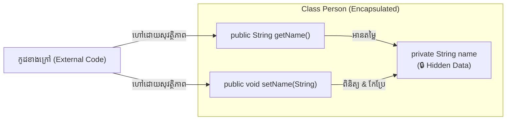

# មេរៀនទី ៧៖ Java Encapsulation (ការការពារ និងគ្រប់គ្រងទិន្នន័យក្នុង OOP)

> **ស្វែងយល់ស៊ីជម្រៅអំពីសសរទ្រូងទី ១ នៃ OOP គឺ Encapsulation៖ គោលការណ៍ Data Hiding យន្តការ Getter & Setter និងការបន្ថែម Validation Logic ក្នុង Class**

[](#)
[](#)
[](#)

---

## 🔒 ១. អ្វីជា Encapsulation? (What is Encapsulation?)

នៅក្នុង OOP, **Encapsulation** គឺជាយន្តការនៃការចងក្រងទិន្នន័យ (Attributes/Fields) និងកូដប្រតិបត្តិការ (Methods) ឱ្យស្ថិតនៅក្នុង Unit តែមួយ (Class) ព្រមទាំងការពារកុំឱ្យទិន្នន័យខាងក្នុងនោះត្រូវរងការកែប្រែដោយផ្ទាល់ពីខាងក្រៅដោយគ្មានការត្រួតពិនិត្យ (ហៅថា **Data Hiding**)។

### 🛠️ ជំហានពីរដើម្បីបង្កើត Encapsulation ក្នុង Java៖
1. 🔐 ប្រកាស Variables / Attributes ទាំងអស់ក្នុង Class ជា **`private`**។
2. 🔑 បង្កើត **`public` Getter និង Setter Methods** ដើម្បីអនុញ្ញាតឱ្យពិភពខាងក្រៅអាចអាន និងកែប្រែតម្លៃបានដោយសុវត្ថិភាព។

---

## 🔑 ២. យន្តការ Getter និង Setter (Getters and Setters)

* **Getter (Get Method):** Method សម្រាប់អាន ឬទាញយកតម្លៃ Attribute (ឈ្មោះចាប់ផ្តើមដោយ `get` ដូចជា `getName()`)។
* **Setter (Set Method):** Method សម្រាប់កំណត់ ឬកែប្រែតម្លៃ Attribute (ឈ្មោះចាប់ផ្តើមដោយ `set` ដូចជា `setName(String name)`)។



---

## 💻 ៣. កូដគំរូអនុវត្តជាក់ស្តែង (Practical Code Example)

### File ទី ១: `Person.java` (Encapsulated Class)
```java
public class Person {
    // 1. private attribute: មិនអាចអាន ឬកែប្រែផ្ទាល់ពីក្រៅ Class បានទេ
    private String name;
    private int age;

    // 2. Getter សម្រាប់ទាញយក name
    public String getName() {
        return name;
    }

    // 3. Setter សម្រាប់កំណត់តម្លៃ name
    public void setName(String name) {
        this.name = name;
    }

    // Getter សម្រាប់ age
    public int getAge() {
        return age;
    }

    // Setter សម្រាប់ age ដោយមាន Validation Logic ការពារ Error
    public void setAge(int age) {
        if (age > 0) {
            this.age = age;
        } else {
            System.out.println("❌ អាយុមិនអាចជាលេខអវិជ្ជមាន ឬសូន្យបានឡើយ!");
        }
    }
}
```

### File ទី ២: `Main.java`
```java
public class Main {
    public static void main(String[] args) {
        Person p = new Person();

        // កំណត់តម្លៃតាមរយៈ Setter
        p.setName("Sokha");
        p.setAge(25);

        // ទាញយកតម្លៃតាមរយៈ Getter
        System.out.println("ឈ្មោះ: " + p.getName());
        System.out.println("អាយុ: " + p.getAge() + " ឆ្នាំ");

        // សាកល្បងបញ្ចូលតម្លៃខុសច្បាប់
        p.setAge(-5); // នឹងបង្ហាញសារ Error ដោយមិនធ្វើឱ្យខូចទិន្នន័យក្នុង Object
    }
}
```

**Output:**
```text
ឈ្មោះ: Sokha
អាយុ: 25 ឆ្នាំ
❌ អាយុមិនអាចជាលេខអវិជ្ជមាន ឬសូន្យបានឡើយ!
```

---

## 🌟 ៤. ហេតុអ្វីត្រូវប្រើ Encapsulation? (Why Encapsulation?)

> [!NOTE]
> **គុណសម្បត្តិសំខាន់ៗនៃ Encapsulation:**
> 1. 🛡️ **ការគ្រប់គ្រងទិន្នន័យល្អប្រសើរ (Better Control):** អ្នកអាចសម្រេចបានថាតើ Attribute នោះអាចត្រឹមតែ Read-Only (មានតែ Getter គ្មាន Setter) ឬ Write-Only (មានតែ Setter គ្មាន Getter)។
> 2. ✅ **ការត្រួតពិនិត្យទិន្នន័យ (Data Validation):** អាចសរសេរលក្ខខណ្ឌ Conditional logic ក្នុង Setter ដើម្បីការពារកុំឱ្យទិន្នន័យមិនប្រក្រតីចូលក្នុងប្រព័ន្ធ។
> 3. 🧩 **ភាពបត់បែន (Flexibility):** អ្នកអាចផ្លាស់ប្តូរ Internal Logic ក្នុង Class ដោយមិនប៉ះពាល់ដល់កូដខាងក្រៅដែលកំពុងប្រើប្រាស់ Class នោះឡើយ។

---

## 💡 សេចក្តីសង្ខេបសំខាន់ (Key Takeaways)

> [!TIP]
> 1. **Encapsulation** គឺជាការលាក់បាំងទិន្នន័យ (Data Hiding) ដោយកំណត់ Fields ជា **`private`**។
> 2. ប្រើ **`public` Getter & Setter** ដើម្បីអាន និងកែប្រែទិន្នន័យ។
> 3. អាចបន្ថែម **Validation Rules** នៅក្នុង Setter Method ដើម្បីបង្កើនភាពរឹងមាំ និងសុវត្ថិភាពដល់ Software។

---

← [មេរៀនមុន (០៦៖ Java Modifiers)](../06-modifiers/README.md) ｜ [មាតិការួម](../README.md) ｜ [មេរៀនបន្ទាប់ (០៨៖ Java Packages & Imports)](../08-packages/README.md) →
