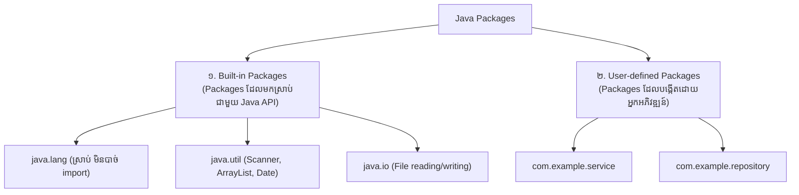

# មេរៀនទី ៨៖ Java Packages & Imports (ការគ្រប់គ្រងកញ្ចប់កូដក្នុង Java)

> **ស្វែងយល់អំពី Java Packages៖ និយមន័យ ប្រភេទនៃ Packages (Built-in vs User-defined) វាក្យសម្ព័ន្ធ import និងការរៀបចំ Directory Structure ស្តង់ដារក្នុងគម្រោង Java**

[](#)
[](#)
[](#)

---

## 📦 ១. អ្វីជា Java Package? (What is a Package?)

នៅក្នុង Java, **Package** ប្រៀបដូចជា **ថត (Folder)** មួយនៅក្នុង File Directory នៃកុំព្យូទ័ររបស់អ្នកដូច្នោះដែរ។ វាត្រូវបានប្រើប្រាស់សម្រាប់**ប្រមូលផ្តុំ Classes, Interfaces, និង Sub-packages ដែលពាក់ព័ន្ធគ្នាដាក់ក្នុងក្រុមតែមួយ**។

### 🌟 ផលប្រយោជន៍ចម្បងនៃការប្រើប្រាស់ Packages៖
1. 🛡️ **ជៀសវាងការជាន់ឈ្មោះគ្នា (Prevent Name Collisions):** អ្នកអាចបង្កើត Class ឈ្មោះ `Date` ក្នុង Package មួយ ទោះបីជាមាន Class ឈ្មោះ `Date` មួយទៀតក្នុង Package ផ្សេងក៏ដោយ។
2. 🗂️ **រៀបចំកូដឱ្យមានសណ្តាប់ធ្នាប់ (Code Organization):** ងាយស្រួលស្វែងរក និងគ្រប់គ្រង Class ក្នុងគម្រោងធំៗ។
3. 🔐 **គ្រប់គ្រងកម្រិតសិទ្ធិ (Access Control):** អាចប្រើ `protected` និង `default` (package-private) access modifiers បាន។

---

## 📚 ២. ប្រភេទនៃ Packages ក្នុង Java



---

## 📥 ៣. របៀបប្រើប្រាស់ Built-in Packages (`import`)

Java API មានបណ្តុំនៃ Library ដ៏សម្បូរបែប។ ដើម្បីទាញយក Class ទាំងនោះមកប្រើ យើងប្រើពាក្យគន្លឹះ **`import`**៖

### ក. Import Class តែមួយគត់ (Single Class Import):
```java
// Import តែ Class Scanner មួយប៉ុណ្ណោះពី java.util package
import java.util.Scanner;

public class Main {
    public static void main(String[] args) {
        Scanner scanner = new Scanner(System.in);
        System.out.print("សូមបញ្ចូលឈ្មោះរបស់អ្នក: ");
        String name = scanner.nextLine();
        System.out.println("សួស្តី " + name + "! 👋");
    }
}
```

### ខ. Import Classes ទាំងអស់ក្នុង Package (Wildcard `*` Import):
```java
// Import គ្រប់ Classes ទាំងអស់ដែលនៅក្នុង java.util package
import java.util.*;
```

> [!NOTE]
> Package **`java.lang`** (ដូចជា `System`, `String`, `Math`) ត្រូវបាន Java import ដោយស្វ័យប្រវត្តជានិច្ច ដូច្នេះអ្នកមិនបាច់សរសេរ `import java.lang.*` ឡើយ។

---

## 🛠️ ៤. របៀបបង្កើត User-defined Package ផ្ទាល់ខ្លួន

ដើម្បីបង្កើត Package ផ្ទាល់ខ្លួន យើងត្រូវសរសេរបន្ទាត់ **`package`** នៅ**បន្ទាត់ទីមួយគេបង្អស់**នៃ Source Code File៖

### File: `MyPackageClass.java`
```java
package mypack;

public class MyPackageClass {
    public static void main(String[] args) {
        System.out.println("នេះគឺជា Package ផ្ទាល់ខ្លួនរបស់ខ្ញុំ! 📦");
    }
}
```

### 💻 របៀប Compile និង Run Package តាម Command Line:
```bash
# 1. Compile ដោយប្រើ flag -d ដើម្បីឱ្យ Java បង្កើត Folder mypack ដោយស្វ័យប្រវត្តិ
javac -d . MyPackageClass.java

# 2. Run ដោយបញ្ជាក់ Fully Qualified Name (packageName.ClassName)
java mypack.MyPackageClass
```

**Output:**
```text
នេះគឺជា Package ផ្ទាល់ខ្លួនរបស់ខ្ញុំ! 📦
```

> [!IMPORTANT]
> នៅក្នុងស្តង់ដារ Enterprise (ដូចជាគម្រោង Spring Boot), ឈ្មោះ Package ត្រូវដាក់បញ្ច្រាសតាម Domain របស់ស្ថាប័ន ដូចជា `com.companyname.projectname.module` ដើម្បីធានាថាឈ្មោះនោះប្លែក និងមិនស្ទួននៅលើពិភពលោក។

---

## 💡 សេចក្តីសង្ខេបសំខាន់ (Key Takeaways)

> [!TIP]
> 1. **Package** គឺជា Folder/Namespace សម្រាប់ផ្ទុក Classes និង Interfaces ឱ្យមានសណ្តាប់ធ្នាប់។
> 2. ប្រើ **`import`** ដើម្បីទាញយក Classes ពី Built-in Libraries (ដូចជា `java.util.Scanner`) ឬពី Package ផ្សេង។
> 3. បន្ទាត់ **`package packageName;`** ត្រូវតែនៅលំដាប់ទីមួយគេបង្អស់ក្នុង File កូដ។

---

← [មេរៀនមុន (០៧៖ Java Encapsulation)](../07-encapsulation/README.md) ｜ [មាតិការួម](../README.md) ｜ [មេរៀនបន្ទាប់ (០៩៖ Java Inheritance)](../09-inheritance/README.md) →
