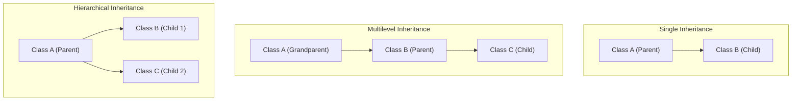

# មេរៀនទី ៩៖ Java Inheritance (ការផ្ទេរ និងទទួលមរតកកូដក្នុង OOP)

> **ស្វែងយល់ស៊ីជម្រៅអំពីសសរទ្រូងទី ២ នៃ OOP គឺ Inheritance៖ និយមន័យ Superclass vs Subclass ពាក្យគន្លឹះ extends ទំនាក់ទំនង IS-A និងប្រភេទនៃ Inheritance ក្នុង Java**

[](#)
[](#)
[](#)

---

## 🧬 ១. អ្វីជា Inheritance? (What is Inheritance?)

នៅក្នុង Java, **Inheritance** គឺជាយន្តការមួយដែលអនុញ្ញាតឱ្យ Class មួយ (ហៅថា **Subclass / Child Class**) អាចស្នង ឬទទួលបាននូវ Attributes និង Methods ទាំងអស់ពី Class មួយទៀត (ហៅថា **Superclass / Parent Class**)។

### 🔑 ពាក្យគន្លឹះ និងគំនិតសំខាន់ៗ៖
* 👴 **Superclass (Parent / Base Class):** Class មេដែលជាម្ចាស់លក្ខណៈសម្បត្តិដើម។
* 👶 **Subclass (Child / Derived Class):** Class កូនដែលស្នងយកលក្ខណៈពី Class មេ ដោយប្រើពាក្យគន្លឹះ **`extends`**។
* 🤝 **ទំនាក់ទំនង IS-A (IS-A Relationship):** ឧទាហរណ៍ `Car` **IS-A** `Vehicle`, `Dog` **IS-A** `Animal`។

---

## 🚀 ២. ហេតុអ្វីត្រូវប្រើប្រាស់ Inheritance? (Why Use Inheritance?)

> [!NOTE]
> 1. ♻️ **Code Reusability (កូដប្រើឡើងវិញបាន):** អ្នកមិនចាំបាច់សរសេរ Attributes ឬ Methods ដដែលៗក្នុង Class កូននោះទេ គឺគ្រាន់តែទាញយកពី Class មេមកប្រើជាការស្រេច (DRY Principle)។
> 2. 🎭 **គាំទ្រដល់ Polymorphism:** Inheritance គឺជាមូលដ្ឋានគ្រឹះក្នុងការធ្វើ Method Overriding ដើម្បីបង្កើត Runtime Polymorphism។

---

## 💻 ៣. កូដគំរូអនុវត្តជាក់ស្តែង (Basic Inheritance Example)

```java
// ១. Superclass (Parent Class)
class Vehicle {
    protected String brand = "Ford"; // Attribute អាចឱ្យ Subclass ចូលប្រើបាន

    public void honk() {
        System.out.println("ស៊ីផ្លេបន្លឺឡើង: ទីត... ទីត...! 📢");
    }
}

// ២. Subclass (Child Class) ស្នងពី Vehicle
class Car extends Vehicle {
    private String modelName = "Mustang";

    public static void main(String[] args) {
        // បង្កើត Object ចេញពី Subclass
        Car myCar = new Car();

        // ហៅ Method ដែលបានស្នងមកពី Superclass
        myCar.honk();

        // ប្រើប្រាស់ Attribute ពី Superclass និង Subclass ចូលគ្នា
        System.out.println(myCar.brand + " " + myCar.modelName);
    }
}
```

**Output:**
```text
ស៊ីផ្លេបន្លឺឡើង: ទីត... ទីត...! 📢
Ford Mustang
```

---

## 🌳 ៤. ប្រភេទនៃ Inheritance ក្នុង Java (Types of Inheritance)



### ១. Single Inheritance
Class កូនមួយ ស្នងពី Class មេមួយ (`B extends A`)។

### ២. Multilevel Inheritance
ការផ្ទេរមរតកបន្តកន្ទុយគ្នាពីមួយជំនាន់ទៅមួយជំនាន់ (`C extends B`, ហើយ `B extends A`)។

### ៣. Hierarchical Inheritance
Class មេតែមួយ មាន Class កូនៗជាច្រើនស្នងពីវា (`B extends A` និង `C extends A`)។

### ៤. Multiple Inheritance (ហេតុអ្វី Java មិនគាំទ្រលើ Class?)
> [!IMPORTANT]
> **សំណួរសម្ភាសន៍ការងារដ៏ល្បីល្បាញ:** *ហេតុអ្វី Java មិនអនុញ្ញាតឱ្យ Class មួយ `extends` ពី Class ច្រើនក្នុងពេលតែមួយ?*  
> **ចម្លើយ:** ដើម្បីជៀសវាង **Diamond Problem (ភាពស្រពេចស្រពិល)**។ ឧបមាថា Class B និង C សុទ្ធតែស្នងពី A ហើយសុទ្ធតែ Override method `display()`។ ប្រសិនបើ Class D ស្នងទាំង B និង C នោះពេល D ហៅ `display()` Java Compiler នឹងមិនដឹងថាត្រូវដំណើរការកូដរបស់ B ឬ C ឡើយ។  
> *(បញ្ហានេះត្រូវបាន Java ដោះស្រាយដោយប្រើប្រាស់ **Interfaces** ជំនួសវិញ)*។

---

## ⛔ ៥. តើអ្វីខ្លះដែល Subclass មិនអាចស្នងយកបាន?

* 🔒 **`private` Members:** Subclass មិនអាចចូលប្រើ Field ឬ Method ដែលជា `private` របស់ Superclass ដោយផ្ទាល់បានទេ (ប៉ុន្តែអាចអានបានតាម Getter/Setter)។
* 🏗️ **Constructors:** Subclass មិនស្នងយក Constructors របស់ Parent ឡើយ (ប៉ុន្តែអាចហៅដំណើរការបានតាមរយៈពាក្យគន្លឹះ `super()`)។

---

## 💡 សេចក្តីសង្ខេបសំខាន់ (Key Takeaways)

> [!TIP]
> 1. **Inheritance** ប្រើពាក្យគន្លឹះ **`extends`** ដើម្បីបង្កើតទំនាក់ទំនង Parent-Child (IS-A)។
> 2. ជួយកាត់បន្ថយកូដច្រំដែល និងធ្វើឱ្យការរៀបចំស្ថាបត្យកម្មកូដកាន់តែមានសណ្តាប់ធ្នាប់។
> 3. Java គាំទ្រ **Single, Multilevel, និង Hierarchical Inheritance** លើ Classes ប៉ុន្តែមិនគាំទ្រ **Multiple Inheritance** លើ Class ឡើយ។

---

← [មេរៀនមុន (០៨៖ Java Packages & Imports)](../08-packages/README.md) ｜ [មាតិការួម](../README.md) ｜ [មេរៀនបន្ទាប់ (១០៖ this Keyword ក្នុង Java)](../10-this-keyword/README.md) →
