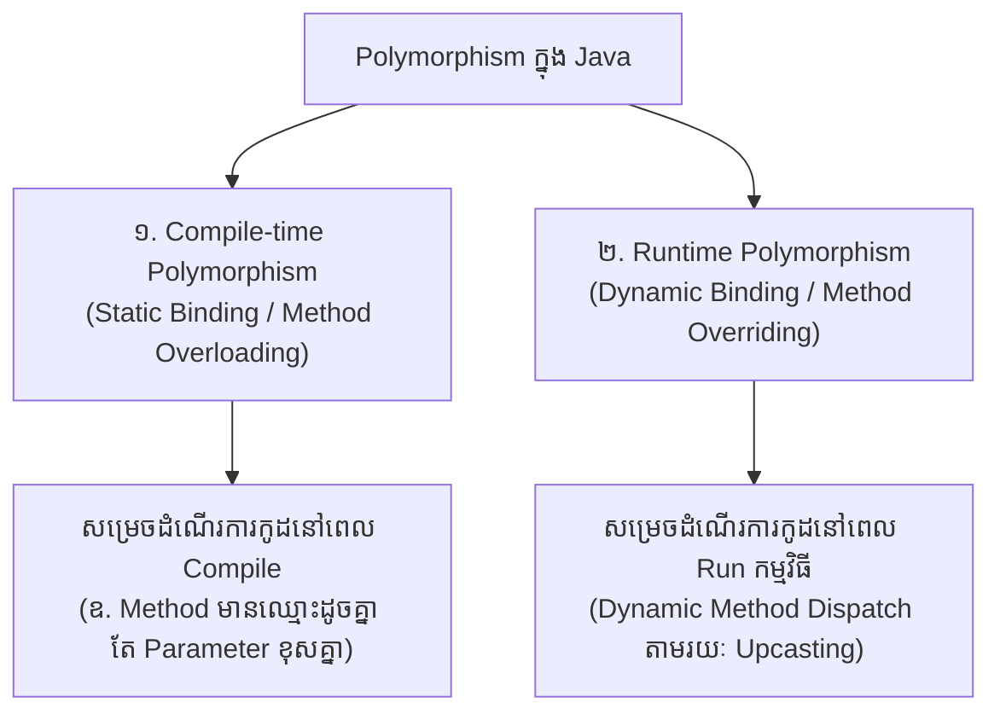

# មេរៀនទី ១៥៖ Java Polymorphism (សមត្ថភាពបញ្ចេញសកម្មភាពច្រើនទម្រង់)

> **ស្វែងយល់ស៊ីជម្រៅអំពីសសរទ្រូងទី ៣ នៃ OOP គឺ Polymorphism៖ និយមន័យ Compile-time vs Runtime Polymorphism យន្តការ Upcasting និង Dynamic Method Dispatch ក្នុង Java**

[](#)
[](#)
[](#)

---

## 🎭 ១. អ្វីជា Polymorphism? (What is Polymorphism?)

ពាក្យថា **Polymorphism** កើតចេញពីពាក្យក្រិកពីរម៉ាត់គឺ *"Poly"* (ច្រើន) និង *"Morph"* (រូបរាង/ទម្រង់)។ នៅក្នុង OOP, Polymorphism សំដៅលើ **សមត្ថភាពរបស់ Method ឬ Object ដែលអាចបញ្ចេញសកម្មភាពបានច្រើនទម្រង់ខុសៗគ្នា** ទៅតាមបរិបទនៃ Object ជាក់ស្តែងដែលកំពុងប្រតិបត្តិការ។

Polymorphism កើតឡើងយ៉ាងពេញលេញនៅពេលដែលមាន **Inheritance** (ការផ្ទេរមរតក) និង **Method Overriding** ធ្វើការរួមគ្នា។

---

## 📊 ២. ប្រភេទទាំង ២ នៃ Polymorphism



---

## 💻 ៣. គំរូអនុវត្តជាក់ស្តែងនៃ Runtime Polymorphism

ឧបមាថាយើងមាន Superclass ឈ្មោះ `Animal` ដែលមាន method `animalSound()` ហើយយើងមាន Subclasses ដូចជា `Pig` និង `Dog` ដែល Override method នោះតាមបែបផែនរៀងៗខ្លួន៖

```java
// Superclass
class Animal {
    public void animalSound() {
        System.out.println("សត្វបញ្ចេញសំឡេង... 🐾");
    }
}

// Subclass 1
class Pig extends Animal {
    @Override
    public void animalSound() {
        System.out.println("ជ្រូកស្រែក: អ៊ូក! អ៊ូក! 🐷");
    }
}

// Subclass 2
class Dog extends Animal {
    @Override
    public void animalSound() {
        System.out.println("ឆ្កែព្រុស: វូស! វូស! 🐶");
    }
}

public class Main {
    public static void main(String[] args) {
        // យន្តការ Upcasting: Superclass Reference ចង្អុលទៅ Subclass Object
        Animal myAnimal = new Animal();
        Animal myPig = new Pig();  // Reference ជា Animal តែ Object ជា Pig
        Animal myDog = new Dog();  // Reference ជា Animal តែ Object ជា Dog

        // JVM នឹងសម្រេចដំណើរការ method ទៅតាម Object ជាក់ស្តែងនៅ Runtime:
        myAnimal.animalSound();
        myPig.animalSound();
        myDog.animalSound();
    }
}
```

**Output:**
```text
សត្វបញ្ចេញសំឡេង... 🐾
ជ្រូកស្រែក: អ៊ូក! អ៊ូក! 🐷
ឆ្កែព្រុស: វូស! វូស! 🐶
```

---

## 🌟 ៤. ហេតុអ្វីត្រូវប្រើប្រាស់ Polymorphism? (Why Use Polymorphism?)

> [!NOTE]
> **អត្ថប្រយោជន៍ចម្បងៗក្នុងស្ថាបត្យកម្ម Software៖**
> 1. 🧩 **ភាពបត់បែនខ្ពស់ (Flexibility & Extensibility):** ប្រសិនបើថ្ងៃក្រោយអ្នកបង្កើត Subclass ថ្មីមួយទៀត (ដូចជា `Cat` ឬ `Bird`) អ្នកមិនចាំបាច់កែប្រែកូដចាស់ដែលមានស្រាប់ឡើយ។
> 2. 🗃️ **ការគ្រប់គ្រង Data Collection:** អ្នកអាចបង្កើត Array ឬ List នៃ Superclass (ឧទាហរណ៍ `Animal[] zoo = {new Dog(), new Pig(), new Cat()};`) ហើយ Loop ដំណើរការ `animalSound()` លើសត្វទាំងអស់បានយ៉ាងងាយស្រួល។

---

## 💡 សេចក្តីសង្ខេបសំខាន់ (Key Takeaways)

> [!TIP]
> 1. **Polymorphism** អនុញ្ញាតឱ្យ Object បញ្ចេញឥរិយាបថផ្សេងៗគ្នាតាមកាលៈទេសៈ។
> 2. **Compile-time Polymorphism** សម្រេចបានតាមរយៈ **Method Overloading**។
> 3. **Runtime Polymorphism** សម្រេចបានតាមរយៈ **Method Overriding** និង **Upcasting**។
> 4. ជាមូលដ្ឋានគ្រឹះដ៏រឹងមាំនៃការបង្កើត Interface-driven development ក្នុង Spring Framework។

---

← [មេរៀនមុន (១៤៖ final Keyword ក្នុង Java)](../14-final-keyword/README.md) ｜ [មាតិការួម](../README.md) ｜ [មេរៀនបន្ទាប់ (១៦៖ Java Inner Classes)](../16-inner-classes/README.md) →
