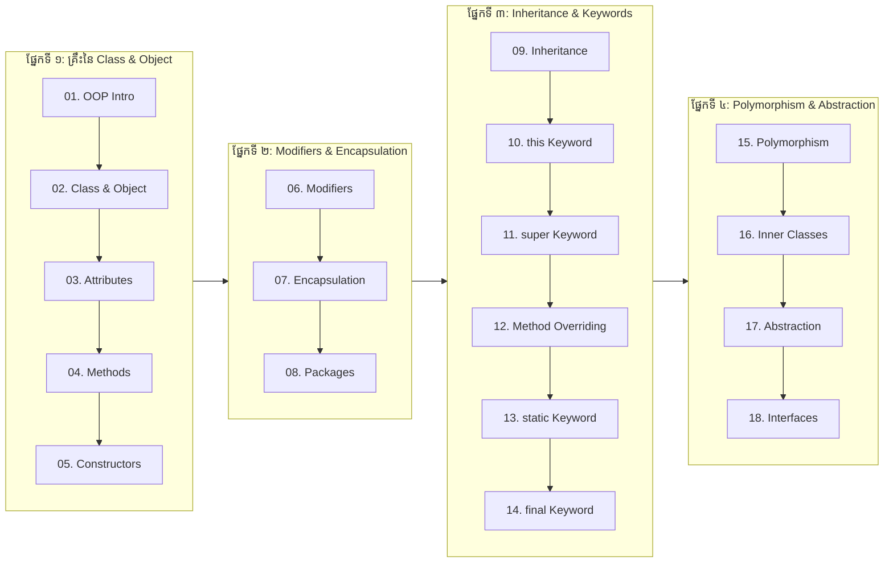

# Java កម្រិតខ្ពស់ OOP (Advance Java OOP for Developers)

> **វគ្គសិក្សា Java Object-Oriented Programming (OOP) កម្រិតវិស្វកម្មសូហ្វវែរ (១៨ មេរៀនពេញលេញ + ៨៦ ស្លាយបង្រៀន) ចម្លងចេញពីស្លាយ និងមានកូដអនុវត្តជាក់ស្តែង។**

---

## 📖 អំពីវគ្គសិក្សានេះ

**Object-Oriented Programming (OOP)** គឺជាមូលដ្ឋានគ្រឹះដ៏មានអានុភាពបំផុតនៃការអភិវឌ្ឍសូហ្វវែរខ្នាតសហគ្រាស (Enterprise Software Engineering)។ វគ្គសិក្សា **Advance Java** នេះផ្តោតស៊ីជម្រៅលើសសរទ្រូងទាំង ៤ នៃ OOP (`Encapsulation`, `Inheritance`, `Polymorphism`, `Abstraction`) ព្រមទាំងយន្តការនៃការគ្រប់គ្រង Memory, Class Design Patterns, Keywords សំខាន់ៗ (`this`, `super`, `static`, `final`), Inner Classes និង Interfaces ដើម្បីត្រៀមខ្លួនឆ្ពោះទៅកាន់ការកសាងស្ថាបត្យកម្មលើ Spring Framework និង Spring Boot Microservices។

> [!TIP]
> 🗺️ **ចង់ឃើញផែនទីបង្ហាញផ្លូវពេញលេញ?**  
> សូមចូលទៅកាន់ [Java Full Stack Web Development Roadmap](ROADMAP.md) ដើម្បីមើលជំហានលម្អិតទាំង ៦ ចាប់ពីកម្រិតដំបូងរហូតដល់ក្លាយជា Senior Full Stack Engineer!

---

## 🧭 គំនូសបំព្រួញលំដាប់លំដោយនៃការរៀន (Learning Path)

---

## 📚 មាតិកាវគ្គសិក្សា (Table of Contents)

| មេរៀន  | ប្រធានបទ (Topic)                            | ខ្លឹមសារ និងចំណុចសំខាន់ៗ                                                                            |               តំណភ្ជាប់ (Link)               |
| :----: | :------------------------------------------ | :-------------------------------------------------------------------------------------------------- | :------------------------------------------: |
| **01** | **សេចក្តីផ្តើមអំពី OOP (OOP Introduction)** | និយមន័យ OOP, គុណសម្បត្តិនៃ OOP, អត្ថប្រយោជន៍ និងសសរទ្រូងទាំង ៤                                      |  [អានមេរៀន](01-oop-introduction/README.md)   |
| **02** | **Java Class និង Object**                   | និយមន័យ Class vs Object, ការបង្កើត Class, ការ Instantiate តាម `new`, Multiple Objects               | [អានមេរៀន](02-classes-and-objects/README.md) |
| **03** | **Java Class Attributes**                   | Attributes / Fields ក្នុង Class, ការកែប្រែតម្លៃ, Multiple Attributes, `final` attributes            |  [អានមេរៀន](03-class-attributes/README.md)   |
| **04** | **Java Class Methods**                      | ការបង្កើត Method, `static` vs `public` methods, ការហៅ Method តាមរយៈ Object                          |    [អានមេរៀន](04-class-methods/README.md)    |
| **05** | **Java Constructors**                       | និយមន័យ Constructor, Default vs Parameterized Constructor, Constructor Overloading                  |    [អានមេរៀន](05-constructors/README.md)     |
| **06** | **Java Modifiers**                          | Access Modifiers (`public`, `private`, `protected`, default) និង Non-Access Modifiers               |      [អានមេរៀន](06-modifiers/README.md)      |
| **07** | **Java Encapsulation**                      | គោលការណ៍ Data Hiding, ការប្រើប្រាស់ Getter និង Setter methods, Validation Logic                     |    [អានមេរៀន](07-encapsulation/README.md)    |
| **08** | **Java Packages & Imports**                 | Built-in Packages (`java.util.*`), User-defined Packages, វាក្យសម្ព័ន្ធ `import`, Directory Path    |      [អានមេរៀន](08-packages/README.md)       |
| **09** | **Java Inheritance**                        | Subclass និង Superclass, ពាក្យគន្លឹះ `extends`, ប្រភេទនៃ Inheritance, IS-A Relationship             |     [អានមេរៀន](09-inheritance/README.md)     |
| **10** | **this Keyword ក្នុង Java**                 | សំដៅទៅ Current Class Instance Variable, ការហៅ Constructor `this()`, ការហៅ Method                    |    [អានមេរៀន](10-this-keyword/README.md)     |
| **11** | **super Keyword ក្នុង Java**                | សំដៅទៅ Parent Class Variable, Method, និង Constructor Chaining តាមរយៈ `super()`                     |    [អានមេរៀន](11-super-keyword/README.md)    |
| **12** | **Java Method Overriding**                  | វិធាននៃ Method Overriding, Annotation `@Override`, Dynamic Method Dispatch (Runtime)                |  [អានមេរៀន](12-method-overriding/README.md)  |
| **13** | **static Keyword ក្នុង Java**               | Static Variables (Class Variables), Static Methods, Static Blocks, ការគ្រប់គ្រង Memory              |   [អានមេរៀន](13-static-keyword/README.md)    |
| **14** | **final Keyword ក្នុង Java**                | `final` Variable (Constant), `final` Method (ការពារ Overriding), `final` Class (ការពារ Inheritance) |    [អានមេរៀន](14-final-keyword/README.md)    |
| **15** | **Java Polymorphism**                       | គោលការណ៍ Polymorphism, Upcasting, Runtime Polymorphism ជាមួយ Superclass Reference                   |    [អានមេរៀន](15-polymorphism/README.md)     |
| **16** | **Java Inner Classes**                      | Nested Classes, Inner Classes (Non-static), Static Nested Classes, Private Inner Class              |    [អានមេរៀន](16-inner-classes/README.md)    |
| **17** | **Java Abstraction**                        | Abstract Class និង Abstract Methods, វិធាននៃ Abstraction, ការលាក់បាំង Implementation                |     [អានមេរៀន](17-abstraction/README.md)     |
| **18** | **Java Interfaces**                         | Interface និយមន័យ, ពាក្យគន្លឹះ `implements`, Multiple Interfaces Implementation, Default Methods    |     [អានមេរៀន](18-interfaces/README.md)      |

---

## 📽️ ស្លាយមេរៀនបង្រៀន (Slide Presentations)

វគ្គសិក្សានេះមានភ្ជាប់មកជាមួយនូវស្លាយបង្រៀនចំនួន ៨៦ ស្លាយ ដែលបានរៀបចំចងក្រងយ៉ាងផ្ចិតផ្ចង់៖

- 📊 **[កាតាឡុកស្លាយបង្រៀន ៨៦ ស្លាយ (86 Lecture Slides Catalog)](slides/README.md)**

---

## 🗺️ ផែនទីបង្ហាញផ្លូវអាជីព (Career Roadmap)

វគ្គសិក្សានេះគឺជាជំហានទីពីរ (Phase 1 Part 2) នៃមាគ៌ាវិស្វករសូហ្វវែរសហគ្រាស៖

- 🚀 **[ផែនទីបង្ហាញផ្លូវពេញលេញ Java Full Stack Web Development](ROADMAP.md)**

---

## 🔗 ស៊េរីវគ្គសិក្សាពាក់ព័ន្ធ (Sister Repositories)

- 📘 [មូលដ្ឋានគ្រឹះ Java (Basic Java)](https://github.com/sakousa856-sketch/java-basic-for-developers-khmer)
- 📙 [Spring Framework Core Architecture](https://github.com/sakousa856-sketch/spring-framework-for-developers-khmer)
- 📕 [Spring Boot Enterprise & Microservices](https://github.com/sakousa856-sketch/spring-boot-for-developers-khmer)
- 💼 [Java & Spring Interview Handbook](https://github.com/sakousa856-sketch/java-spring-interview-handbook-khmer)
