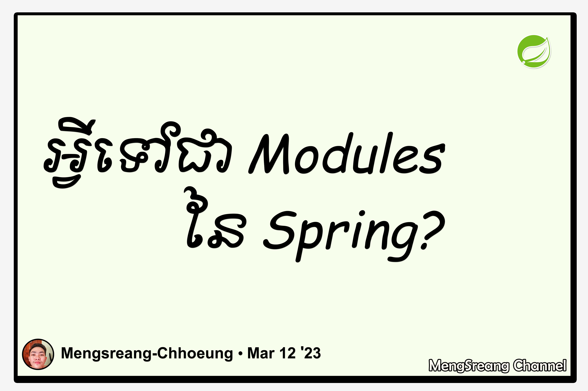

# Part 4: Spring Modules Architecture

> 🌐 **Language / ភាសា:** 🇬🇧 **[English](README.md)** | 🇰🇭 [ភាសាខ្មែរ (Khmer)](README.kh.md)

## Table of Contents

- [1. Spring's Layered Modular Architecture](#1-springs-layered-modular-architecture)
- [2. Detailed Breakdown of the 5 Module Groups](#2-detailed-breakdown-of-the-5-module-groups)
- [3. Architecture Summary Table](#3-architecture-summary-table)

---

## 1. Spring's Layered Modular Architecture

The **Spring Framework** is designed with a **Modular Architecture**, comprising approximately 20 distinct modules grouped into core layers. The primary advantage of this modularity is:
> **You only pull in the specific dependencies your application requires, keeping your artifact lean and free of unnecessary bloat.**

---

## 2. Detailed Breakdown of the 5 Module Groups

### 1. Spring Core Container
The foundational layer upon which everything else sits:
- **`spring-core` & `spring-beans`:** Provide the essential **IoC (Inversion of Control)** and **Dependency Injection (DI)** capabilities.
- **`spring-context`:** Extends Core and Beans with application lifecycle events, **Internationalization (I18n)**, validation, and enterprise integration.
- **`spring-expression` (SpEL):** Provides the Spring Expression Language for querying and mutating an object graph dynamically at runtime.

### 2. AOP, Aspects, and Instrumentation
- **`spring-aop`:** Implements **Aspect-Oriented Programming**, enabling developers to isolate cross-cutting concerns (logging, security, auditing) via pointcuts and advices.
- **`spring-aspects`:** Seamless integration with **AspectJ**.
- **`spring-instrument`:** Class instrumentation and custom ClassLoader implementations for application servers.

### 3. Data Access / Integration
Comprehensive persistence and transaction capabilities:
- **`spring-jdbc`:** Provides `JdbcTemplate`, cutting JDBC boilerplate code by over 80%.
- **`spring-tx`:** Enterprise declarative and programmatic transaction management (`@Transactional`).
- **`spring-orm`:** Integration layer for popular ORM tools (Hibernate, JPA).
- **`spring-oxm`:** Object-to-XML mapping abstractions (JAXB, Castor).
- **`spring-jms`:** Java Message Service support for sending and receiving asynchronous messages.

### 4. Web Module
- **`spring-web`:** Core web-oriented integration features (multipart file uploads, HTTP clients, web contexts).
- **`spring-webmvc`:** Model-View-Controller framework for building REST APIs and traditional web apps.
- **`spring-websocket`:** Bidirectional real-time socket communication.

### 5. Test Module
- **`spring-test`:** Comprehensive test runner support for **JUnit** and **TestNG**, featuring container caching and mock objects.

---

## 3. Architecture Summary Table

| Layer | Key Modules | Core Role |
| :--- | :--- | :--- |
| **Test** | `spring-test` | Unit and integration testing with mocks |
| **Web** | `web`, `webmvc`, `websocket` | REST Controllers, Views, Web Requests |
| **Data Access** | `jdbc`, `tx`, `orm`, `jms` | Database access, ORM persistence, transactions |
| **AOP** | `aop`, `aspects`, `instrument` | Cross-cutting concerns (audit, logging, security) |
| **Core Container** | `core`, `beans`, `context`, `expression` | Bean factory, wiring, lifecycle, SpEL |

---

## 🧭 Lesson Navigation

| Previous | Main Index | Next |
| :--- | :---: | :--- |
| [← Part 3: Features of Spring](../03-features-of-spring/README.md) | [📚 Spring Framework Index](../README.md) | [Part 5: Versions of Spring →](../05-versions-of-spring/README.md) |
