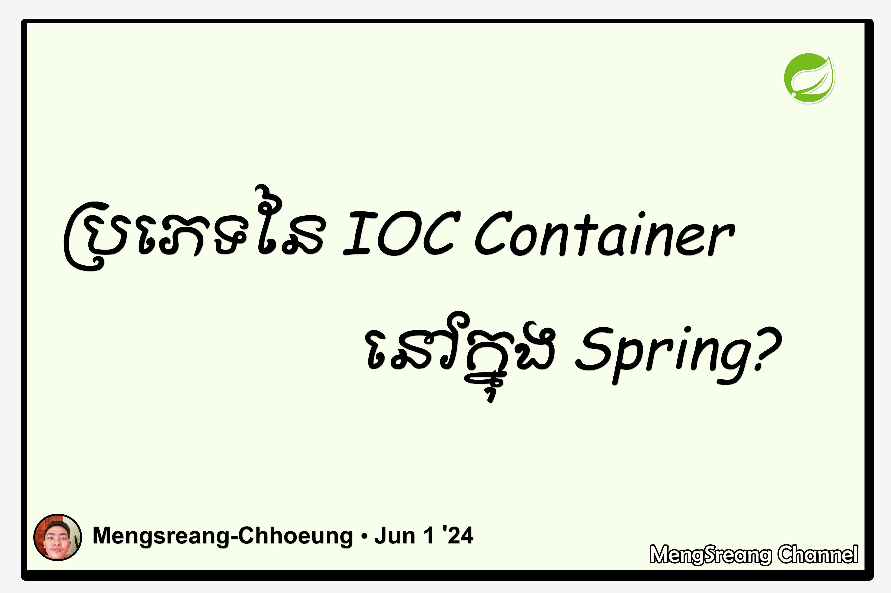

# Part 7: ប្រភេទនៃ IoC Containers (Types of IoC Containers)

> 🌐 **ភាសា / Language:** 🇰🇭 **[ភាសាខ្មែរ (Khmer)](README.kh.md)** | 🇬🇧 [English](README.md)



## មាតិកា (Table of Contents)

- [1. ប្រភេទទាំង ២ នៃ Spring IoC Container](#1-ប្រភេទទាំង-២-នៃ-spring-ioc-container)
- [2. ស្វែងយល់ពី BeanFactory](#2-ស្វែងយល់ពី-beanfactory)
- [3. ស្វែងយល់ពី ApplicationContext](#3-ស្វែងយល់ពី-applicationcontext)
- [4. តារាងប្រៀបធៀប៖ BeanFactory vs ApplicationContext](#4-តារាងប្រៀបធៀប-beanfactory-vs-applicationcontext)
- [5. Implementations ពេញនិយមនៃ ApplicationContext](#5-implementations-ពេញនិយមនៃ-applicationcontext)

---

## 1. ប្រភេទទាំង ២ នៃ Spring IoC Container

នៅក្នុង Spring Framework កុងតឺន័រ **IoC Container** ត្រូវបានបែងចែកជា ២ ប្រភេទធំៗតាមរយៈ Java Interfaces៖

1. **`BeanFactory`** — កុងតឺន័រមូលដ្ឋានកម្រិតស្រាល (Basic Container)
2. **`ApplicationContext`** — កុងតឺន័រកម្រិតខ្ពស់សម្រាប់ Enterprise (Advanced Container)

```
        ┌──────────────────┐
        │   BeanFactory    │  (Basic IoC & DI)
        └────────┬─────────┘
                 │ extends (ស្នងមរតក)
                 ▼
        ┌──────────────────┐
        │ApplicationContext│  (AOP, I18n, Events, Web)
        └──────────────────┘
```

---

## 2. ស្វែងយល់ពី BeanFactory

`org.springframework.beans.factory.BeanFactory` គឺជា Interface មូលដ្ឋានគ្រឹះបំផុតរបស់ Spring Core Container៖
- ផ្តល់នូវមុខងារចាំបាច់ក្នុងការកំណត់ និងហៅប្រើ Beans (`getBean()`)។
- **Lazy Loading (ផ្ទុកយឺត):** BeanFactory នឹងមិនបង្កើត Instance របស់ Bean ភ្លាមៗពេល App ចាប់ផ្តើមនោះទេ លុះត្រាតែមានកូដហៅ `getBean()` ទើបវាចាប់ផ្តើមបង្កើត។
- **សមស្របសម្រាប់:** ឧបករណ៍ដែលមាន Memory កម្រិតទាបបំផុតដូចជា Mobile ឬ Embedded IoT Devices (ប៉ុន្តែបច្ចុប្បន្នកម្រត្រូវបានប្រើណាស់)។

---

## 3. ស្វែងយល់ពី ApplicationContext

`org.springframework.context.ApplicationContext` គឺជា Interface កម្រិតខ្ពស់ដែលស្នងមរតកពី `BeanFactory` និងបន្ថែមនូវមុខងារ Enterprise ជាច្រើន៖
- **Eager Loading (ផ្ទុកជាមុន):** បង្កើត Singleton Beans ទាំងអស់ជាមុនពេល Application កំពុង Start ដែលជួយឱ្យយើងដឹងពីកំហុសភ្លាមៗ (Fail-Fast)។
- **AOP Integration:** គាំទ្រការតភ្ជាប់ Aspect-Oriented Programming ដោយស្វ័យប្រវត្តិ។
- **Message Resource (I18n):** គាំទ្រការបង្ហាញអក្សរ និងភាសាផ្សេងៗគ្នា (Internationalization)។
- **Event Publication:** គាំទ្រប្រព័ន្ធបញ្ជូន Event ផ្ទៃក្នុង (ApplicationEventPublisher)។
- **Environment & Profiles:** ការគ្រប់គ្រង Config តាម Dev, Staging, Prod។

---

## 4. តារាងប្រៀបធៀប៖ BeanFactory vs ApplicationContext

| លក្ខណៈសម្បត្តិ | `BeanFactory` | `ApplicationContext` |
| :--- | :--- | :--- |
| **យុទ្ធសាស្ត្របង្កើត Bean** | **Lazy** (បង្កើតពេលហៅប្រើ) | **Eager** (បង្កើតទុកជាមុនពេល Startup) |
| **Enterprise Services** | មានតែកម្រិតមូលដ្ឋាន | ពេញលេញ (AOP, I18n, Validation) |
| **Event Handling** | មិនគាំទ្រ | គាំទ្រយ៉ាងពេញលេញ (`ApplicationEvent`) |
| **ការប្រើប្រាស់បច្ចុប្បន្ន** | កម្រប្រើណាស់ | **ជាជម្រើសស្តង់ដារ ១០០% ក្នុង Spring & Spring Boot** |

---

## 5. Implementations ពេញនិយមនៃ ApplicationContext

1. **`AnnotationConfigApplicationContext`:** ប្រើសម្រាប់ Standalone Java App ដោយអាន `@Configuration` classes។
2. **`ClassPathXmlApplicationContext`:** ប្រើសម្រាប់អានឯកសារ XML Configuration ពី Classpath។
3. **`AnnotationConfigServletWebServerApplicationContext`:** ជា Container លំនាំដើមដែល **Spring Boot Web** ប្រើប្រាស់ដោយស្វ័យប្រវត្តិ។

---

## 🧭 ការរុករកមេរៀន (Lesson Navigation)

| ថយក្រោយ (Previous) | មាតិកាចម្បង (Home) | បន្ទាប់ (Next) |
| :--- | :---: | :--- |
| [← Part 6: តើ Inversion of Control (IoC) ជាអ្វី?](../06-what-is-ioc/README.kh.md) | [📚 មាតិកា Spring Framework](../README.kh.md) | [Part 8: ឯកសារ Spring Configuration →](../08-spring-configuration-file/README.kh.md) |
