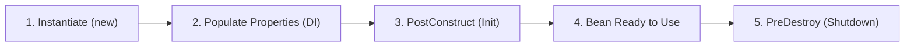

# Part 10: What Is a Spring Bean?

> 🌐 **Language / ភាសា:** 🇬🇧 **[English](README.md)** | 🇰🇭 [ភាសាខ្មែរ (Khmer)](README.kh.md)

## Table of Contents

- [1. Definition of a Spring Bean](#1-definition-of-a-spring-bean)
- [2. Regular Java Object vs. Spring Bean](#2-regular-java-object-vs-spring-bean)
- [3. Anatomy of a Spring Bean Definition](#3-anatomy-of-a-spring-bean-definition)
- [4. High-Level Bean Lifecycle](#4-high-level-bean-lifecycle)

---

## 1. Definition of a Spring Bean

In the **Spring Framework**, a **Bean** is defined as:
> **An object that is instantiated, assembled, and managed by a Spring IoC container.**

If you manually execute `User user = new User();` in Java, `user` is merely a standard Java object. It only becomes a **Spring Bean** when its lifecycle, dependencies, and configuration are handed over to the Spring IoC Container via annotations like `@Component` or Java configuration methods marked with `@Bean`.

---

## 2. Regular Java Object vs. Spring Bean

| Property | Plain Java Object (`new`) | Spring Bean (IoC Managed) |
| :--- | :--- | :--- |
| **Creator** | Developer invokes constructor manually | **Spring IoC Container** instantiates it |
| **Lifecycle** | Governed strictly by standard GC | Governed by Container scopes & hooks |
| **Dependency Wiring** | Setters/constructors invoked manually | Injected automatically (`@Autowired`) |
| **AOP Interception** | Not possible natively | Wrapped in dynamic proxies (`@Transactional`, etc.) |

---

## 3. Anatomy of a Spring Bean Definition

When the container registers a bean definition, it records essential metadata:
1. **Class Name:** The fully qualified implementation class.
2. **Bean Identifier:** A unique name/ID within the container.
3. **Scope:** The lifecycle boundary (e.g., `singleton`, `prototype`).
4. **Dependencies:** References to other collaborator beans.
5. **Lifecycle Callbacks:** Initialization (`@PostConstruct`) and destruction (`@PreDestroy`) methods.

---

## 4. High-Level Bean Lifecycle

---

## 🧭 Lesson Navigation

| Previous | Main Index | Next |
| :--- | :---: | :--- |
| [← Part 9: 3 Ways to Configure Spring](../09-ways-to-configure-spring/README.md) | [📚 Spring Framework Index](../README.md) | [Part 11: Defining Bean Scopes →](../11-how-to-define-bean-scope/README.md) |
