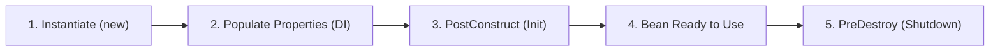

# Part 10: តើ Spring Bean ជាអ្វី? (What Is a Spring Bean?)

## មាតិកា (Table of Contents)

- [1. និយមន័យនៃ Spring Bean](#1-និយមន័យនៃ-spring-bean)
- [2. ការប្រៀបធៀប៖ Java Object ធម្មតា vs Spring Bean](#2-ការប្រៀបធៀប-java-object-ធម្មតា-vs-spring-bean)
- [3. ធាតុផ្សំនៃ Spring Bean Definition](#3-ធាតុផ្សំនៃ-spring-bean-definition)
- [4. វដ្តជីវិតសង្ខេបរបស់ Bean (Bean Lifecycle)](#4-វដ្តជីវិតសង្ខេបរបស់-bean-bean-lifecycle)

---

## 1. និយមន័យនៃ Spring Bean

នៅក្នុង **Spring Framework** ពាក្យថា **Bean** ឬ **Spring Bean** គឺជា៖
> **Instance របស់ Java Class (Java Object) ទាំងឡាយណាដែលត្រូវបានបង្កើត (Instantiated), ផ្គុំតភ្ជាប់ (Wired), និងគ្រប់គ្រងវដ្តជីវិតទាំងស្រុងដោយ Spring IoC Container។**

ប្រសិនបើអ្នកសរសេរ `User user = new User();` ដោយដៃ នោះ `user` គ្រាន់តែជា Java Object ធម្មតា មិនមែនជា Spring Bean ឡើយ។ ផ្ទុយទៅវិញ ប្រសិនបើ Class នោះត្រូវបានគ្រប់គ្រង និងបង្កើតដោយ Spring IoC Container តាមរយៈ `@Component` ឬ `@Bean` ទើបវាមានឈ្មោះជា **Spring Bean**។

---

## 2. ការប្រៀបធៀប៖ Java Object ធម្មតា vs Spring Bean

| ចំណុចប្រៀបធៀប | Java Object ធម្មតា (`new`) | Spring Bean (គ្រប់គ្រងដោយ IoC) |
| :--- | :--- | :--- |
| **អ្នកបង្កើត** | អ្នកសរសេរកូដហៅ `new` ដោយផ្ទាល់ | **Spring IoC Container** ជាអ្នកបង្កើត |
| **ការគ្រប់គ្រង Memory** | Java Garbage Collection ធម្មតា | IoC Container គ្រប់គ្រងតាម Scope និង Lifecycle |
| **Dependency Injection** | ត្រូវហៅ Setter ឬ Constructor ដោយដៃ | ផ្គុំ Dependencies ស្វ័យប្រវត្តិតាម `@Autowired` |
| **AOP Proxies** | មិនអាចប្រើប្រាស់មុខងារ AOP បាន | អាចស្រោប AOP (Transactions, Security, Cache) |

---

## 3. ធាតុផ្សំនៃ Spring Bean Definition

នៅពេល IoC Container ចុះឈ្មោះ Bean មួយ វារក្សាទុកនូវព័ត៌មាន (Metadata) ដូចជា៖
1. **Bean Class Name:** Full package និងឈ្មោះ Class។
2. **Bean Name / ID:** ឈ្មោះសម្គាល់តែមួយគត់ក្នុង Container។
3. **Scope:** វិសាលភាពរបស់ Bean (ឧ. `singleton`, `prototype`)។
4. **Constructor Arguments & Properties:** តម្លៃ ឬ Dependencies ដែលត្រូវ Inject។
5. **Lifecycle Callbacks:** Method ណាដែលត្រូវដំណើរការពេល Init (`@PostConstruct`) និងពេល Destroy (`@PreDestroy`)។

---

## 4. វដ្តជីវិតសង្ខេបរបស់ Bean (Bean Lifecycle)

---

## 🧭 ការរុករកមេរៀន (Lesson Navigation)

| ថយក្រោយ (Previous) | មាតិកាចម្បង (Home) | បន្ទាប់ (Next) |
| :--- | :---: | :--- |
| [← Part 9: វិធីទាំង ៣ ក្នុងការកំណត់ Config ក្នុង Spring](../09-ways-to-configure-spring/README.md) | [📚 មាតិកា Spring Framework](../README.md) | [Part 11: របៀបកំណត់វិសាលភាព Bean Scope →](../11-how-to-define-bean-scope/README.md) |
