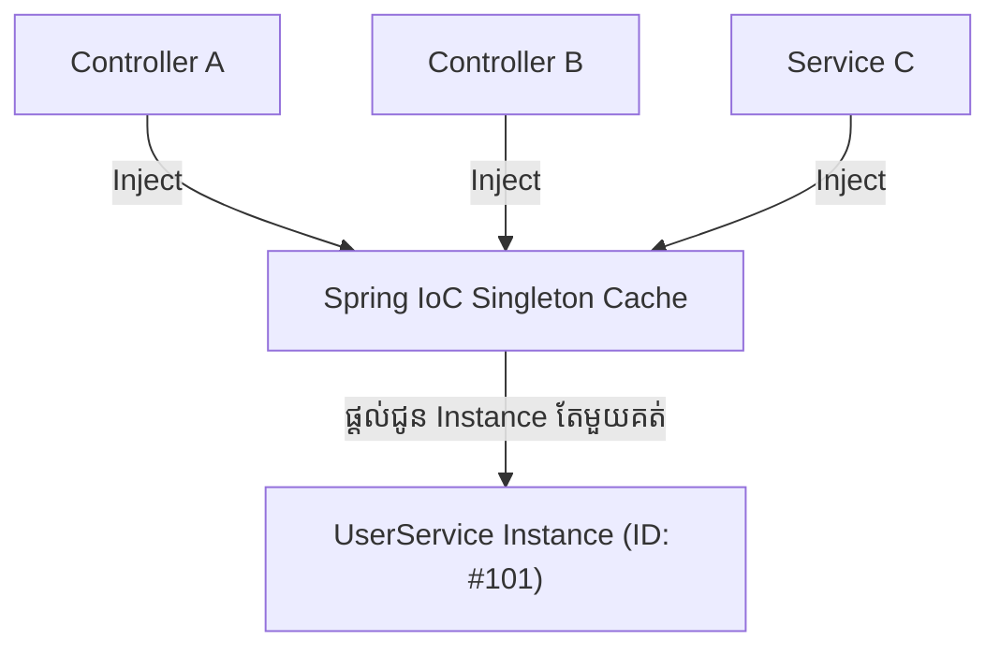

# Part 13: ការយល់ដឹងស៊ីជម្រៅអំពី Singleton Scope (Singleton Scope Deep Dive)

> 🌐 **ភាសា / Language:** 🇰🇭 **[ភាសាខ្មែរ (Khmer)](README.kh.md)** | 🇬🇧 [English](README.md)


## មាតិកា (Table of Contents)

- [1. យន្តការដំណើរការនៃ Singleton Scope](#1-យន្តការដំណើរការនៃ-singleton-scope)
- [2. Spring Singleton ខុសគ្នាដូចម្តេចពី GoF Singleton Pattern?](#2-spring-singleton-ខុសគ្នាដូចម្តេចពី-gof-singleton-pattern)
- [3. ការផ្ទៀងផ្ទាត់ Bean Identity ក្នុងកូដជាក់ស្តែង](#3-ការផ្ទៀងផ្ទាត់-bean-identity-ក្នុងកូដជាក់ស្តែង)
- [4. យន្តការផ្ទុក Bean ក្នុង Spring Container (Singleton Cache)](#4-យន្តការផ្ទុក-bean-ក្នុង-spring-container-singleton-cache)

---

## 1. យន្តការដំណើរការនៃ Singleton Scope

នៅពេលដែលយើងកំណត់ Bean មួយជា **Singleton Scope** នៅក្នុង Spring Framework៖
> **Spring IoC Container នឹងបង្កើត Instance តែមួយគត់ (Exactly One Instance) សម្រាប់ Bean Definition នោះ រួចរក្សាទុកក្នុង Cache របស់កុងតឺន័រ។**

រាល់ពេលដែលមាន Class ផ្សេងទៀតចង់ហៅប្រើ (Inject) ឬពេលដែលយើងហៅ `context.getBean()` នោះ Spring នឹងប្រគល់នូវ Reference នៃ Object ដដែលៗដែលបានរក្សាទុកក្នុង Cache នោះមកវិញជានិច្ច។



---

## 2. Spring Singleton ខុសគ្នាដូចម្តេចពី GoF Singleton Pattern?

នេះជាចំណោទសួរញឹកញាប់បំផុតក្នុងបទសម្ភាសន៍ការងារ (Interview Question)៖

| ចំណុចប្រៀបធៀប | GoF Singleton Pattern (Classic Java) | Spring Singleton Scope |
| :--- | :--- | :--- |
| **វិសាលភាព (Scope)** | **១ Instance ក្នុង ១ Java ClassLoader** | **១ Instance ក្នុង ១ Spring Container (`ApplicationContext`)** |
| **យន្តការបង្កើត** | Constructor ត្រូវបានដាក់ជា `private` និងមាន `static getInstance()` | Constructor នៅតែជា `public` (Spring ជាអ្នកបង្កើត) |
| **ភាពងាយស្រួលតេស្ត** | ពិបាក Mock ខ្លាំង (ដោយសារ hardcoded static) | **ងាយស្រួល Mock ១០០%** សម្រាប់ Unit Testing |
| **ភាពបត់បែន** | រឹងរូស ពិបាកផ្លាស់ប្តូរ | អាចផ្លាស់ប្តូរទៅជា Prototype ដោយគ្រាន់តែកែ `@Scope` |

---

## 3. ការផ្ទៀងផ្ទាត់ Bean Identity ក្នុងកូដជាក់ស្តែង

យើងអាចធ្វើតេស្តផ្ទៀងផ្ទាត់ថា Instance ទាំងពីរគឺដូចគ្នាដោយប្រើសញ្ញា `==` (Reference Equality)៖

```java
ApplicationContext context = new AnnotationConfigApplicationContext(AppConfig.class);

// ទាញយក Bean ពីរដងផ្សេងគ្នា
UserService service1 = context.getBean(UserService.class);
UserService service2 = context.getBean(UserService.class);

// លទ្ធផលចេញ true ពីព្រោះវាជា Object តែមួយក្នុង Memory
System.out.println(service1 == service2); // Output: true
```

---

## 4. យន្តការផ្ទុក Bean ក្នុង Spring Container (Singleton Cache)

នៅពីក្រោយខ្នង Spring IoC Container (ជាពិសេស `DefaultSingletonBeanRegistry`) រក្សាទុក Singleton Beans ទាំងអស់នៅក្នុង Concurrent Map មួយឈ្មោះថា៖

```java
private final Map<String, Object> singletonObjects = new ConcurrentHashMap<>(256);
```

នៅពេលមានការស្នើសុំ Bean៖
1. Container នឹងស្វែងរកឈ្មោះ Bean ក្នុង `singletonObjects` Map ជាមុនសិន។
2. បើមានរួចហើយ វានឹង Return Instance នោះមកភ្លាម។
3. បើមិនទាន់មាន វានឹងបង្កើតថ្មី រក្សាទុកក្នុង Map រួចទើប Return មកវិញ។

---

## 🧭 ការរុករកមេរៀន (Lesson Navigation)

| ថយក្រោយ (Previous) | មាតិកាចម្បង (Home) | បន្ទាប់ (Next) |
| :--- | :---: | :--- |
| [← Part 12: Default Bean Scope ក្នុង Spring Framework](../12-default-bean-scope/README.kh.md) | [📚 មាតិកា Spring Framework](../README.kh.md) | [Part 14: តើ Dependency Injection (DI) ជាអ្វី? →](../14-what-is-dependency-injection/README.kh.md) |
