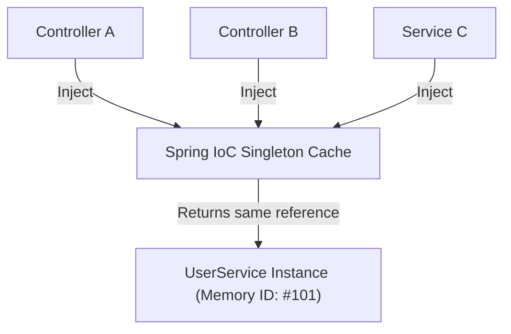

# Part 13: Singleton Scope Deep Dive

> 🌐 **Language / ភាសា:** 🇬🇧 **[English](README.md)** | 🇰🇭 [ភាសាខ្មែរ (Khmer)](README.kh.md)


## Table of Contents

- [1. Mechanics of the Singleton Scope](#1-mechanics-of-the-singleton-scope)
- [2. Spring Singleton vs. Gang of Four (GoF) Singleton Pattern](#2-spring-singleton-vs-gang-of-four-gof-singleton-pattern)
- [3. Verifying Bean Identity in Code](#3-verifying-bean-identity-in-code)
- [4. Internal Registry: The Singleton Cache](#4-internal-registry-the-singleton-cache)

---

## 1. Mechanics of the Singleton Scope

When a bean is configured with **`singleton` scope** in the Spring Framework:
> **The Spring IoC Container instantiates exactly one instance per bean definition and caches it internally.**

Every subsequent injection or `context.getBean()` request returns a direct reference to that exact same cached instance in memory.



---

## 2. Spring Singleton vs. Gang of Four (GoF) Singleton Pattern

A classic software engineering interview question:

| Dimension | Classic GoF Singleton Pattern | Spring Singleton Scope |
| :--- | :--- | :--- |
| **Scope Boundary** | **One instance per ClassLoader** | **One instance per Spring Container (`ApplicationContext`)** |
| **Instantiation Hook** | `private` constructor + `static getInstance()` | Standard `public` constructor (Container instantiates) |
| **Testability** | Hard to mock due to tight static coupling | **Effortless to mock** in standard unit tests |
| **Flexibility** | Rigidly fixed across the entire JVM | Easily configurable to `prototype` via `@Scope` |

---

## 3. Verifying Bean Identity in Code

You can verify that multiple lookups point to the exact same object reference using the `==` operator:

```java
ApplicationContext context = new AnnotationConfigApplicationContext(AppConfig.class);

// Retrieve the bean twice
UserService service1 = context.getBean(UserService.class);
UserService service2 = context.getBean(UserService.class);

// Returns true because both variables reference the identical heap object
System.out.println(service1 == service2); // Output: true
```

---

## 4. Internal Registry: The Singleton Cache

Internally, the container (via `DefaultSingletonBeanRegistry`) stores singleton instances in a thread-safe map:

```java
private final Map<String, Object> singletonObjects = new ConcurrentHashMap<>(256);
```

When a bean is requested:
1. The container queries `singletonObjects` by the bean name.
2. If present, it immediately returns the cached instance.
3. If absent, it constructs the bean, executes lifecycle callbacks, places it in the cache, and returns it.

---

## 🧭 Lesson Navigation

| Previous | Main Index | Next |
| :--- | :---: | :--- |
| [← Part 12: Default Bean Scope in Spring](../12-default-bean-scope/README.md) | [📚 Spring Framework Index](../README.md) | [Part 14: What Is Dependency Injection? →](../14-what-is-dependency-injection/README.md) |
