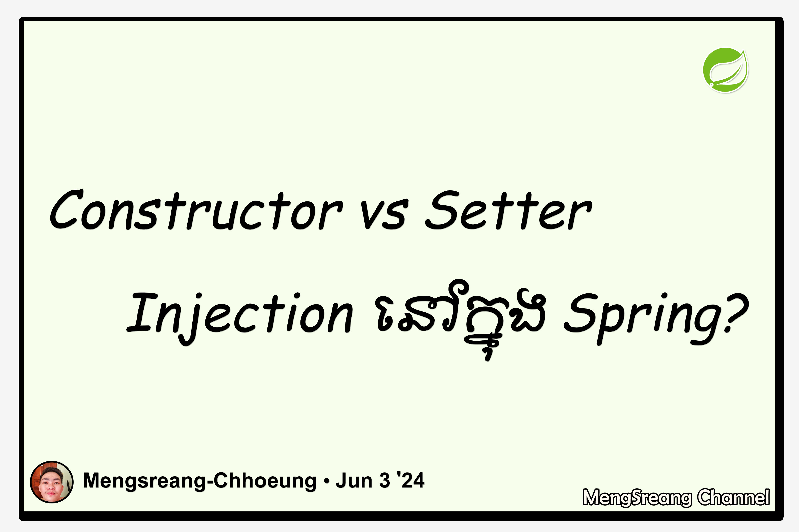

# Part 15: Constructor vs Setter Injection

> 🌐 **Language / ភាសា:** 🇬🇧 **[English](README.md)** | 🇰🇭 [ភាសាខ្មែរ (Khmer)](README.kh.md)

## Table of Contents

- [1. Introduction](#1-introduction)
- [2. 5 Key Architectural Differences](#2-5-key-architectural-differences)
- [3. Detailed Comparison Table](#3-detailed-comparison-table)
- [4. Pragmatic Decision Guide](#4-pragmatic-decision-guide)

---

## 1. Introduction

While Field Injection exists via `@Autowired`, **Constructor Injection** and **Setter Injection** represent the two formal, object-oriented dependency wiring mechanisms in the Spring Framework. Understanding their structural differences is fundamental to designing robust, maintainable domain classes.

---

## 2. 5 Key Architectural Differences

### 1. Mandatory vs. Optional Dependencies
- **Constructor Injection:** Tailor-made for **mandatory dependencies**. A class cannot be instantiated without supplying valid references, guaranteeing that the object enters the application in a fully initialized, valid state.
- **Setter Injection:** Ideal for **optional dependencies** or reasonable defaults that can be optionally overridden.

### 2. Immutability & Thread Safety
- **Constructor Injection:** Allows dependent fields to be marked with the **`final`** keyword (e.g., `private final PaymentService service;`). Once instantiated, references cannot be reassigned, providing bulletproof thread safety.
- **Setter Injection:** Cannot use `final` fields because setter methods are invoked after the object constructor returns.

### 3. Execution & Overriding Order
- If a class defines both constructor injection and setter injection for the exact same dependency property, **Setter Injection executes last and overrides the value provided by the constructor**.

### 4. Runtime Mutability
- **Setter Injection:** Allows dependencies to be swapped or re-injected dynamically at runtime without discarding the enclosing instance.
- **Constructor Injection:** Strictly immutable post-construction.

### 5. Circular Dependency Detection
- If Class A requires Class B and Class B requires Class A:
  - **Constructor Injection:** Fails fast at startup with `BeanCurrentlyInCreationException`.
  - **Setter Injection:** Can resolve circular dependencies at startup (though circular dependencies generally indicate an architectural code smell).

---

## 3. Detailed Comparison Table

| Dimension | Constructor Injection | Setter Injection |
| :--- | :--- | :--- |
| **Dependency Nature** | **Mandatory (Required)** | **Optional (Configurable)** |
| **`final` Keyword Support** | ✅ **Yes (Immutable)** | ❌ No (Mutable fields) |
| **Null Safety** | ✅ Guarantees no NPE on collaborators | ⚠️ Possible NPE if unassigned |
| **Overriding Order** | Executes first | Executes second (overrides constructor) |
| **Unit Test Usability** | ✅ Easiest (`new MyService(mock)`) | Moderate (requires calling setters) |
| **Spring Team Recommendation** | **⭐⭐⭐⭐⭐ Strongly Recommended** | ⭐⭐⭐ Use selectively |

---

## 4. Pragmatic Decision Guide

- **Use Constructor Injection by default:** For ~95% of your services, repositories, and controllers to enforce immutability, fail-fast startup verification, and effortless unit testing.
- **Use Setter Injection sparingly:** Only for non-essential dependencies that have safe internal defaults or require dynamic runtime modification.

---

## 🧭 Lesson Navigation

| Previous | Main Index | Next |
| :--- | :---: | :--- |
| [← Part 14: What Is Dependency Injection?](../14-what-is-dependency-injection/README.md) | [📚 Spring Framework Index](../README.md) | [Part 16: Best Way of Injecting Beans →](../16-best-way-of-injecting-beans/README.md) |
