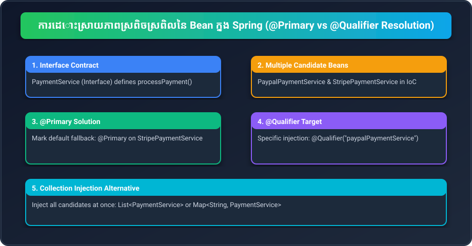

# Part 17: ការដោះស្រាយភាពស្រពិចស្រពិលនៃ Bean (Bean Ambiguity Resolution: @Primary & @Qualifier)

> 🌐 **ភាសា / Language:** 🇰🇭 **[ភាសាខ្មែរ (Khmer)](README.kh.md)** | 🇬🇧 [English](README.md)
> 
> 📖 **ឯកសារយោងផ្លូវការ Spring Docs:** [Fine-tuning Annotation-based Autowiring with Qualifiers](https://docs.spring.io/spring-framework/reference/core/beans/annotation-config/autowired-qualifiers.html) | [Primary Beans](https://docs.spring.io/spring-framework/reference/core/beans/annotation-config/autowired-primary.html)



## មាតិកា (Table of Contents)

- [1. បញ្ហា Bean Ambiguity និង NoUniqueBeanDefinitionException](#1-បញ្ហា-bean-ambiguity-និង-nouniquebeandefinitionexception)
- [2. ដំណោះស្រាយទី ១៖ ការប្រើប្រាស់ @Primary (Default Candidate)](#2-ដំណោះស្រាយទី-១-ការប្រើប្រាស់-primary-default-candidate)
- [3. ដំណោះស្រាយទី ២៖ ការប្រើប្រាស់ @Qualifier (Explicit Target)](#3-ដំណោះស្រាយទី-២-ការប្រើប្រាស់-qualifier-explicit-target)
- [4. ការបង្កើត Custom Qualifier Annotations](#4-ការបង្កើត-custom-qualifier-annotations)
- [5. ការ Inject Beans ទាំងអស់ជា Collection (List & Map Injection)](#5-ការ-inject-beans-ទាំងអស់ជា-collection-list--map-injection)
- [6. លំហាត់អនុវត្តកូដ (Code Challenge)](#6-លំហាត់អនុវត្តកូដ-code-challenge)
- [🔗 ឯកសារយោងផ្លូវការ Spring Docs](#-ឯកសារយោងផ្លូវការ-spring-docs)

---

## 1. បញ្ហា Bean Ambiguity និង NoUniqueBeanDefinitionException

នៅពេលដែលយើងអនុវត្តគោលការណ៍ **Polymorphism** និង **Interface-Driven Design** យើងតែងតែបង្កើត Interface មួយដែលមាន Classes ច្រើនជាអ្នក Implement។

ឧបមាថាយើងមាន Interface `PaymentService`៖
```java
public interface PaymentService {
    void processPayment(double amount);
}
```
ហើយយើងមាន Implementations ចំនួន ២ ត្រូវបានចុះឈ្មោះក្នុង IoC Container៖
```java
@Service
public class PaypalPaymentService implements PaymentService {
    public void processPayment(double amount) {
        System.out.println("Processing PayPal: $" + amount);
    }
}

@Service
public class StripePaymentService implements PaymentService {
    public void processPayment(double amount) {
        System.out.println("Processing Stripe: $" + amount);
    }
}
```

នៅពេលដែល `OrderService` ចង់ហៅប្រើ `PaymentService` តាមរយៈ Constructor Injection៖
```java
@Service
public class OrderService {
    private final PaymentService paymentService;

    public OrderService(PaymentService paymentService) {
        this.paymentService = paymentService;
    }
}
```

### 💥 អ្វីនឹងកើតឡើងពេល Run កម្មវិធី?
Spring IoC Container នឹងគាំង ហើយបោះកំហុស៖
```
NoUniqueBeanDefinitionException: No qualifying bean of type 'com.example.PaymentService' available:
expected single matching bean but found 2: paypalPaymentService, stripePaymentService
```
Spring មិនអាចទាយដឹងដោយខ្លួនឯងបានទេថា តើ Developer ចង់ប្រើ `PaypalPaymentService` ឬ `StripePaymentService` នោះឡើយ!

---

## 2. ដំណោះស្រាយទី ១៖ ការប្រើប្រាស់ @Primary (Default Candidate)

ប្រសិនបើនៅក្នុងប្រព័ន្ធមាន Implementation មួយដែលជា **ជម្រើសលំនាំដើម (Default)** សម្រាប់ករណីទូទៅ យើងប្រើប្រាស់ `@Primary`៖

```java
@Service
@Primary
public class StripePaymentService implements PaymentService {
    public void processPayment(double amount) {
        System.out.println("Processing default Stripe payment: $" + amount);
    }
}
```
ឥឡូវនេះ នៅពេលណាដែល Spring ជួបការ Inject `PaymentService` ដោយគ្មានការបញ្ជាក់ឈ្មោះច្បាស់លាស់ វានឹងជ្រើសយក `StripePaymentService` មកប្រើដោយស្វ័យប្រវត្តិ។

---

## 3. ដំណោះស្រាយទី ២៖ ការប្រើប្រាស់ @Qualifier (Explicit Target)

ប្រសិនបើអ្នកចង់ជ្រើសរើស Implementation ជាក់លាក់មួយដោយចំៗ មិនថាមាន `@Primary` ឬអត់នោះទេ អ្នកត្រូវប្រើ `@Qualifier("beanName")`៖

```java
@Service
public class CheckoutService {

    private final PaymentService paymentService;

    // ចង្អុលចំឈ្មោះ Bean: paypalPaymentService
    public CheckoutService(@Qualifier("paypalPaymentService") PaymentService paymentService) {
        this.paymentService = paymentService;
    }
}
```

> **💡 ច្បាប់អាទិភាព (Precedence Rule):**
> `@Qualifier` ឈ្នះ `@Primary` ជានិច្ច! ប្រសិនបើ Bean មួយមាន `@Primary` តែនៅកន្លែង Injection គេដាក់ `@Qualifier("anotherBean")` នោះ Spring នឹងជ្រើសយក Bean តាម `@Qualifier`។

---

## 4. ការបង្កើត Custom Qualifier Annotations

ការសរសេរឈ្មោះ Bean ជា String ដូចជា `@Qualifier("paypalPaymentService")` អាចប្រឈមនឹងបញ្ហា Typo (សរសេរខុសអក្សរ) ពេល Refactor កូដ។ ដំណោះស្រាយល្អបំផុតក្នុង Enterprise គឺការបង្កើត **Custom Qualifier Annotation**៖

```java
@Target({ElementType.FIELD, ElementType.PARAMETER, ElementType.TYPE, ElementType.METHOD})
@Retention(RetentionPolicy.RUNTIME)
@Qualifier
public @interface PaypalMode {
}
```

បន្ទាប់មកអនុវត្តវាលើ Service និងកន្លែង Inject៖
```java
@Service
@PaypalMode
public class PaypalPaymentService implements PaymentService { ... }

@Service
public class OrderService {
    public OrderService(@PaypalMode PaymentService paymentService) {
        this.paymentService = paymentService;
    }
}
```

---

## 5. ការ Inject Beans ទាំងអស់ជា Collection (List & Map Injection)

ក្នុងករណីដែលអ្នកចង់គាំទ្រគ្រប់វិធីសាស្ត្រទូទាត់ប្រាក់ទាំងអស់ក្នុងពេលតែមួយ (Strategy Pattern) Spring អនុញ្ញាតឱ្យអ្នក Inject Candidate Beans ទាំងអស់ចូលទៅក្នុង `List` ឬ `Map`៖

```java
@Service
public class PaymentGatewayManager {

    // Inject គ្រប់ Implementation ទាំងអស់នៃ PaymentService មកជា Map
    // Key = ឈ្មោះ Bean, Value = Instance
    private final Map<String, PaymentService> paymentServices;

    public PaymentGatewayManager(Map<String, PaymentService> paymentServices) {
        this.paymentServices = paymentServices;
    }

    public void pay(String gatewayType, double amount) {
        PaymentService service = paymentServices.get(gatewayType + "PaymentService");
        if (service == null) {
            throw new IllegalArgumentException("Unknown gateway: " + gatewayType);
        }
        service.processPayment(amount);
    }
}
```

---

## 6. លំហាត់អនុវត្តកូដ (Code Challenge)

**លំហាត់:** ចូរបង្កើត Interface `NotificationService` ដែលមាន method `send(String msg)`។ បង្កើត Class ចំនួន ២៖ `EmailNotificationService` (ជា `@Primary`) និង `SmsNotificationService` (ប្រើ Custom Qualifier `@SmsGateway`)។ បន្ទាប់មកបង្កើត `AlertService` ដែល Inject SMS Service ដោយប្រើ Custom Qualifier នោះ។

<details>
<summary>🔍 ចុចទីនេះដើម្បីមើលដំណោះស្រាយគំរូ</summary>

```java
public interface NotificationService {
    void send(String msg);
}

@Service
@Primary
public class EmailNotificationService implements NotificationService {
    public void send(String msg) { System.out.println("Email: " + msg); }
}

@Target({ElementType.FIELD, ElementType.PARAMETER, ElementType.TYPE})
@Retention(RetentionPolicy.RUNTIME)
@Qualifier
public @interface SmsGateway {}

@Service
@SmsGateway
public class SmsNotificationService implements NotificationService {
    public void send(String msg) { System.out.println("SMS: " + msg); }
}

@Service
public class AlertService {
    private final NotificationService notificationService;

    public AlertService(@SmsGateway NotificationService notificationService) {
        this.notificationService = notificationService;
    }

    public void notifyAdmin(String msg) {
        notificationService.send(msg);
    }
}
```
</details>

---

## 🔗 ឯកសារយោងផ្លូវការ Spring Docs

- [Fine-tuning Annotation-based Autowiring with Qualifiers](https://docs.spring.io/spring-framework/reference/core/beans/annotation-config/autowired-qualifiers.html)
- [Primary Beans in Spring](https://docs.spring.io/spring-framework/reference/core/beans/annotation-config/autowired-primary.html)
- [Generics as Autowiring Qualifiers](https://docs.spring.io/spring-framework/reference/core/beans/annotation-config/autowired-generics.html)

---

## 🧭 ការរុករកមេរៀន (Lesson Navigation)

| ថយក្រោយ (Previous) | មាតិកាចម្បង (Home) | បន្ទាប់ (Next) |
| :--- | :---: | :--- |
| [← Part 16: វិធីសាស្រ្តល្អបំផុតក្នុងការ Inject Beans](../16-best-way-of-injecting-beans/README.kh.md) | [📚 មាតិកា Spring Framework](../README.kh.md) | [Part 18: Bean Lifecycle & BeanPostProcessor →](../18-bean-lifecycle-and-postprocessor/README.kh.md) |
