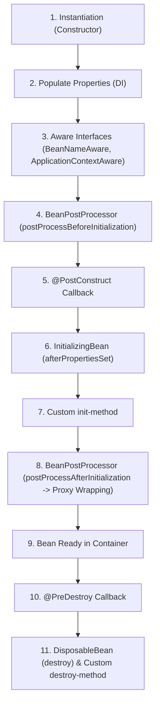

# Part 18: វដ្តជីវិតលម្អិតរបស់ Spring Bean និង BeanPostProcessor (Bean Lifecycle & BeanPostProcessor)

> 🌐 **ភាសា / Language:** 🇰🇭 **[ភាសាខ្មែរ (Khmer)](README.kh.md)** | 🇬🇧 [English](README.md)
> 
> 📖 **ឯកសារយោងផ្លូវការ Spring Docs:** [Customizing the Nature of a Bean](https://docs.spring.io/spring-framework/reference/core/beans/factory-nature.html) | [Customizing Beans Using a BeanPostProcessor](https://docs.spring.io/spring-framework/reference/core/beans/factory-extension.html#beans-factory-extension-bpp)


## មាតិកា (Table of Contents)

- [1. ដំណាក់កាលទាំង ១១ នៃវដ្តជីវិត Spring Bean](#1-ដំណាក់កាលទាំង-១១-នៃវដ្តជីវិត-spring-bean)
- [2. ចំណុចប្រទាក់ Aware Interfaces](#2-ចំណុចប្រទាក់-aware-interfaces)
- [3. យន្តការ BeanPostProcessor — បេះដូងនៃ AOP និង Proxies](#3-យន្តការ-beanpostprocessor--បេះដូងនៃ-aop-និង-proxies)
- [4. វិធីទាំង ៣ ក្នុងការកំណត់ Initialization និង Destruction Callbacks](#4-វិធីទាំង-៣-ក្នុងការកំណត់-initialization-និង-destruction-callbacks)
- [5. យន្តការ BeanFactoryPostProcessor](#5-យន្តការ-beanfactorypostprocessor)
- [6. លំហាត់អនុវត្តកូដ (Code Challenge)](#6-លំហាត់អនុវត្តកូដ-code-challenge)
- [🔗 ឯកសារយោងផ្លូវការ Spring Docs](#-ឯកសារយោងផ្លូវការ-spring-docs)

---

## 1. ដំណាក់កាលទាំង ១១ នៃវដ្តជីវិត Spring Bean

នៅក្នុង **Spring Framework** វដ្តជីវិតរបស់ Bean មិនមែនគ្រាន់តែហៅ `new` រួចចប់នោះទេ។ ខាងក្រោមនេះជាលំដាប់លំដោយពេញលេញដែល Spring IoC Container ដំណើរការ៖



---

## 2. ចំណុចប្រទាក់ Aware Interfaces

ជួនកាល Bean ត្រូវការដឹងអំពីព័ត៌មានហេដ្ឋារចនាសម្ព័ន្ធរបស់ Container។ Spring ផ្តល់នូវ **Aware Interfaces** សម្រាប់បញ្ជូនព័ត៌មានទាំងនោះ៖

```java
@Component
public class CustomService implements BeanNameAware, ApplicationContextAware {

    private String beanName;
    private ApplicationContext context;

    @Override
    public void setBeanName(String name) {
        this.beanName = name;
        System.out.println("Bean Name is: " + name);
    }

    @Override
    public void setApplicationContext(ApplicationContext applicationContext) {
        this.context = applicationContext;
        System.out.println("ApplicationContext injected into bean!");
    }
}
```

---

## 3. យន្តការ BeanPostProcessor — បេះដូងនៃ AOP និង Proxies

`BeanPostProcessor` គឺជា Extension Point ដ៏មានអនុភាពបំផុតក្នុង Spring Core។ វាអនុញ្ញាតឱ្យយើងលូកដៃកែប្រែ ឬស្រោប (Wrap) Instance របស់ Bean មុនពេល និងក្រោយពេល Bean ត្រូវបាន Initialize៖

```java
@Component
public class PerformanceMonitoringBPP implements BeanPostProcessor {

    @Override
    public Object postProcessBeforeInitialization(Object bean, String beanName) {
        // ដំណើរការមុនពេល @PostConstruct រត់
        return bean; 
    }

    @Override
    public Object postProcessAfterInitialization(Object bean, String beanName) {
        // ដំណាក់កាលនេះហើយដែល Spring បង្កើត AOP Proxies (Dynamic Proxy / CGLIB)!
        if (bean.getClass().isAnnotationPresent(Monitored.class)) {
            System.out.println("Wrapping bean with monitoring proxy: " + beanName);
            // អាច Return Dynamic Proxy ជំនួស Original Bean បាន
        }
        return bean;
    }
}
```

> **💡 តើអ្នកដឹងទេ?**  
> មុខងារសំខាន់ៗដូចជា `@Autowired`, `@Async`, `@Transactional`, និង Spring AOP ទាំងអស់ សុទ្ធតែត្រូវបានអនុវត្តដោយប្រើ `BeanPostProcessor` នេះឯង!

---

## 4. វិធីទាំង ៣ ក្នុងការកំណត់ Initialization និង Destruction Callbacks

| វិធីសាស្ត្រ | Initialization Hook | Destruction Hook | ការវាយតម្លៃ (Verdict) |
| :--- | :--- | :--- | :--- |
| **១. JSR-250 Annotations** | `@PostConstruct` | `@PreDestroy` | **ល្អបំផុត (Recommended)** - ស្តង់ដារ Java POJO មិនជាប់ជំពាក់នឹង Spring |
| **២. Spring Interfaces** | `InitializingBean.afterPropertiesSet()` | `DisposableBean.destroy()` | ចងភ្ជាប់កូដទៅនឹង Spring APIs (Coupled) |
| **៣. Config Declaration** | `@Bean(initMethod = "init")` | `@Bean(destroyMethod = "cleanup")` | ល្អបំផុតសម្រាប់បណ្ណាល័យក្រៅ (3rd Party Libraries) |

```java
@Component
public class DatabaseConnectionPool {

    @PostConstruct
    public void init() {
        System.out.println("1. បង្កើត Database Connection Pool...");
    }

    @PreDestroy
    public void cleanup() {
        System.out.println("2. បិទ Connections ទាំងអស់ និងសម្អាត Memory...");
    }
}
```

---

## 5. យន្តការ BeanFactoryPostProcessor

ខុសពី `BeanPostProcessor` ដែលដំណើរការលើ **Bean Instances (Objects)**, `BeanFactoryPostProcessor` ដំណើរការលើ **Bean Definitions (Metadata)** មុនពេល Bean ត្រូវបាន Instantiate!
- ឧទាហរណ៍ជាក់ស្តែងគឺ `PropertySourcesPlaceholderConfigurer` ដែលស្វែងរកអក្សរ `${app.db.url}` ក្នុង metadata រួចជំនួសដោយតម្លៃពិតពី file `.properties` មុនពេល Bean ត្រូវបានបង្កើត។

---

## 6. លំហាត់អនុវត្តកូដ (Code Challenge)

**លំហាត់:** ចូរបង្កើត `AuditingBeanPostProcessor` ដែលពិនិត្យមើលគ្រប់ Bean ទាំងអស់ក្នុង Container ហើយបើឈ្មោះ Bean ចាប់ផ្តើមដោយពាក្យ `"order"` សូមកត់ត្រា Log បង្ហាញពីពេលវេលាដែល Bean នោះត្រូវបានបង្កើតរួចរាល់។

<details>
<summary>🔍 ចុចទីនេះដើម្បីមើលដំណោះស្រាយគំរូ</summary>

```java
@Component
public class AuditingBeanPostProcessor implements BeanPostProcessor {

    @Override
    public Object postProcessAfterInitialization(Object bean, String beanName) {
        if (beanName.toLowerCase().startsWith("order")) {
            System.out.println("[AUDIT] Bean '" + beanName + "' ready at: " + java.time.Instant.now());
        }
        return bean;
    }
}
```
</details>

---

## 🔗 ឯកសារយោងផ្លូវការ Spring Docs

- [Customizing the Nature of a Bean](https://docs.spring.io/spring-framework/reference/core/beans/factory-nature.html)
- [BeanPostProcessor Documentation](https://docs.spring.io/spring-framework/reference/core/beans/factory-extension.html#beans-factory-extension-bpp)
- [BeanFactoryPostProcessor Documentation](https://docs.spring.io/spring-framework/reference/core/beans/factory-extension.html#beans-factory-extension-factory-postprocessors)

---

## 🧭 ការរុករកមេរៀន (Lesson Navigation)

| ថយក្រោយ (Previous) | មាតិកាចម្បង (Home) | បន្ទាប់ (Next) |
| :--- | :---: | :--- |
| [← Part 17: ការដោះស្រាយភាពស្រពិចស្រពិលនៃ Bean](../17-bean-ambiguity-primary-qualifier/README.kh.md) | [📚 មាតិកា Spring Framework](../README.kh.md) | [Part 19: Core Annotations & Environment Properties →](../19-core-annotations-and-properties/README.kh.md) |
