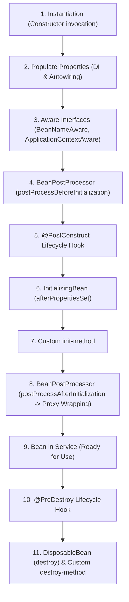

# Part 18: Spring Bean Lifecycle & BeanPostProcessor Deep Dive

> 🌐 **Language / ភាសា:** 🇬🇧 **[English](README.md)** | 🇰🇭 [ភាសាខ្មែរ (Khmer)](README.kh.md)
> 
> 📖 **Official Spring Documentation:** [Customizing the Nature of a Bean](https://docs.spring.io/spring-framework/reference/core/beans/factory-nature.html) | [Customizing Beans Using a BeanPostProcessor](https://docs.spring.io/spring-framework/reference/core/beans/factory-extension.html#beans-factory-extension-bpp)


## Table of Contents

- [1. The 11 Lifecycle Phases of a Spring Bean](#1-the-11-lifecycle-phases-of-a-spring-bean)
- [2. Infrastructure Awareness with Aware Interfaces](#2-infrastructure-awareness-with-aware-interfaces)
- [3. BeanPostProcessor — The Engine of AOP & Proxies](#3-beanpostprocessor--the-engine-of-aop--proxies)
- [4. The 3 Mechanisms for Lifecycle Callbacks](#4-the-3-mechanisms-for-lifecycle-callbacks)
- [5. BeanFactoryPostProcessor vs BeanPostProcessor](#5-beanfactorypostprocessor-vs-beanpostprocessor)
- [6. Practical Code Challenge](#6-practical-code-challenge)
- [🔗 Official Spring Documentation](#-official-spring-documentation)

---

## 1. The 11 Lifecycle Phases of a Spring Bean

A Spring Bean is not simply an object instantiated with `new`. The Spring IoC Container executes an elaborate lifecycle pipeline:



---

## 2. Infrastructure Awareness with Aware Interfaces

Occasionally, a bean requires direct access to infrastructure facilities. Spring provides **Aware Interfaces**:

```java
@Component
public class CacheManagerBean implements BeanNameAware, ApplicationContextAware {

    private String name;
    private ApplicationContext context;

    @Override
    public void setBeanName(String name) {
        this.name = name;
    }

    @Override
    public void setApplicationContext(ApplicationContext applicationContext) {
        this.context = applicationContext;
    }
}
```

---

## 3. BeanPostProcessor — The Engine of AOP & Proxies

The `BeanPostProcessor` interface is the most crucial extension mechanism in Spring Core. It intercepts every bean before and after its initialization:

```java
@Component
public class AuditLoggingBeanPostProcessor implements BeanPostProcessor {

    @Override
    public Object postProcessBeforeInitialization(Object bean, String beanName) {
        // Executes prior to @PostConstruct
        return bean;
    }

    @Override
    public Object postProcessAfterInitialization(Object bean, String beanName) {
        // Critical step: This is where Spring wraps beans with AOP dynamic proxies!
        return bean;
    }
}
```

> **💡 Under the Hood:**
> Core features like `@Autowired`, `@Async`, `@Transactional`, and Spring AOP advice are powered by built-in `BeanPostProcessor` implementations!

---

## 4. The 3 Mechanisms for Lifecycle Callbacks

| Mechanism | Init Hook | Destroy Hook | Recommendation |
| :--- | :--- | :--- | :--- |
| **1. Annotations (JSR-250)** | `@PostConstruct` | `@PreDestroy` | **Best Practice** (Standard Java, non-invasive) |
| **2. Spring Interfaces** | `InitializingBean` | `DisposableBean` | Tightly couples code to Spring interfaces |
| **3. Bean Declaration** | `@Bean(initMethod = "init")` | `@Bean(destroyMethod = "close")` | Ideal for external 3rd-party classes |

```java
@Component
public class ConnectionPoolManager {

    @PostConstruct
    public void initialize() {
        System.out.println("Allocating pool resources...");
    }

    @PreDestroy
    public void shutdown() {
        System.out.println("Releasing socket connections...");
    }
}
```

---

## 5. BeanFactoryPostProcessor vs BeanPostProcessor

- **`BeanFactoryPostProcessor`:** Operates on **Bean Definitions (Metadata)** before any bean instances are created. Example: `PropertySourcesPlaceholderConfigurer` resolves `${...}` placeholders.
- **`BeanPostProcessor`:** Operates on **Bean Instances (Live Objects)** after instantiation.

---

## 6. Practical Code Challenge

**Challenge:** Implement a custom `BeanPostProcessor` named `ExecutionTimeTracker` that logs every bean whose class name contains `"Service"` after initialization.

<details>
<summary>🔍 Click to view solution</summary>

```java
@Component
public class ExecutionTimeTracker implements BeanPostProcessor {

    @Override
    public Object postProcessAfterInitialization(Object bean, String beanName) {
        if (bean.getClass().getSimpleName().contains("Service")) {
            System.out.printf("[INIT-COMPLETE] Service bean initialized: %s (%s)%n", 
                    beanName, bean.getClass().getName());
        }
        return bean;
    }
}
```
</details>

---

## 🔗 Official Spring Documentation

- [Customizing the Nature of a Bean](https://docs.spring.io/spring-framework/reference/core/beans/factory-nature.html)
- [BeanPostProcessor Specification](https://docs.spring.io/spring-framework/reference/core/beans/factory-extension.html#beans-factory-extension-bpp)
- [BeanFactoryPostProcessor Specification](https://docs.spring.io/spring-framework/reference/core/beans/factory-extension.html#beans-factory-extension-factory-postprocessors)

---

## 🧭 Lesson Navigation

| Previous | Main Index | Next |
| :--- | :---: | :--- |
| [← Part 17: Resolving Bean Ambiguity](../17-bean-ambiguity-primary-qualifier/README.md) | [📚 Spring Framework Index](../README.md) | [Part 19: Core Annotations & Environment Properties →](../19-core-annotations-and-properties/README.md) |
