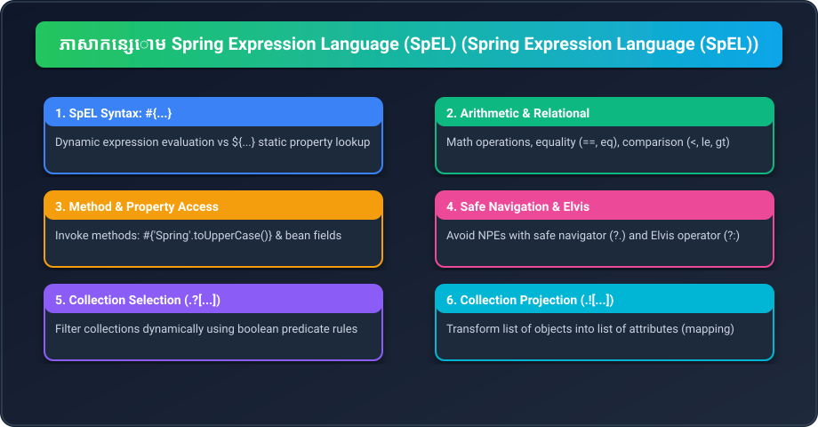

# Part 20: ភាសាកន្សោម Spring Expression Language (SpEL Fundamentals)

> 🌐 **ភាសា / Language:** 🇰🇭 **[ភាសាខ្មែរ (Khmer)](README.kh.md)** | 🇬🇧 [English](README.md)
> 
> 📖 **ឯកសារយោងផ្លូវការ Spring Docs:** [Spring Expression Language (SpEL)](https://docs.spring.io/spring-framework/reference/core/expressions.html)



## មាតិកា (Table of Contents)

- [1. តើ SpEL ជាអ្វី? ភាពខុសគ្នារវាង #{...} និង ${...}](#1-តើ-spel-ជាអ្វី-ភាពខុសគ្នារវាង--និង-)
- [2. ប្រមាណវិធីមូលដ្ឋានក្នុង SpEL (Arithmetic & Logical)](#2-ប្រមាណវិធីមូលដ្ឋានក្នុង-spel-arithmetic--logical)
- [3. ការហៅ Method និងការប្រើប្រាស់ Safe Navigation Operator (?.)](#3-ការហៅ-method-និងការប្រើប្រាស់-safe-navigation-operator-)
- [4. Elvis Operator (?:) សម្រាប់ Default Values](#4-elvis-operator--សម្រាប់-default-values)
- [5. Collection Selection (.?[...]) និង Projection (.![...])](#5-collection-selection--និង-projection-)
- [6. លំហាត់អនុវត្តកូដ (Code Challenge)](#6-លំហាត់អនុវត្តកូដ-code-challenge)
- [🔗 ឯកសារយោងផ្លូវការ Spring Docs](#-ឯកសារយោងផ្លូវការ-spring-docs)

---

## 1. តើ SpEL ជាអ្វី? ភាពខុសគ្នារវាង #{...} និង ${...}

**Spring Expression Language (SpEL)** គឺជាភាសាកន្សោមដ៏មានអនុភាពដែលអនុវត្តក្នុង Runtime ដើម្បីទាញយក ឬគណនាតម្លៃ Object Graph ក្នុង Spring Framework។

| សញ្ញា | ឈ្មោះ | មុខងារ | ឧទាហរណ៍ |
| :--- | :--- | :--- | :--- |
| **`${...}`** | **Property Placeholder** | គ្រាន់តែទាញយកតម្លៃអត្ថបទពី `.properties` | `@Value("${app.port}")` |
| **`#{...}`** | **SpEL Expression** | គណនា Logic, ហៅ Method, និងដំណើរការ Dynamic Code | `@Value("#{2 * T(java.lang.Math).PI}")` |

> 💡 អ្នកថែមទាំងអាចសរសេររួមបញ្ចូលគ្នាបានទៀតផង៖ `@Value("#{${app.factor} * 10}")`!

---

## 2. ប្រមាណវិធីមូលដ្ឋានក្នុង SpEL (Arithmetic & Logical)

SpEL គាំទ្រគ្រប់ប្រមាណវិធីគណិតវិទ្យា និងតក្កវិទ្យាទាំងអស់៖

```java
@Component
public class SpELDemo {

    // ១. គណិតវិទ្យា
    @Value("#{10 + 25}")
    private int sum; // 35

    // ២. ប្រៀបធៀបតម្លៃ (Relational)
    @Value("#{100 > 50}")
    private boolean isGreater; // true

    // ៣. តក្កវិទ្យា (Logical and, or, not)
    @Value("#{true and false}")
    private boolean logicalTest; // false

    // ៤. ហៅ Static Method តាមរយៈ T(...) operator
    @Value("#{T(java.lang.Math).random() * 100}")
    private double randomNumber;
}
```

---

## 3. ការហៅ Method និងការប្រើប្រាស់ Safe Navigation Operator (?.)

SpEL អនុញ្ញាតឱ្យអ្នកហៅ Method របស់ String ឬ Bean ផ្សេងទៀតបានយ៉ាងងាយស្រួល៖

```java
@Component
public class StringSpEL {

    // ហៅ method របស់ String
    @Value("#{'hello cambodia'.toUpperCase()}")
    private String upperText; // "HELLO CAMBODIA"

    // Safe Navigation (?.) ការពារ NullPointerException
    // ប្រសិនបើ user.getAddress() ស្មើ null វានឹង return null ភ្លាម មិនគាំងប្រព័ន្ធឡើយ
    @Value("#{user.address?.city}")
    private String city;
}
```

---

## 4. Elvis Operator (?:) សម្រាប់ Default Values

Elvis Operator ត្រូវបានខ្ចីពីភាសា Groovy/Kotlin ដើម្បីផ្ដល់តម្លៃជំនួសបើទិន្នន័យដើមជា `null`៖

```java
@Component
public class UserProfile {

    // បើ user.nickname ជា null វានឹងយកតម្លៃ "Anonymous"
    @Value("#{user.nickname ?: 'Anonymous'}")
    private String displayName;
}
```

---

## 5. Collection Selection (.?[...]) និង Projection (.![...])

នេះគឺជាមុខងារដ៏អស្ចារ្យបំផុតរបស់ SpEL ក្នុងការ Filter និង Map ទិន្នន័យ Collections៖

```java
@Component
public class OrderAnalytics {

    // ១. Selection (.?[condition]): ចម្រាញ់យកតែ Order ណាដែលមានតម្លៃ > 1000
    @Value("#{orderRepository.orders.?[price > 1000]}")
    private List<Order> expensiveOrders;

    // ២. Projection (.![property]): បម្លែងពី List<Order> មកជា List<String> យកតែ Customer Names
    @Value("#{orderRepository.orders.![customerName]}")
    private List<String> customerNames;
}
```

---

## 6. លំហាត់អនុវត្តកូដ (Code Challenge)

**លំហាត់:** ចូរសរសេរ SpEL Expression មួយក្នុង `@Value` ដើម្បីគណនាពន្ធលើប្រាក់ចំណូល៖ ប្រសិនបើ property `salary` ធំជាង 1000 ត្រូវយកពន្ធ 10% (salary * 0.1) បើមិនដូច្នេះទេ យកពន្ធ 0។

<details>
<summary>🔍 ចុចទីនេះដើម្បីមើលដំណោះស្រាយគំរូ</summary>

```java
@Component
public class TaxCalculator {

    @Value("#{${employee.salary} > 1000 ? ${employee.salary} * 0.1 : 0}")
    private double calculatedTax;

    public double getTax() {
        return calculatedTax;
    }
}
```
</details>

---

## 🔗 ឯកសារយោងផ្លូវការ Spring Docs

- [Spring Expression Language (SpEL) Reference](https://docs.spring.io/spring-framework/reference/core/expressions.html)
- [SpEL Evaluation in Bean Definitions](https://docs.spring.io/spring-framework/reference/core/expressions/beandef.html)
- [SpEL Language Reference Operators](https://docs.spring.io/spring-framework/reference/core/expressions/language-ref.html)

---

## 🧭 ការរុករកមេរៀន (Lesson Navigation)

| ថយក្រោយ (Previous) | មាតិកាចម្បង (Home) | បន្ទាប់ (Next) |
| :--- | :---: | :--- |
| [← Part 19: Core Annotations & Environment Properties](../19-core-annotations-and-properties/README.kh.md) | [📚 មាតិកា Spring Framework](../README.kh.md) | [Part 21: Spring Application Events →](../21-spring-application-events/README.kh.md) |
