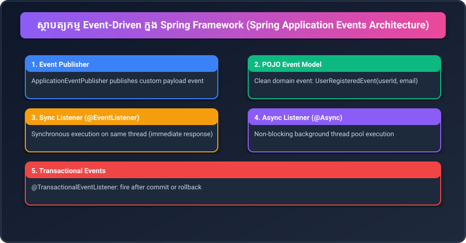

# Part 21: Spring Application Events & Event-Driven Architecture

> 🌐 **Language / ភាសា:** 🇬🇧 **[English](README.md)** | 🇰🇭 [ភាសាខ្មែរ (Khmer)](README.kh.md)
> 
> 📖 **Official Spring Documentation:** [Standard and Custom Events](https://docs.spring.io/spring-framework/reference/core/beans/context-introduction.html#context-functionality-events) | [Annotation-based Event Listeners](https://docs.spring.io/spring-framework/reference/core/beans/context-introduction.html#context-functionality-events-annotation)



## Table of Contents

- [1. Observer Pattern & Architectural Decoupling](#1-observer-pattern--architectural-decoupling)
- [2. Defining POJO Domain Events](#2-defining-pojo-domain-events)
- [3. Publishing Events with ApplicationEventPublisher](#3-publishing-events-with-applicationeventpublisher)
- [4. Handling Events with @EventListener](#4-handling-events-with-eventlistener)
- [5. Non-Blocking Execution with @Async](#5-non-blocking-execution-with-async)
- [6. Transaction-Bound Events (@TransactionalEventListener)](#6-transaction-bound-events-transactionaleventlistener)
- [7. Practical Code Challenge](#7-practical-code-challenge)
- [🔗 Official Spring Documentation](#-official-spring-documentation)

---

## 1. Observer Pattern & Architectural Decoupling

In enterprise architectures, primary business flows trigger secondary side-effects. For example, upon `registerUser()`:
1. Save user to database
2. Transmit welcome email
3. Dispatch SMS OTP
4. Initialize analytics profile

Directly injecting all secondary services into `UserService` creates severe tight coupling and violates the **Single Responsibility Principle**.

Spring provides an in-memory event bus implementing the **Observer Pattern**:
- `UserService` publishes a `UserRegisteredEvent`.
- Secondary modules observe the event with `@EventListener`, completely independent of each other.

---

## 2. Defining POJO Domain Events

Since Spring 4.2, events need not extend framework classes. Java Records provide optimal immutability:

```java
public record UserRegisteredEvent(String userId, String email, String fullName) {
}
```

---

## 3. Publishing Events with ApplicationEventPublisher

Inject Spring's built-in `ApplicationEventPublisher`:

```java
@Service
public class UserService {

    private final ApplicationEventPublisher publisher;

    public UserService(ApplicationEventPublisher publisher) {
        this.publisher = publisher;
    }

    public void register(String userId, String email, String name) {
        System.out.println("Persisting user to database...");

        // Fire event to all registered listeners
        publisher.publishEvent(new UserRegisteredEvent(userId, email, name));

        System.out.println("Registration transaction complete.");
    }
}
```

---

## 4. Handling Events with @EventListener

Components register listeners simply by annotating method signatures matching the payload:

```java
@Component
public class NotificationManager {

    @EventListener
    public void onUserRegistered(UserRegisteredEvent event) {
        System.out.println("[EMAIL] Welcome dispatch sent to: " + event.email());
    }

    @EventListener
    public void onAuditLog(UserRegisteredEvent event) {
        System.out.println("[AUDIT] Security audit recorded for: " + event.userId());
    }
}
```

---

## 5. Non-Blocking Execution with @Async

By default, event listeners run synchronously on the caller's thread. Annotating listeners with `@Async` runs them on a managed task executor pool:

```java
@Configuration
@EnableAsync
public class AsyncConfig {}

@Component
public class AsyncEmailDelivery {

    @Async
    @EventListener
    public void handle(UserRegisteredEvent event) {
        System.out.println("[ASYNC] Background mail transmission on thread: " + Thread.currentThread().getName());
    }
}
```

---

## 6. Transaction-Bound Events (@TransactionalEventListener)

Ensures listeners execute only after transactional phases complete:

```java
@Component
public class AuditTransactionListener {

    @TransactionalEventListener(phase = TransactionPhase.AFTER_COMMIT)
    public void onOrderSaved(OrderCreatedEvent event) {
        System.out.println("Guaranteed execution strictly after database commit!");
    }
}
```

---

## 7. Practical Code Challenge

**Challenge:** Create an `OrderPlacedEvent(String orderId, double amount)`. Provide an `InventoryHandler` that deducts stock, and a `ReceiptHandler` that prints billing details.

<details>
<summary>🔍 Click to view solution</summary>

```java
public record OrderPlacedEvent(String orderId, double amount) {}

@Component
public class InventoryHandler {
    @EventListener
    public void onOrder(OrderPlacedEvent event) {
        System.out.println("Reserved inventory for order: " + event.orderId());
    }
}

@Component
public class ReceiptHandler {
    @EventListener
    public void onOrder(OrderPlacedEvent event) {
        System.out.printf("Receipt generated for Order #%s: $%.2f%n", event.orderId(), event.amount());
    }
}
```
</details>

---

## 🔗 Official Spring Documentation

- [Standard and Custom Events](https://docs.spring.io/spring-framework/reference/core/beans/context-introduction.html#context-functionality-events)
- [Annotation-based Event Listeners](https://docs.spring.io/spring-framework/reference/core/beans/context-introduction.html#context-functionality-events-annotation)
- [Asynchronous Event Listeners](https://docs.spring.io/spring-framework/reference/core/beans/context-introduction.html#context-functionality-events-async)

---

## 🧭 Lesson Navigation

| Previous | Main Index | Next |
| :--- | :---: | :--- |
| [← Part 20: Spring Expression Language (SpEL)](../20-spring-expression-language-spel/README.md) | [📚 Spring Framework Index](../README.md) | [Part 22: Spring AOP & Proxies →](../22-spring-aop-and-proxies/README.md) |
