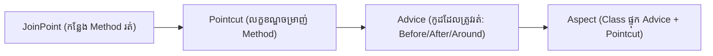

# Part 22: យន្តការ Spring AOP និង Dynamic Proxies (Spring AOP & Proxy Mechanics)

> 🌐 **ភាសា / Language:** 🇰🇭 **[ភាសាខ្មែរ (Khmer)](README.kh.md)** | 🇬🇧 [English](README.md)
> 
> 📖 **ឯកសារយោងផ្លូវការ Spring Docs:** [Aspect Oriented Programming with Spring](https://docs.spring.io/spring-framework/reference/core/aop.html) | [AOP Proxies](https://docs.spring.io/spring-framework/reference/core/aop/proxying.html)


## មាតិកា (Table of Contents)

- [1. ស្ថាបត្យកម្ម Cross-Cutting Concerns និងទស្សនទាន AOP](#1-ស្ថាបត្យកម្ម-cross-cutting-concerns-និងទស្សនទាន-aop)
- [2. វាក្យស័ព្ទស្នូលទាំង ៥ នៃ AOP (Aspect, JoinPoint, Pointcut, Advice, Weaving)](#2-វាក្យស័ព្ទស្នូលទាំង-៥-នៃ-aop-aspect-joinpoint-pointcut-advice-weaving)
- [3. យន្តការ Proxy នៅពីក្រោយខ្នង៖ JDK Dynamic Proxy vs CGLIB](#3-យន្តការ-proxy-នៅពីក្រោយខ្នង-jdk-dynamic-proxy-vs-cglib)
- [4. ការបើកដំណើរការ និងសរសេរ Aspect ក្នុង Pure Spring (@EnableAspectJAutoProxy)](#4-ការបើកដំណើរការ-និងសរសេរ-aspect-ក្នុង-pure-spring-enableaspectjautoproxy)
- [5. អន្ទាក់ដ៏គ្រោះថ្នាក់បំផុត៖ បញ្ហា Self-Invocation (this.method())](#5-អន្ទាក់ដ៏គ្រោះថ្នាក់បំផុត-បញ្ហា-self-invocation-thismethod)
- [6. លំហាត់អនុវត្តកូដ (Code Challenge)](#6-លំហាត់អនុវត្តកូដ-code-challenge)
- [🔗 ឯកសារយោងផ្លូវការ Spring Docs](#-ឯកសារយោងផ្លូវការ-spring-docs)

---

## 1. ស្ថាបត្យកម្ម Cross-Cutting Concerns និងទស្សនទាន AOP

នៅក្នុងកម្មវិធីមួយ យើងតែងមានកូដដដែលៗដែលត្រូវរត់កាត់គ្រប់ Layer ទាំងអស់ ដូចជា **Logging**, **Security Check**, **Performance Measurement**, និង **Transaction Management**។ កូដទាំងនេះត្រូវបានគេហៅថា **Cross-Cutting Concerns**។

ប្រសិនបើយើងសរសេរវាត្រួតៗគ្នាក្នុងគ្រប់ Service នោះកូដនឹងបាត់បង់ភាពស្អាត។ **Aspect-Oriented Programming (AOP)** អនុញ្ញាតឱ្យយើងដកស្រង់កូដទាំងនោះចេញ មកដាក់ក្នុង **Aspect** តែមួយ ហើយ Spring នឹងយកវាទៅស្រោបលើ Target Methods ដោយស្វ័យប្រវត្តិ!

---

## 2. វាក្យស័ព្ទស្នូលទាំង ៥ នៃ AOP



1. **Aspect:** Class មួយដែលប្រមូលផ្តុំកូដ Cross-cutting concerns (ស្រោបដោយ `@Aspect`)។
2. **JoinPoint:** ចំណុចណាមួយក្នុងកម្មវិធីដែលកូដអាចលូកដៃចូលបាន (ក្នុង Spring AOP គឺរាល់ការហៅ **Method Execution** លើ Spring Beans)។
3. **Pointcut:** កន្សោម Regular Expression (Expression) សម្រាប់កំណត់ថា តើ Method ណាខ្លះដែលត្រូវទទួលយក Advice (ឧ. `execution(* com.example.service.*.*(..))`)។
4. **Advice:** សកម្មភាពដែលត្រូវធ្វើ និងពេលណាដែលត្រូវធ្វើ (`@Before`, `@After`, `@Around`, `@AfterReturning`, `@AfterThrowing`)។
5. **Weaving:** ដំណើរការនៃការភ្ជាប់ Aspect ទៅកាន់ Target Object ដើម្បីបង្កើតជា **Proxy Object**។

---

## 3. យន្តការ Proxy នៅពីក្រោយខ្នង៖ JDK Dynamic Proxy vs CGLIB

Spring AOP មិនមែនកែប្រែ Bytecode ដើមឡើយ ប៉ុន្តែវាប្រើប្រាស់ **Proxy Pattern** ដោយបង្កើត Proxy Object មួយមកស្រោបពីក្រៅ Bean របស់អ្នក៖

| លក្ខណៈ | JDK Dynamic Proxy | CGLIB Proxy |
| :--- | :--- | :--- |
| **មូលដ្ឋានគ្រឹះ** | ភ្ជាប់មកជាមួយ Java Standard Library (`java.lang.reflect.Proxy`) | បណ្ណាល័យបង្កើត Bytecode ខាងក្រៅ |
| **តម្រូវការ** | Target Class **ត្រូវតែ Implement Interface** | មិនបាច់មាន Interface ក៏បាន (បង្កើត Subclass) |
| **ដែនកំណត់** | អាច Proxy បានតែ Methods ដែលមានក្នុង Interface | **មិនអាច Proxy លើ `final` Class ឬ `final` Method បានឡើយ** |
| **Spring Boot 2.x/3.x** | មិនមែនជា Default ទេ | **ត្រូវបានកំណត់ជា Default ជានិច្ច** |

---

## 4. ការបើកដំណើរការ និងសរសេរ Aspect ក្នុង Pure Spring (@EnableAspectJAutoProxy)

```java
@Configuration
@ComponentScan("com.example")
@EnableAspectJAutoProxy // បើកដំណើរការ Spring AOP Proxying
public class AopConfig {
}

@Aspect
@Component
public class PerformanceAspect {

    // កំណត់ Pointcut លើគ្រប់ Methods ក្នុងកញ្ចប់ service
    @Pointcut("execution(* com.example.service.*.*(..))")
    public void serviceLayer() {}

    // Around Advice: វាស់ស្ទង់ពេលវេលាដំណើរការ
    @Around("serviceLayer()")
    public Object measureExecutionTime(ProceedingJoinPoint joinPoint) throws Throwable {
        long start = System.currentTimeMillis();

        Object result = joinPoint.proceed(); // ដំណើរការ Target Method ពិតប្រាកដ

        long duration = System.currentTimeMillis() - start;
        System.out.printf("[AOP METRIC] Method %s() executed in %d ms%n",
                joinPoint.getSignature().getName(), duration);

        return result;
    }
}
```

---

## 5. អន្ទាក់ដ៏គ្រោះថ្នាក់បំផុត៖ បញ្ហា Self-Invocation (this.method())

នេះជាសំណួរសម្ភាសន៍កម្រិត Senior ដ៏ពេញនិយមបំផុត៖  
> **"ហេតុអ្វីបានជា method ដែលដាក់ `@Transactional` ឬ Aspect មិនដំណើរការ នៅពេលវាត្រូវបានហៅពី method មួយទៀតក្នុង Class តែមួយ?"**

```java
@Service
public class OrderService {

    public void processOrder() {
        // 💥 កំហុស Self-Invocation!
        // ការហៅ this.sendReceipt() ដោយផ្ទាល់ គឺហៅលើ Object ខាងក្នុង មិនឆ្លងកាត់ Spring Proxy ឡើយ!
        this.sendReceipt(); 
    }

    @Transactional // ឬ Custom Aspect
    public void sendReceipt() {
        System.out.println("Sending receipt...");
    }
}
```

### 💡 ដំណោះស្រាយ៖
1. **Refactoring (ល្អបំផុត):** បំបែក Method នោះទៅកាន់ Service ផ្សេងមួយទៀត។
2. **Self-Injection:** Inject `OrderService` ចូលខ្លួនឯងវិញដោយប្រើ `@Lazy`។

---

## 6. លំហាត់អនុវត្តកូដ (Code Challenge)

**លំហាត់:** ចូរបង្កើត Custom Annotation `@AuditLog`។ បន្ទាប់មកបង្កើត Aspect មួយដែលមាន `@Before` advice ចាប់យកតែ Methods ណាដែលមានដាក់ Annotation `@AuditLog` រួច Log បង្ហាញឈ្មោះ Method និង Arguments ទាំងអស់របស់វា។

<details>
<summary>🔍 ចុចទីនេះដើម្បីមើលដំណោះស្រាយគំរូ</summary>

```java
@Target(ElementType.METHOD)
@Retention(RetentionPolicy.RUNTIME)
public @interface AuditLog {}

@Aspect
@Component
public class AuditLogAspect {

    @Before("@annotation(com.example.AuditLog)")
    public void logMethodCall(JoinPoint joinPoint) {
        String methodName = joinPoint.getSignature().getName();
        Object[] args = joinPoint.getArgs();
        System.out.printf("[AUDIT] Method %s() called with args: %s%n",
                methodName, java.util.Arrays.toString(args));
    }
}
```
</details>

---

## 🔗 ឯកសារយោងផ្លូវការ Spring Docs

- [Aspect Oriented Programming with Spring](https://docs.spring.io/spring-framework/reference/core/aop.html)
- [AOP Proxies in Spring Core](https://docs.spring.io/spring-framework/reference/core/aop/proxying.html)
- [Declaring an Aspect in Spring](https://docs.spring.io/spring-framework/reference/core/aop/ataspectj.html)

---

## 🧭 ការរុករកមេរៀន (Lesson Navigation)

| ថយក្រោយ (Previous) | មាតិកាចម្បង (Home) | បន្ទាប់ (Next) |
| :--- | :---: | :--- |
| [← Part 21: Spring Application Events](../21-spring-application-events/README.kh.md) | [📚 មាតិកា Spring Framework](../README.kh.md) | [Part 23: Circular Dependencies & Resolution →](../23-circular-dependencies-resolution/README.kh.md) |
