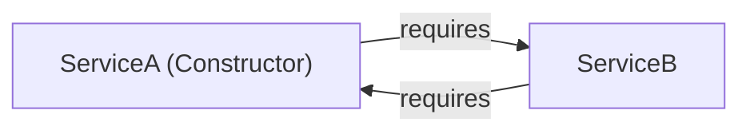
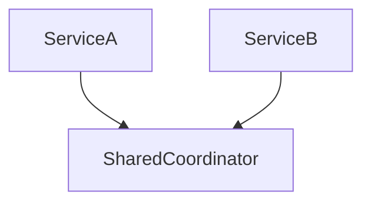

# Part 23: Circular Dependencies & Resolution Strategies

> 🌐 **Language / ភាសា:** 🇬🇧 **[English](README.md)** | 🇰🇭 [ភាសាខ្មែរ (Khmer)](README.kh.md)
> 
> 📖 **Official Spring Documentation:** [Circular Dependencies](https://docs.spring.io/spring-framework/reference/core/beans/dependencies/factory-collaborators.html#beans-dependency-resolution)


## Table of Contents

- [1. Understanding Circular Dependencies](#1-understanding-circular-dependencies)
- [2. Why Constructor Injection Fails Fast](#2-why-constructor-injection-fails-fast)
- [3. Why Field/Setter Injection Masks Architectural Flaws](#3-why-fieldsetter-injection-masks-architectural-flaws)
- [4. The Tactical Workaround: @Lazy Injection](#4-the-tactical-workaround-lazy-injection)
- [5. True Architectural Solutions: Refactoring & Mediators](#5-true-architectural-solutions-refactoring--mediators)
- [6. Why Spring Boot 2.6+ Disallows Circular References by Default](#6-why-spring-boot-26-disallows-circular-references-by-default)
- [7. Practical Code Challenge](#7-practical-code-challenge)
- [🔗 Official Spring Documentation](#-official-spring-documentation)

---

## 1. Understanding Circular Dependencies

A **Circular Dependency** arises when two or more components depend upon one another directly or transitively:
- `Class A` requires `Class B` in its constructor.
- `Class B` requires `Class A` in its constructor.



---

## 2. Why Constructor Injection Fails Fast

During container bootstrap, Spring creates beans deterministically:
1. Container attempts to instantiate `ServiceA` via `new ServiceA(serviceB)`.
2. Discovery reveals `ServiceB` is missing; creation of `ServiceA` pauses.
3. Container attempts to instantiate `ServiceB` via `new ServiceB(serviceA)`.
4. Discovery reveals `ServiceA` is currently being created.
5. An unresolvable circular deadlock triggers `BeanCurrentlyInCreationException`.

---

## 3. Why Field/Setter Injection Masks Architectural Flaws

With field/setter injection, Spring can instantiate an empty target bean and cache it in the **three-level singleton cache** (`earlySingletonObjects`) prior to setting properties.

While this allows application startup, it masks severe code smell, produces tight architectural coupling, and causes `NullPointerException` if collaborators invoke each other during `@PostConstruct`.

---

## 4. The Tactical Workaround: @Lazy Injection

When legacy constraints prevent immediate refactoring, break the instantiation loop with `@Lazy` on the parameter:

```java
@Service
public class ServiceA {

    private final ServiceB serviceB;

    // Spring injects a dynamic proxy rather than initializing ServiceB immediately
    public ServiceA(@Lazy ServiceB serviceB) {
        this.serviceB = serviceB;
    }
}
```

The dynamic proxy satisfies `ServiceA`'s constructor, unblocking the container to complete `ServiceB`.

---

## 5. True Architectural Solutions: Refactoring & Mediators

Engineering best practices mandate refactoring:

### Strategy 1: Extract a Shared Mediator Component
Move mutual logic into a new intermediary bean:


### Strategy 2: Leverage Event-Driven Decoupling
Replace direct method calls with Spring Application Events (`@EventListener`).

---

## 6. Why Spring Boot 2.6+ Disallows Circular References by Default

Starting in **Spring Boot 2.6**, circular references are disabled by default (`spring.main.allow-circular-references=false`). The Spring engineering team enacted this constraint to mandate clean, acyclic dependency graphs across microservices.

---

## 7. Practical Code Challenge

**Challenge:** Given mutually dependent `OrderService` and `BillingService`, implement the `@Lazy` tactical workaround, followed by refactoring the shared operation into a `PaymentCoordinator`.

<details>
<summary>🔍 Click to view solution</summary>

```java
// Solution 1: Tactical workaround
@Service
public class OrderService {
    private final BillingService billing;
    public OrderService(@Lazy BillingService billing) {
        this.billing = billing;
    }
}

// Solution 2: Clean architectural mediator
@Service
public class OrderSettlementCoordinator {
    private final OrderService orderService;
    private final BillingService billingService;

    public OrderSettlementCoordinator(OrderService orderService, BillingService billingService) {
        this.orderService = orderService;
        this.billingService = billingService;
    }
}
```
</details>

---

## 🔗 Official Spring Documentation

- [Circular Dependencies in Spring](https://docs.spring.io/spring-framework/reference/core/beans/dependencies/factory-collaborators.html#beans-dependency-resolution)
- [Lazy Resolution of Collaborators](https://docs.spring.io/spring-framework/reference/core/beans/annotation-config/lazy-arguments.html)

---

## 🧭 Lesson Navigation

| Previous | Main Index | Next |
| :--- | :---: | :--- |
| [← Part 22: Spring AOP & Proxies](../22-spring-aop-and-proxies/README.md) | [📚 Spring Framework Index](../README.md) | [Part 24: Spring Resource Loader →](../24-spring-resource-loader/README.md) |
