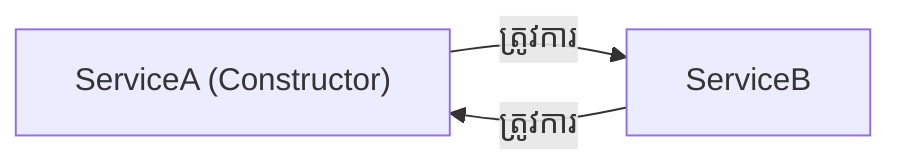
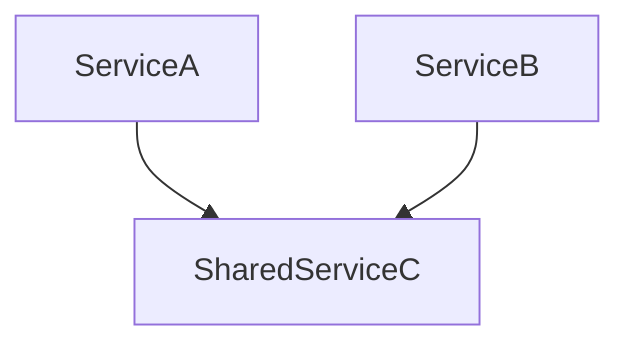

# Part 23: ការដោះស្រាយបញ្ហា Circular Dependency ក្នុង Spring (Circular Dependencies & Resolution)
> 
> 📖 **ឯកសារយោងផ្លូវការ Spring Docs:** [Circular Dependencies](https://docs.spring.io/spring-framework/reference/core/beans/dependencies/factory-collaborators.html#beans-dependency-resolution)


## មាតិកា (Table of Contents)

- [1. តើ Circular Dependency គឺជាអ្វី?](#1-តើ-circular-dependency-គឺជាអ្វី)
- [2. ហេតុអ្វី Constructor Injection គាំងភ្លាមៗ (BeanCurrentlyInCreationException)?](#2-ហេតុអ្វី-constructor-injection-គាំងភ្លាមៗ-beancurrentlyincreationexception)
- [3. ហេតុអ្វី Setter/Field Injection អាចដំណើរការបាន តែមានហានិភ័យខ្ពស់?](#3-ហេតុអ្វី-setterfield-injection-អាចដំណើរការបាន-តែមានហានិភ័យខ្ពស់)
- [4. ដំណោះស្រាយបច្ចេកទេស៖ ការប្រើប្រាស់ @Lazy Injection](#4-ដំណោះស្រាយបច្ចេកទេស-ការប្រើប្រាស់-lazy-injection)
- [5. ដំណោះស្រាយស្ថាបត្យកម្មត្រឹមត្រូវ (Architectural Refactoring)](#5-ដំណោះស្រាយស្ថាបត្យកម្មត្រឹមត្រូវ-architectural-refactoring)
- [6. ហេតុអ្វីបានជា Spring Boot 2.6+ បិទ Circular References ជា Default?](#6-ហេតុអ្វីបានជា-spring-boot-26-បិទ-circular-references-ជា-default)
- [7. លំហាត់អនុវត្តកូដ (Code Challenge)](#7-លំហាត់អនុវត្តកូដ-code-challenge)
- [🔗 ឯកសារយោងផ្លូវការ Spring Docs](#-ឯកសារយោងផ្លូវការ-spring-docs)

---

## 1. តើ Circular Dependency គឺជាអ្វី?

**Circular Dependency (ភាពអាស្រ័យវិលជុំ)** កើតឡើងនៅពេលដែល Bean ពីរ ឬច្រើន មានការពឹងពាក់គ្នាទៅវិញទៅមកជាវដ្តបិទជិត៖
- `Class A` ត្រូវការ `Class B` តាម Constructor
- ហើយ `Class B` ក៏ត្រូវការ `Class A` តាម Constructor ដូចគ្នា



---

## 2. ហេតុអ្វី Constructor Injection គាំងភ្លាមៗ (BeanCurrentlyInCreationException)?

នៅពេល Spring ចាប់ផ្តើមដំណើរការ Container៖
1. Spring ចង់បង្កើត `ServiceA` ប៉ុន្តែឃើញថាត្រូវហៅ `new ServiceA(serviceB)`
2. Spring ក៏ផ្អាក `ServiceA` សិន រួចងាកទៅបង្កើត `ServiceB`
3. ប៉ុន្តែពេលបង្កើត `ServiceB` វាតម្រូវឱ្យមាន `new ServiceB(serviceA)`
4. Spring ជាប់គាំងក្នុងរង្វិលជុំស្លាប់ (Deadlock Cycle) រួចបោះ Exception ភ្លាមៗ៖
```
BeanCurrentlyInCreationException: Error creating bean with name 'serviceA': 
Requested bean is currently in creation: Is there an unresolvable circular reference?
```

---

## 3. ហេតុអ្វី Setter/Field Injection អាចដំណើរការបាន តែមានហានិភ័យខ្ពស់?

ជាមួយ Field ឬ Setter Injection, Spring អាចបង្កើត Object ទទេ (`new ServiceA()`) មុនគេ ហើយរក្សាទុកក្នុង **Early Singleton Cache (3-level cache)**។ បន្ទាប់មកទើប Spring លូកដៃបញ្ចូល Field តាមក្រោយ។

> ⚠️ **គ្រោះថ្នាក់:** ទោះបីជា Container ចាប់ផ្តើមបានក៏ដោយ ក៏វាជាសញ្ញាបង្ហាញថា **ស្ថាបត្យកម្មកូដរបស់អ្នកមានបញ្ហា (Bad Code Smells)** ដោយសារតែ Services ទាំងពីរជាប់ជំពាក់គ្នាខ្លាំងពេក (Tightly Coupled) និងងាយនឹងបង្ក `NullPointerException` ពេលហៅឆ្លងគ្នាក្នុង `@PostConstruct`។

---

## 4. ដំណោះស្រាយបច្ចេកទេស៖ ការប្រើប្រាស់ @Lazy Injection

ប្រសិនបើអ្នកមិនអាចកែប្រែស្ថាបត្យកម្មកូដបានភ្លាមៗទេ អ្នកអាចបំបែករង្វិលជុំដោយប្រើ `@Lazy` លើ Constructor Parameter៖

```java
@Service
public class ServiceA {

    private final ServiceB serviceB;

    // ប្រើ @Lazy: Spring នឹងមិនបង្កើត ServiceB ពិតប្រាកដភ្លាមៗទេ
    // ប៉ុន្តែ Spring បញ្ជូន Dynamic Proxy មកជំនួសសិន
    public ServiceA(@Lazy ServiceB serviceB) {
        this.serviceB = serviceB;
    }
}
```
ដោយសារតែ Spring បញ្ជូន **Proxy Object** ឱ្យ `ServiceA` ភ្លាមៗ នោះ `ServiceA` អាចបង្កើតរួចរាល់ ហើយ Spring អាចបន្តទៅបង្កើត `ServiceB` បានយ៉ាងជោគជ័យ។

---

## 5. ដំណោះស្រាយស្ថាបត្យកម្មត្រឹមត្រូវ (Architectural Refactoring)

ដំណោះស្រាយដ៏ត្រឹមត្រូវតាមស្ដង់ដារ Enterprise គឺមិនត្រូវប្រើ `@Lazy` ឡើយ ប៉ុន្តែត្រូវរៀបចំកូដឡើងវិញតាមវិធីទាំង ២ នេះ៖

### វិធីសាស្ត្រ ក៖ បង្កើត Mediator Service ទី ៣
ដកស្រង់មុខងារដែលសេវាកម្មទាំងពីរត្រូវការ រួចបង្កើតជា `ServiceC` មួយដាច់ដោយឡែក៖


### វិធីសាស្ត្រ ខ៖ ប្រើប្រាស់ Spring Events (Decoupling)
ជំនួសឱ្យការហៅ `serviceB.notify()` ដោយផ្ទាល់ ចូរឱ្យ `ServiceA` បោះ Event ចេញទៅ ហើយឱ្យ `ServiceB` ប្រើ `@EventListener` ទទួលយកវិញ។

---

## 6. ហេតុអ្វីបានជា Spring Boot 2.6+ បិទ Circular References ជា Default?

ចាប់តាំងពី **Spring Boot 2.6** មក Spring Team បានសម្រេចចិត្ត **បិទ (Disallow)** មិនឱ្យមាន Circular Dependency ដោយស្វ័យប្រវត្តិតែម្តង។ ប្រសិនបើតេស្តឃើញមាន Circular Dependency កម្មវិធីនឹងគាំងភ្លាមៗនៅពេល Startup!  
នេះគឺដើម្បីបង្ខំឱ្យវិស្វករសូហ្វវែររៀបចំស្ថាបត្យកម្ម Clean Architecture ឱ្យបានត្រឹមត្រូវ។

---

## 7. លំហាត់អនុវត្តកូដ (Code Challenge)

**លំហាត់:** ពិនិត្យកូដ `AuthorService` (ត្រូវការ `BookService`) និង `BookService` (ត្រូវការ `AuthorService`)។ ចូរបង្ហាញវិធី ២ យ៉ាងក្នុងការដោះស្រាយបញ្ហានេះ (១. វិធីប្រើ `@Lazy` និង ២. វិធីរៀបចំ Interface/Mediator)។

<details>
<summary>🔍 ចុចទីនេះដើម្បីមើលដំណោះស្រាយគំរូ</summary>

```java
// ដំណោះស្រាយទី ១: ប្រើ @Lazy
@Service
public class BookService {
    private final AuthorService authorService;
    public BookService(@Lazy AuthorService authorService) {
        this.authorService = authorService;
    }
}

// ដំណោះស្រាយទី ២: Architectural Refactoring (ដក Common Logic ទៅ PublicationService)
@Service
public class PublicationService {
    public void linkAuthorAndBook(String authorId, String bookId) {
        // Core linking logic here, resolving dependency loop!
    }
}
```
</details>

---

## 🔗 ឯកសារយោងផ្លូវការ Spring Docs

- [Circular Dependencies in Spring](https://docs.spring.io/spring-framework/reference/core/beans/dependencies/factory-collaborators.html#beans-dependency-resolution)
- [Lazy Resolution of Collaborators](https://docs.spring.io/spring-framework/reference/core/beans/annotation-config/lazy-arguments.html)

---

## 🧭 ការរុករកមេរៀន (Lesson Navigation)

| ថយក្រោយ (Previous) | មាតិកាចម្បង (Home) | បន្ទាប់ (Next) |
| :--- | :---: | :--- |
| [← Part 22: Spring AOP & Proxies](../22-spring-aop-and-proxies/README.md) | [📚 មាតិកា Spring Framework](../README.md) | [Part 24: Spring Resource Loader →](../24-spring-resource-loader/README.md) |
