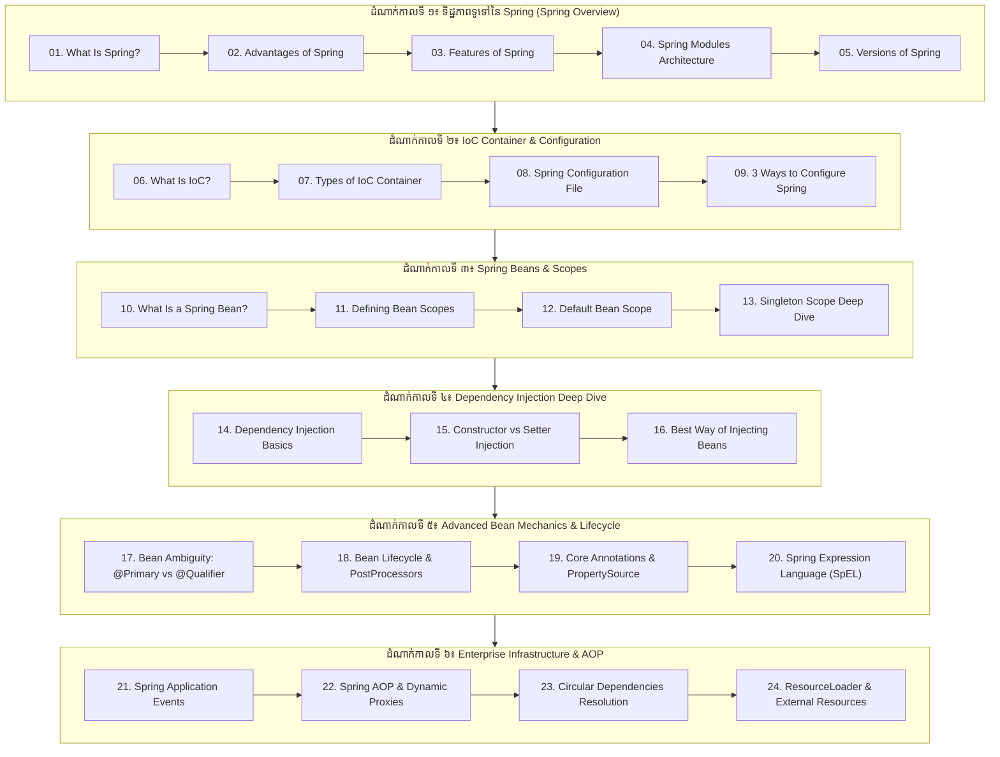

# Spring Framework for Developers (ខេមរភាសា) 🇰🇭

> **វគ្គសិក្សាទី ៣៖ មូលដ្ឋានគ្រឹះ និងស្ថាបត្យកម្មស្នូលនៃ Spring Framework សម្រាប់ Enterprise Java Developers**

[-brightgreen.svg)](#-មាតិកាវគ្គសិក្សា-table-of-contents)

---

## 📖 អំពីវគ្គសិក្សា Spring Framework

**Spring Framework** គឺជា Framework កម្រិតពិភពលោកដែលគ្រប់គ្រងដំណើរការសូហ្វវែរធំៗរាប់លាននៅលើសកលលោក។ នៅក្នុងវគ្គសិក្សាទាំង **២៤ ផ្នែក (24 Comprehensive Parts)** នេះ អ្នកនឹងស្វែងយល់យ៉ាងស៊ីជម្រៅអំពីរបៀបដែល Spring ដំណើរការនៅពីក្រោយខ្នង (Under the Hood)៖
- ទស្សនវិជ្ជានៃ **Inversion of Control (IoC)** និង **Dependency Injection (DI)**
- ស្ថាបត្យកម្មកុងតឺន័ររវាង `BeanFactory` និង `ApplicationContext`
- វិធីទាំង ៣ ក្នុងការកំណត់ Metadata (XML, Java-based `@Configuration`, Annotation-based `@Component`)
- ការគ្រប់គ្រង **Spring Beans**, **Bean Scopes** (Singleton, Prototype, Web Scopes)
- ការប្រៀបធៀប Constructor vs Setter Injection និង Best Practices កម្រិត Production
- **Bean Ambiguity Resolution** ជាមួយ `@Primary`, `@Qualifier` និង Custom Qualifier Annotations
- **Bean Lifecycle & PostProcessors** (`BeanPostProcessor`, `BeanFactoryPostProcessor`, Aware Interfaces)
- **Core Annotations & Externalized Configuration** (`@Value`, `@PropertySource`, `@Profile`, `@Lazy`, `@DependsOn`, `@Order`)
- **Spring Expression Language (SpEL)** ការគណនាបែប Dynamic ក្នុង Runtime (`#{...}`)
- **Spring Application Events** ស្ថាបត្យកម្ម Decoupled Event-Driven (`ApplicationEventPublisher`, `@EventListener`, `@Async`)
- **Spring AOP & Proxy Mechanics** (JDK Dynamic Proxy vs CGLIB, Self-Invocation Trap)
- **Circular Dependencies Resolution** (មូលហេតុឫសគល់, Design Smell, និងដំណោះស្រាយតាម `@Lazy`, ObjectProvider, Setter Injection)
- **Spring ResourceLoader & Resource Abstraction** (`classpath:`, `file:`, `https:`, Pattern Matching)

---

## 🗺️ ផែនទីសិក្សា (Learning Roadmap)

---

## 📚 មាតិកាវគ្គសិក្សា (Table of Contents)

### 🟢 ដំណាក់កាលទី ១ — ទិដ្ឋភាពទូទៅនៃ Spring Framework
1. [Part 1: តើ Spring Framework ជាអ្វី? (What Is Spring Framework?)](01-what-is-spring/README.md)
   - *ប្រវត្តិ Rod Johnson, បដិវត្តន៍ប្រឆាំង J2EE/EJB, ទស្សនវិជ្ជា Non-Invasive POJO*
2. [Part 2: គុណសម្បត្តិរបស់ Spring Framework (Advantages of Spring)](02-advantages-of-spring/README.md)
   - *Templates, Loose Coupling, ភាពងាយស្រួលធ្វើតេស្ត, និងការកាត់បន្ថយកូដ Boilerplate*
3. [Part 3: លក្ខណៈពិសេសរបស់ Spring Framework (Features of Spring)](03-features-of-spring/README.md)
   - *ក្រុមលក្ខណៈពិសេសទាំង ៦៖ Core, Testing, Data Access, Web (MVC/WebFlux), Integration, Languages*
4. [Part 4: ស្ថាបត្យកម្ម និង Modules របស់ Spring (Spring Modules Architecture)](04-modules-of-spring/README.md)
   - *Core Container, AOP & Aspects, Data Access/ORM, Web, Test*
5. [Part 5: កំណែទម្រង់ និងប្រវត្តិនៃ Spring Versions (Versions of Spring)](05-versions-of-spring/README.md)
   - *ការវិវត្តន៍ពី Spring 1.0, 2.5 Annotations, 4.0 Java 8, រហូតដល់ Spring 6.0 (Java 17+ & Jakarta EE)*

---

### 🔵 ដំណាក់កាលទី ២ — IoC Container & Configuration
6. [Part 6: តើ Inversion of Control (IoC) ជាអ្វី? (What Is IoC?)](06-what-is-ioc/README.md)
   - *គោលការណ៍ហូលីវូដ, ការគ្រប់គ្រងវដ្តជីវិត Object, របៀបដែល Container ផ្គុំ Components*
7. [Part 7: ប្រភេទនៃ IoC Containers (Types of IoC Containers)](07-types-of-ioc-container/README.md)
   - *ការប្រៀបធៀបរវាង `BeanFactory` (Lazy) និង `ApplicationContext` (Eager, Enterprise Services)*
8. [Part 8: ឯកសារ Spring Configuration (Spring Configuration File)](08-spring-configuration-file/README.md)
   - *រចនាសម្ព័ន្ធ XML Configuration, `<beans>`, `<property>`, និងការវិវត្តន៍ទៅ JavaConfig*

9. [Part 9: វិធីទាំង ៣ ក្នុងការកំណត់ Config ក្នុង Spring (3 Ways to Configure Spring)](09-ways-to-configure-spring/README.md)
   - *XML-Based, Java-Based (`@Configuration`), និង Annotation-Based (`@Component` Scanning)*

---

### 🟡 ដំណាក់កាលទី ៣ — Spring Beans & Scopes
10. [Part 10: តើ Spring Bean ជាអ្វី? (What Is a Spring Bean?)](10-what-is-a-spring-bean/README.md)
    - *ភាពខុសគ្នារវាង Java Object ធម្មតា និង Spring Bean, វដ្តជីវិតសង្ខេបរបស់ Bean*
11. [Part 11: របៀបកំណត់វិសាលភាព Bean Scope (Defining Bean Scopes)](11-how-to-define-bean-scope/README.md)
    - *Scopes ទាំង ៦ ក្នុង Spring៖ `singleton`, `prototype`, `request`, `session`, `application`, `websocket`*
12. [Part 12: Default Bean Scope ក្នុង Spring Framework](12-default-bean-scope/README.md)
    - *ហេតុអ្វី Spring កំណត់ `singleton` ជា Default? អត្ថប្រយោជន៍ Memory និងបញ្ហា Thread Safety*
13. [Part 13: ការយល់ដឹងស៊ីជម្រៅអំពី Singleton Scope (Singleton Scope Deep Dive)](13-singleton-scope/README.md)
    - *Spring Singleton Scope vs GoF Singleton Pattern, យន្តការ Singleton Cache Registry*

---

### 🟣 ដំណាក់កាលទី ៤ — Dependency Injection Deep Dive
14. [Part 14: តើ Dependency Injection (DI) ជាអ្វី? (What Is Dependency Injection?)](14-what-is-dependency-injection/README.md)
    - *ទស្សនទាន DI, ប្រភេទទាំង ៣៖ Constructor Injection, Setter Injection, Field Injection*
15. [Part 15: ការប្រៀបធៀប Constructor vs Setter Injection](15-constructor-vs-setter-injection/README.md)
    - *Mandatory vs Optional, Immutability (`final`), Overriding Priority, Circular Dependency*
16. [Part 16: វិធីសាស្រ្តល្អបំផុតក្នុងការ Inject Beans & ហេតុផល (Best Way of Injecting Beans)](16-best-way-of-injecting-beans/README.md)
    - *ហេតុអ្វី Constructor Injection ឈ្នះដាច់គេ? Null Safety, Easy Unit Testing, Lombok `@RequiredArgsConstructor`*

---

### 🟠 ដំណាក់កាលទី ៥ — Advanced Bean Mechanics & Lifecycle
17. [Part 17: ការដោះស្រាយភាពស្រពិចស្រពិលរវាង Beans (@Primary vs @Qualifier)](17-bean-ambiguity-primary-qualifier/README.md)
    - *`NoUniqueBeanDefinitionException`, `@Primary` fallback, `@Qualifier` targeting, និង Type-Safe Custom Qualifier Annotations*
18. [Part 18: វដ្តជីវិត Bean និងយន្តការ PostProcessor (Bean Lifecycle Deep Dive)](18-bean-lifecycle-and-postprocessor/README.md)
    - *ដំណាក់កាលទាំង ១១ នៃ Bean Lifecycle, `BeanPostProcessor`, `BeanFactoryPostProcessor`, និង Aware Interfaces*
19. [Part 19: Core Annotations និងការគ្រប់គ្រង Externalized Properties](19-core-annotations-and-properties/README.md)
    - *`@Value`, `@PropertySource`, `@Profile`, `@Lazy`, `@DependsOn`, `@Order` ក្នុងការគ្រប់គ្រង Enterprise Runtime*
20. [Part 20: ភាសាកន្សោម Spring (Spring Expression Language - SpEL)](20-spring-expression-language-spel/README.md)
    - *វាក្យសម្ព័ន្ធ SpEL `#{...}` vs Property Placeholder `${...}`, Elvis Operator `?:`, Safe Navigation `?.`, Collection Projections*

---

### 🔴 ដំណាក់កាលទី ៦ — Enterprise Infrastructure & AOP
21. [Part 21: យន្តការ Spring Application Events (Decoupled Event-Driven Architecture)](21-spring-application-events/README.md)
    - *`ApplicationEventPublisher`, `@EventListener`, Generic & Transactional Events (`@TransactionalEventListener`), និង Asynchronous `@Async`*
22. [Part 22: Spring AOP និងស្ថាបត្យកម្ម Dynamic Proxies (AOP Deep Dive)](22-spring-aop-and-proxies/README.md)
    - *JDK Dynamic Proxy vs CGLIB, Aspect, Pointcut, Advice Types, និងការដោះស្រាយវិបត្តិ Self-Invocation Trap*
23. [Part 23: ការដោះស្រាយបញ្ហា Circular Dependencies ក្នុង Spring](23-circular-dependencies-resolution/README.md)
    - *`BeanCurrentlyInCreationException`, 3-Tier Cache Architecture, និងដំណោះស្រាយតាម `@Lazy`, `ObjectProvider<T>`, Setter/Field Injection*

24. [Part 24: ការគ្រប់គ្រង Resources តាមរយៈ Spring ResourceLoader](24-spring-resource-loader/README.md)
    - *`Resource` interface, `ResourceLoader`, Prefix Protocols (`classpath:`, `file:`, `https:`), Ant-Style Wildcards (`classpath*:`) ក្នុង Container*

---

## 💻 គម្រោងកូដគំរូជាក់ស្តែង (Runnable Examples)

វគ្គសិក្សានេះមានភ្ជាប់មកជាមួយនូវគម្រោង Maven សុទ្ធ (Pure Spring 6) ដែលអាចដំណើរការបានភ្លាមៗក្នុង folder `examples/`៖

| គម្រោង (Project) | បច្ចេកវិទ្យា (Key Topics) | ទីតាំង (Location) |
| :--- | :--- | :--- |
| **01-pure-spring-ioc-di** | Pure Spring 6, JavaConfig, `@Primary`, `@Qualifier`, Constructor Injection | [`examples/01-pure-spring-ioc-di/`](examples/01-pure-spring-ioc-di) |
| **02-bean-lifecycle-and-postprocessor** | `@PostConstruct`, `@PreDestroy`, `BeanPostProcessor`, Aware interfaces | [`examples/02-bean-lifecycle-and-postprocessor/`](examples/02-bean-lifecycle-and-postprocessor) |
| **03-spring-events-and-spel** | Decoupled Application Events, `@EventListener`, Dynamic SpEL expressions | [`examples/03-spring-events-and-spel/`](examples/03-spring-events-and-spel) |

---

## 📚 ឯកសារយោងផ្លូវការពី Spring Docs (Official Reference Library)

| ប្រធានបទ (Topic) | ឯកសារយោងផ្លូវការ (Official Spring Documentation) |
| :--- | :--- |
| **Spring Framework Core Overview** | [Spring Core Technologies Overview](https://docs.spring.io/spring-framework/reference/core.html) |
| **The IoC Container & Beans** | [The IoC Container Mechanics](https://docs.spring.io/spring-framework/reference/core/beans.html) |
| **Bean Lifecycle Nature** | [Customizing the Nature of a Bean](https://docs.spring.io/spring-framework/reference/core/beans/factory-nature.html) |
| **Annotation-based Container Configuration** | [Annotation-based Container Config](https://docs.spring.io/spring-framework/reference/core/beans/annotation-config.html) |
| **Spring Expression Language (SpEL)** | [Spring Expression Language (SpEL) Guide](https://docs.spring.io/spring-framework/reference/core/expressions.html) |
| **Aspect-Oriented Programming (AOP)** | [Spring Aspect Oriented Programming with Spring](https://docs.spring.io/spring-framework/reference/core/aop.html) |
| **Resources & ResourceLoader** | [Spring Resources Abstraction](https://docs.spring.io/spring-framework/reference/core/resources.html) |

---

## 🧭 ការរុករកវគ្គសិក្សា (Course Navigation)

| ថយក្រោយ (Previous) | មាតិកាចម្បង (Main Vault) | វគ្គបន្ទាប់ (Next Course) |
| :--- | :---: | :--- |
| [← Course 02: Advance Java](../02-advance-java/README.md) | [🏠 មាតិកាធំ](../README.md) | [Course 04: Spring Boot →](../04-spring-boot/README.md) |

---

## 🔗 ស៊េរីវគ្គសិក្សាពាក់ព័ន្ធ (Sister Repositories)
- 📘 [មូលដ្ឋានគ្រឹះ Java (Basic Java)](https://github.com/sakousa856-sketch/java-basic-for-developers-khmer)
- 📗 [Java កម្រិតខ្ពស់ OOP (Advance Java)](https://github.com/sakousa856-sketch/java-advance-for-developers-khmer)
- 📙 [Spring Framework Core Architecture](https://github.com/sakousa856-sketch/spring-framework-for-developers-khmer)
- 📕 [Spring Boot Enterprise & Microservices](https://github.com/sakousa856-sketch/spring-boot-for-developers-khmer)
- 💼 [Java & Spring Interview Handbook](https://github.com/sakousa856-sketch/java-spring-interview-handbook-khmer)
