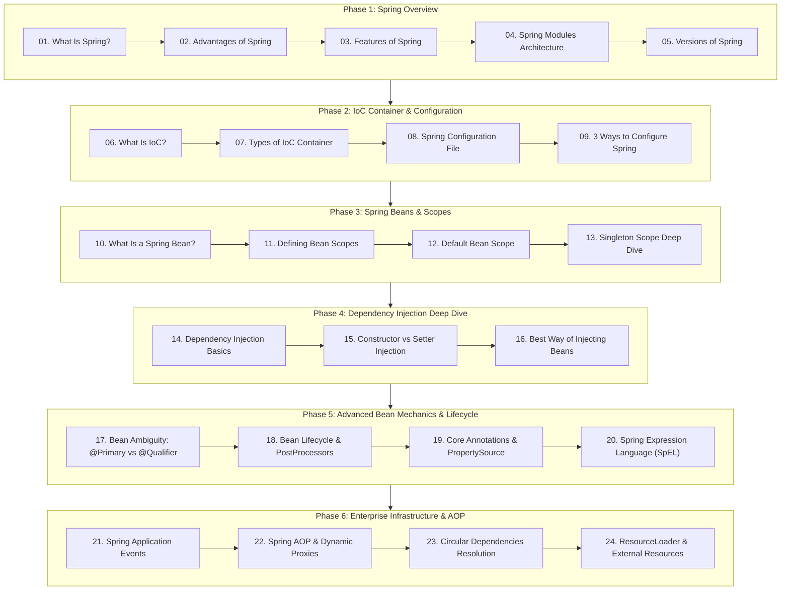

# Spring Framework for Developers

> **Course 03: Core architecture, IoC container, bean lifecycles, advanced mechanics, dynamic proxies, and dependency injection best practices.**

> 🌐 **Language / ភាសា:** 🇬🇧 **[English](README.md)** | 🇰🇭 [ភាសាខ្មែរ (Khmer)](README.kh.md)

[-brightgreen.svg)](#table-of-contents)

---

## 📖 About This Course

The **Spring Framework** powers mission-critical enterprise applications worldwide. In this comprehensive module across **24 Parts**, we uncover how Spring works under the hood:
- The core philosophy of **Inversion of Control (IoC)** and **Dependency Injection (DI)**
- Container mechanics: `BeanFactory` vs `ApplicationContext`
- 3 distinct metadata declaration strategies (XML, Java-based `@Configuration`, Annotation-based `@Component`)
- **Spring Beans**, **Bean Scopes** (Singleton, Prototype, Web Scopes), and thread-safety considerations
- Constructor vs Setter injection and production best practices
- **Bean Ambiguity Resolution** with `@Primary`, `@Qualifier`, and Custom Qualifier Annotations
- **Bean Lifecycle & PostProcessors** (`BeanPostProcessor`, `BeanFactoryPostProcessor`, and Aware Interfaces)
- **Core Annotations & Externalized Configuration** (`@Value`, `@PropertySource`, `@Profile`, `@Lazy`, `@DependsOn`, `@Order`)
- **Spring Expression Language (SpEL)** dynamic runtime evaluation (`#{...}`)
- **Spring Application Events** decoupled event-driven architecture (`ApplicationEventPublisher`, `@EventListener`, `@Async`)
- **Spring AOP & Proxy Mechanics** (JDK Dynamic Proxy vs CGLIB, Self-Invocation Trap)
- **Circular Dependencies Resolution** (Root causes, architectural smells, `@Lazy`, `ObjectProvider<T>`, Setter Injection)
- **Spring ResourceLoader & Resource Abstraction** (`classpath:`, `file:`, `https:`, Pattern Matching)

---

## 🗺️ Learning Roadmap

---

## 📚 Table of Contents

### 🟢 Phase 1 — Spring Framework Overview
1. [Part 1: What Is Spring Framework?](01-what-is-spring/README.md)
   - *Origins with Rod Johnson, the anti-J2EE/EJB revolution, non-invasive POJO design*
2. [Part 2: Advantages of Spring Framework](02-advantages-of-spring/README.md)
   - *Templates, loose coupling, effortless testing, and reduced boilerplate*
3. [Part 3: Features of Spring Framework](03-features-of-spring/README.md)
   - *The 6 pillars: Core, Testing, Data Access, Web (MVC/WebFlux), Integration, Languages*
4. [Part 4: Spring Modules Architecture](04-modules-of-spring/README.md)
   - *Core Container, AOP & Aspects, Data Access/ORM, Web, Test*
5. [Part 5: Versions and Evolution of Spring](05-versions-of-spring/README.md)
   - *Milestones from Spring 1.0, 2.5 Annotations, 4.0 Java 8, to Spring 6.0 (Java 17+ & Jakarta EE)*

---

### 🔵 Phase 2 — IoC Container & Configuration
6. [Part 6: What Is Inversion of Control (IoC)?](06-what-is-ioc/README.md)
   - *The Hollywood Principle, object lifecycle control, and automated container wiring*
7. [Part 7: Types of IoC Containers (BeanFactory vs ApplicationContext)](07-types-of-ioc-container/README.md)
   - *Lazy vs eager instantiation, enterprise service comparisons, and container selection*
8. [Part 8: Spring Configuration File](08-spring-configuration-file/README.md)
   - *XML configuration schema, `<bean>` declarations, property wiring, and evolution to JavaConfig*
9. [Part 9: 3 Ways to Configure Spring Beans](09-ways-to-configure-spring/README.md)
   - *XML-based, Java-based (`@Configuration`), and Annotation-based (`@Component` scanning)*

---

### 🟡 Phase 3 — Spring Beans & Scopes
10. [Part 10: What Is a Spring Bean?](10-what-is-a-spring-bean/README.md)
    - *Regular Java objects vs Spring Beans, bean definition metadata, and lifecycle stages*
11. [Part 11: Defining Bean Scopes](11-how-to-define-bean-scope/README.md)
    - *The 6 scopes: `singleton`, `prototype`, `request`, `session`, `application`, `websocket`*
12. [Part 12: Default Bean Scope in Spring Framework](12-default-bean-scope/README.md)
    - *Why Spring defaults to `singleton`, memory efficiency, and crucial thread-safety rules*
13. [Part 13: Deep Dive: Singleton Scope of a Spring Bean](13-singleton-scope/README.md)
    - *Spring Singleton vs GoF Singleton Design Pattern, internal registry cache*

---

### 🟣 Phase 4 — Dependency Injection Deep Dive
14. [Part 14: What Is Dependency Injection (DI)?](14-what-is-dependency-injection/README.md)
    - *Core DI concepts, 3 injection types: Constructor, Setter, and Field Injection*
15. [Part 15: Constructor Injection vs. Setter Injection](15-constructor-vs-setter-injection/README.md)
    - *Mandatory vs optional dependencies, `final` immutability, overriding priority, circular dependencies*
16. [Part 16: Best Way of Injecting Beans and Why](16-best-way-of-injecting-beans/README.md)
    - *Why Constructor Injection wins: compile-time null safety, pure POJO unit testing, Lombok integration*

---

### 🟠 Phase 5 — Advanced Bean Mechanics & Lifecycle
17. [Part 17: Resolving Bean Ambiguity (@Primary vs @Qualifier)](17-bean-ambiguity-primary-qualifier/README.md)
    - *`NoUniqueBeanDefinitionException`, `@Primary` fallback, `@Qualifier` targeting, and Type-Safe Custom Qualifier Annotations*
18. [Part 18: Spring Bean Lifecycle and PostProcessors Deep Dive](18-bean-lifecycle-and-postprocessor/README.md)
    - *The 11-step Bean Lifecycle, `BeanPostProcessor`, `BeanFactoryPostProcessor`, and Aware Interfaces*
19. [Part 19: Core Annotations and Externalized Configuration](19-core-annotations-and-properties/README.md)
    - *`@Value`, `@PropertySource`, `@Profile`, `@Lazy`, `@DependsOn`, `@Order` runtime environment control*
20. [Part 20: Spring Expression Language (SpEL)](20-spring-expression-language-spel/README.md)
    - *SpEL syntax `#{...}` vs Property Placeholder `${...}`, Elvis operator `?:`, Safe navigation `?.`, Collection projections*

---

### 🔴 Phase 6 — Enterprise Infrastructure & AOP
21. [Part 21: Spring Application Events (Decoupled Event-Driven Architecture)](21-spring-application-events/README.md)
    - *`ApplicationEventPublisher`, `@EventListener`, Generic & Transactional Events (`@TransactionalEventListener`), and Asynchronous `@Async`*
22. [Part 22: Spring AOP and Dynamic Proxies](22-spring-aop-and-proxies/README.md)
    - *JDK Dynamic Proxy vs CGLIB, Aspect, Pointcut, Advice Types, and resolving the Self-Invocation Trap*
23. [Part 23: Resolving Circular Dependencies in Spring](23-circular-dependencies-resolution/README.md)
    - *`BeanCurrentlyInCreationException`, 3-Tier Cache Architecture, and resolution via `@Lazy`, `ObjectProvider<T>`, Setter/Field Injection*
24. [Part 24: Spring ResourceLoader and External Resource Abstraction](24-spring-resource-loader/README.md)
    - *`Resource` interface, `ResourceLoader`, Prefix Protocols (`classpath:`, `file:`, `https:`), Ant-Style Wildcards (`classpath*:`) in Container*

---

## 💻 Runnable Example Projects

This course includes 3 pure Spring Framework 6 Maven projects in the `examples/` directory:

| Project | Key Technologies | Location |
| :--- | :--- | :--- |
| **01-pure-spring-ioc-di** | Pure Spring 6, JavaConfig, `@Primary`, `@Qualifier`, Constructor Injection | [`examples/01-pure-spring-ioc-di/`](examples/01-pure-spring-ioc-di) |
| **02-bean-lifecycle-and-postprocessor** | `@PostConstruct`, `@PreDestroy`, `BeanPostProcessor`, Aware interfaces | [`examples/02-bean-lifecycle-and-postprocessor/`](examples/02-bean-lifecycle-and-postprocessor) |
| **03-spring-events-and-spel** | Decoupled Application Events, `@EventListener`, Dynamic SpEL expressions | [`examples/03-spring-events-and-spel/`](examples/03-spring-events-and-spel) |

---

## 📚 Official Reference Library (Spring Docs)

| Topic | Official Spring Documentation Link |
| :--- | :--- |
| **Spring Framework Core Overview** | [Spring Core Technologies Overview](https://docs.spring.io/spring-framework/reference/core.html) |
| **The IoC Container & Beans** | [The IoC Container Mechanics](https://docs.spring.io/spring-framework/reference/core/beans.html) |
| **Bean Lifecycle Nature** | [Customizing the Nature of a Bean](https://docs.spring.io/spring-framework/reference/core/beans/factory-nature.html) |
| **Annotation-based Container Configuration** | [Annotation-based Container Config](https://docs.spring.io/spring-framework/reference/core/beans/annotation-config.html) |
| **Spring Expression Language (SpEL)** | [Spring Expression Language (SpEL) Guide](https://docs.spring.io/spring-framework/reference/core/expressions.html) |
| **Aspect-Oriented Programming (AOP)** | [Spring Aspect Oriented Programming with Spring](https://docs.spring.io/spring-framework/reference/core/aop.html) |
| **Resources & ResourceLoader** | [Spring Resources Abstraction](https://docs.spring.io/spring-framework/reference/core/resources.html) |

---

## 🧭 Course Navigation

| Previous | Main Vault | Next Course |
| :--- | :---: | :--- |
| [← Course 02: Advance Java](../02-advance-java/README.md) | [🏠 Main Vault](../README.md) | [Course 04: Spring Boot →](../04-spring-boot/README.md) |

---

## 🔗 Sister Repositories in the Master Curriculum
- 📘 [Basic Java Fundamentals](https://github.com/sakousa856-sketch/java-basic-for-developers-khmer)
- 📗 [Advance Java OOP](https://github.com/sakousa856-sketch/java-advance-for-developers-khmer)
- 📙 [Spring Framework Core Architecture](https://github.com/sakousa856-sketch/spring-framework-for-developers-khmer)
- 📕 [Spring Boot Enterprise & Microservices](https://github.com/sakousa856-sketch/spring-boot-for-developers-khmer)
- 💼 [Java & Spring Interview Handbook](https://github.com/sakousa856-sketch/java-spring-interview-handbook-khmer)
