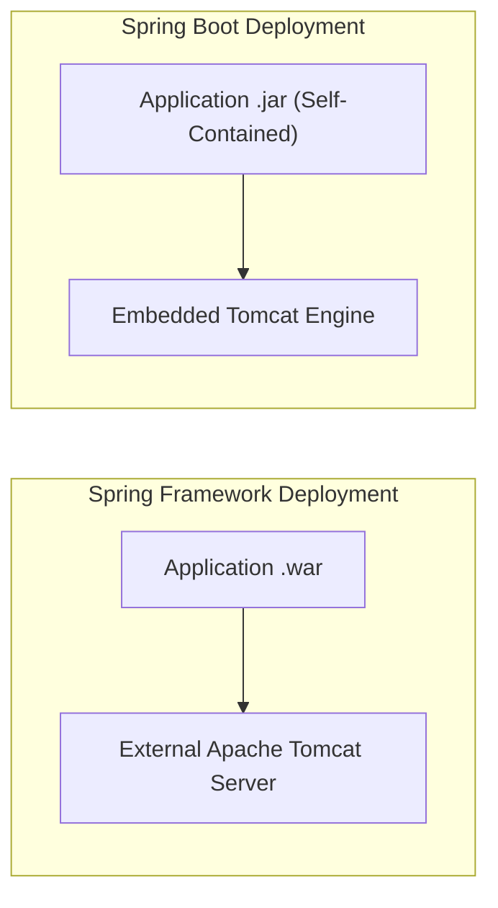

# មេរៀនទី ២: ការប្រៀបធៀប Spring Framework vs Spring Boot

> 🌐 **ភាសា / Language:** 🇰🇭 **[ភាសាខ្មែរ (Khmer)](README.kh.md)** | 🇬🇧 [English](README.md)  
> 🧭 **រុករក:** [📚 មាតិកា Module](../README.kh.md) | [← មេរៀនមុន](../01-introduction-to-spring-boot/README.kh.md) | [មេរៀនបន្ទាប់ →](../03-spring-mvc-vs-spring-boot/README.kh.md)

## មាតិកា (Table of Contents)

- [1. សេចក្តីផ្តើម](#1-សេចក្តីផ្តើម)
- [2. តារាងប្រៀបធៀបលក្ខណៈពិសេស (Feature Comparison Table)](#2-តារាងប្រៀបធៀបលក្ខណៈពិសេស)
- [3. ភាពខុសគ្នាលើការកំណត់ Configuration (XML vs Auto-Config)](#3-ភាពខុសគ្នាលើការកំណត់-configuration)
- [4. បញ្ហានៃ Dependency Management](#4-បញ្ហានៃ-dependency-management)
- [5. Embedded Server vs External Servlet Container](#5-embedded-server-vs-external-servlet-container)
- [6. សង្ខេប](#6-សង្ខេប)

---

## 1. សេចក្តីផ្តើម

Spring Framework ត្រូវបានបង្កើតឡើងក្នុងឆ្នាំ ២០០៣ ដើម្បីដោះស្រាយភាពស្មុគស្មាញនៃ Java EE (Enterprise JavaBeans)។ ប៉ុន្តែតាមពេលវេលាកន្លងផុតទៅ Spring Framework ខ្លួនឯងក៏បានក្លាយជាប្រព័ន្ធដ៏ធំ និងស្មុគស្មាញដោយសារតែការសរសេរ XML Configuration រាប់រយជួរ។ ក្នុងឆ្នាំ ២០១៤ Spring Boot ត្រូវបានបង្កើតឡើងដើម្បីកាត់បន្ថយបន្ទុកទាំងនេះ តាមរយៈគោលការណ៍ **Convention-over-Configuration**។

---

## 2. តារាងប្រៀបធៀបលក្ខណៈពិសេស

| លក្ខណៈវិនិច្ឆ័យ (Criteria) | Spring Framework | Spring Boot |
| :--- | :--- | :--- |
| **គោលបំណងចម្បង** | ផ្តល់នូវ IoC, DI និង Core Architecture | បង្កើនល្បឿនអភិវឌ្ឍន៍ និងបង្កើត Production-ready App |
| **Configuration** | ទាមទារការសរសេរ XML ឬ Java Config ច្រើន | Auto-Configuration ស្ទើរតែ ១០០% |
| **Embedded Server** | គ្មាន (ត្រូវ Build ជា `.war` យកទៅដាក់លើ Tomcat ខាងក្រៅ) | មានស្រាប់ (Tomcat, Jetty ឬ Undertow បង្កប់ក្នុង JAR) |
| **Dependency Management** | ត្រូវកំណត់ Version នៃបណ្ណាល័យនីមួយៗដោយខ្លួនឯង | ប្រើប្រាស់ Starters និង Spring Boot BOM |
| **ការ Deploy** | ស្មុគស្មាញ ទាមទារ External Web Server Setup | សាមញ្ញបំផុត ដំណើរការតាម `java -jar app.jar` |
| **Production Telemetry** | ត្រូវសរសេរ Code បន្ថែមខ្លួនឯង | មានស្រាប់តាមរយៈ Spring Boot Actuator |

---

## 3. ភាពខុសគ្នាលើការកំណត់ Configuration

ក្នុង Spring Framework បុរាណ ដើម្បីបង្កើត DataSource ភ្ជាប់ Database យើងត្រូវសរសេរ XML វែងអន្លាយ៖
```xml
<!-- Spring Framework XML Config -->
<bean id="dataSource" class="org.apache.commons.dbcp.BasicDataSource">
    <property name="driverClassName" value="com.mysql.cj.jdbc.Driver" />
    <property name="url" value="jdbc:mysql://localhost:3306/mydb" />
    <property name="username" value="root" />
    <property name="password" value="secret" />
</bean>
```

ក្នុង Spring Boot យើងគ្រាន់តែប្រកាស Properties ក្នុង `application.yml` ប៉ុណ្ណោះ៖
```yaml
# Spring Boot YAML Config
spring:
  datasource:
    url: jdbc:mysql://localhost:3306/mydb
    username: root
    password: secret
```

---

## 4. បញ្ហានៃ Dependency Management

Spring Framework ទាមទារឱ្យ Developer ស្វែងរក Version នៃ Hibernate, Jackson, និង Spring Context ដែលស៊ីចង្វាក់គ្នា។ បើខុស Version នឹងធ្លាក់ `NoSuchMethodError`។ 
Spring Boot ដោះស្រាយរឿងនេះទាំងស្រុងតាមរយៈ **Starter Dependencies** (ឧ. `spring-boot-starter-web`) និង **BOM (Bill of Materials)**។

---

## 5. Embedded Server vs External Servlet Container



---

## 6. សង្ខេប

- Spring Framework គឺជាគ្រឹះស្ថាបត្យកម្មស្នូល (IoC, DI)។
- Spring Boot គឺជារថយន្តល្បឿនលឿនដែលបើកបរលើផ្លូវដែករបស់ Spring Framework។
- មិនមែន Spring Boot មកជំនួស Spring Framework ទេ តែវាជាស្រទាប់ជំនួយដ៏ឆ្លាតវៃពីលើ។


---
## 🧭 ការរុករកមេរៀន (Lesson Navigation)

| ថយក្រោយ (Previous) | មាតិកា Module (Index) | បន្ទាប់ (Next) |
| :--- | :---: | :--- |
| [← សេចក្តីផ្តើមអំពី Spring Boot (What Is Spring Boot?)](../01-introduction-to-spring-boot/README.kh.md) | [📚 បញ្ជីមេរៀន Module](../README.kh.md) | [ការប្រៀបធៀប Spring MVC vs Spring Boot →](../03-spring-mvc-vs-spring-boot/README.kh.md) |
