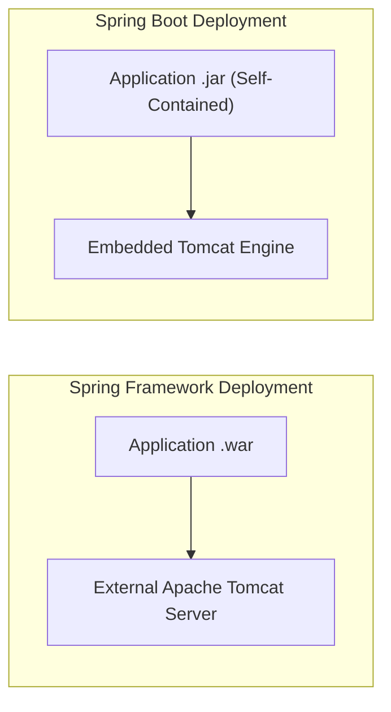

# Lesson 2: Spring Framework vs Spring Boot Comparison

> 🌐 **Language / ភាសា:** 🇬🇧 **[English](README.md)** | 🇰🇭 [ភាសាខ្មែរ (Khmer)](README.kh.md)  
> 🧭 **Navigation:** [📚 Module Index](../README.md) | [← Previous Lesson](../01-introduction-to-spring-boot/README.md) | [Next Lesson →](../03-spring-mvc-vs-spring-boot/README.md)

## Table of Contents

- [1. Introduction](#1-introduction)
- [2. Feature Comparison Table](#2-feature-comparison-table)
- [3. Configuration Overhead (XML vs Auto-Configuration)](#3-configuration-overhead-xml-vs-auto-configuration)
- [4. Dependency Management and Version Collisions](#4-dependency-management-and-version-collisions)
- [5. Embedded Server vs External Servlet Container](#5-embedded-server-vs-external-servlet-container)
- [6. Summary](#6-summary)

---

## 1. Introduction

Spring Framework debuted in 2003 to mitigate the monolithic complexity of Java EE (Enterprise JavaBeans). Over time, Spring configuration itself grew cumbersome due to extensive XML definitions. In 2014, Pivotal introduced Spring Boot to radically simplify enterprise development through **Convention-over-Configuration**.

---

## 2. Feature Comparison Table

| Criteria | Spring Framework | Spring Boot |
| :--- | :--- | :--- |
| **Primary Mission** | Enterprise architecture backbone (IoC, DI) | Rapid application scaffolding & production readiness |
| **Configuration** | Heavy manual XML or Java `@Configuration` | Opinionated Auto-Configuration |
| **Embedded Servers** | None (requires WAR packaging deployed to external Tomcat) | Embedded natively (Tomcat, Jetty, Undertow inside JAR) |
| **Dependency Management** | Manual version orchestration for every library | Opinionated Starters managed via curated BOM |
| **Deployment Model** | Deploy WAR artifact to managed container | Execute standalone executable JAR: `java -jar app.jar` |
| **Production Telemetry** | Requires custom metric implementations | Production-ready telemetry via Spring Boot Actuator |

---

## 3. Configuration Overhead (XML vs Auto-Configuration)

Traditional Spring Framework XML boilerplate for a DataSource:
```xml
<!-- Spring Framework XML Config -->
<bean id="dataSource" class="org.apache.commons.dbcp.BasicDataSource">
    <property name="driverClassName" value="com.mysql.cj.jdbc.Driver" />
    <property name="url" value="jdbc:mysql://localhost:3306/mydb" />
    <property name="username" value="root" />
    <property name="password" value="secret" />
</bean>
```

Spring Boot declarative YAML configuration:
```yaml
# Spring Boot YAML Config
spring:
  datasource:
    url: jdbc:mysql://localhost:3306/mydb
    username: root
    password: secret
```

---

## 4. Dependency Management and Version Collisions

Spring Framework projects frequently encountered classpath runtime incompatibilities (`NoSuchMethodError`) when mixing divergent versions of Hibernate, Jackson, and Spring core libraries. Spring Boot resolves this via curated parent BOMs (Bill of Materials) and starter aggregators.

---

## 5. Embedded Server vs External Servlet Container



---

## 6. Summary

- Spring Framework provides the architectural foundation (IoC, DI).
- Spring Boot is the opinionated accelerator executing atop Spring Framework.
- Spring Boot does not replace Spring Framework; it operationalizes it for cloud-native delivery.


---
## 🧭 Lesson Navigation

| Previous Lesson | Module Index | Next Lesson |
| :--- | :---: | :--- |
| [← Introduction to Spring Boot](../01-introduction-to-spring-boot/README.md) | [📚 Module Index](../README.md) | [Spring MVC vs Spring Boot Comparison →](../03-spring-mvc-vs-spring-boot/README.md) |
