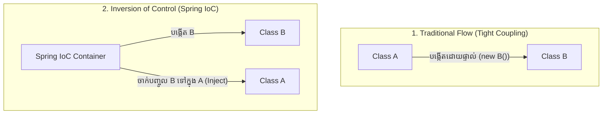

# មេរៀនទី ១: ការយល់ដឹងអំពី Inversion of Control (IoC)

> 🌐 **ភាសា / Language:** 🇰🇭 **[ភាសាខ្មែរ (Khmer)](README.kh.md)** | 🇬🇧 [English](README.md)  
> 🧭 **រុករក:** [📚 មាតិកា Module](../README.kh.md) | [← មេរៀនមុន](../../01-getting-started-with-spring-boot/07-run-spring-boot-application/README.kh.md) | [មេរៀនបន្ទាប់ →](../02-dependency-injection/README.kh.md)

## មាតិកា (Table of Contents)

- [1. បញ្ហាប្រឈមនៃ Tight Coupling ក្នុង Java ធម្មតា](#1-បញ្ហាប្រឈមនៃ-tight-coupling-ក្នុង-java-ធម្មតា)
- [2. គោលការណ៍ Inversion of Control (IoC)](#2-គោលការណ៍-inversion-of-control-ioc)
- [3. Hollywood Principle: Don't call us, we'll call you](#3-hollywood-principle-dont-call-us-well-call-you)
- [4. Spring IoC Container ដើរតួជាអ្វី?](#4-spring-ioc-container-ដើរតួជាអ្វី)
- [5. សង្ខេប](#5-សង្ខេប)

---

## 1. បញ្ហាប្រឈមនៃ Tight Coupling ក្នុង Java ធម្មតា

ក្នុងកូដ OOP ធម្មតា នៅពេល Class មួយត្រូវការ Class មួយទៀត វាតែងតែបង្កើតដោយផ្ទាល់តាមរយៈ `new`:
```java
public class OrderService {
    // Tight Coupling: OrderService ជាប់ចំណងស្អិតជាមួយ MySQLRepository
    private OrderRepository repository = new MySQLOrderRepository();
}
```
ប្រសិនបើយើងចង់ប្តូរទៅ `PostgreSQLOrderRepository` ឬចង់ Mock សម្រាប់ Unit Test យើងត្រូវចូលមកកែ Class `OrderService` ផ្ទាល់ ដែលបំពានលើគោលការណ៍ Open/Closed Principle (SOLID)។

---

## 2. គោលការណ៍ Inversion of Control (IoC)

**Inversion of Control (IoC)** គឺជាគោលការណ៍ស្ថាបត្យកម្មដែល "ក្រឡាប់បញ្ច្រាស" ការគ្រប់គ្រង Object Lifecycle។ ជំនួសឱ្យ Class ខ្លួនឯងជាអ្នកបង្កើត Object នោះភារកិច្ចគ្រប់គ្រងការបង្កើត និងភ្ជាប់ Object ត្រូវបានប្រគល់ឱ្យ **Container ខាងក្រៅ (Spring Framework)** ជាអ្នកចាត់ចែងជំនួសវិញ។



---

## 3. Hollywood Principle: Don't call us, we'll call you

គោលការណ៍ IoC ត្រូវបានគេប្រដូចទៅនឹងពាក្យស្លោកហូលីវូដ៖ *"កុំទូរស័ព្ទមករកយើង ចាំយើងទូរស័ព្ទទៅអ្នកវិញ"*។ 
- Classes របស់អ្នកមិនបាច់ខ្វល់ពីការបង្កើត Dependencies ឡើយ។
- Spring IoC Container នឹងដឹងថាពេលណាត្រូវហៅ និងពេលណាត្រូវប្រគល់ Object ឱ្យអ្នក។

---

## 4. Spring IoC Container ដើរតួជាអ្វី?

Spring IoC Container គឺជាបេះដូងស្នូលរបស់ Spring Framework។ វាទទួលបន្ទុក៖
1. **Instantiate:** បង្កើត Objects (Beans) ពេល App ចាប់ផ្តើម។
2. **Configure:** កំណត់តម្លៃ Properties និង Environment variables។
3. **Assemble (Wire):** ចាក់បញ្ចូល (Inject) Beans មួយទៅកាន់ Beans មួយទៀតតាមរយៈ Dependency Injection។
4. **Manage Lifecycle:** គ្រប់គ្រងចាប់តាំងពីកើត រហូតដល់រលត់ (Destroy)។

---

## 5. សង្ខេប

- IoC បំបែកភាពស្អិតរមួត (Decoupling) រវាង Classes ក្នុងកម្មវិធី។
- អ្នកបង្កើត Business Logic ឱ្យឯករាជ្យ ហើយទុកឱ្យ Spring IoC Container ជាអ្នកផ្គុំបញ្ចូលគ្នា។


---
## 🧭 ការរុករកមេរៀន (Lesson Navigation)

| ថយក្រោយ (Previous) | មាតិកា Module (Index) | បន្ទាប់ (Next) |
| :--- | :---: | :--- |
| [← វិធីទាំង ៤ ក្នុងការ Run កម្មវិធី Spring Boot](../../01-getting-started-with-spring-boot/07-run-spring-boot-application/README.kh.md) | [📚 បញ្ជីមេរៀន Module](../README.kh.md) | [ការយល់ដឹងស៊ីជម្រៅអំពី Dependency Injection (DI) →](../02-dependency-injection/README.kh.md) |
