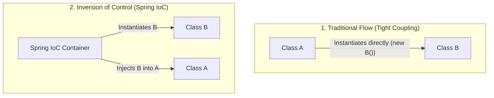

# Lesson 1: Understanding Inversion of Control (IoC)

> 🌐 **Language / ភាសា:** 🇬🇧 **[English](README.md)** | 🇰🇭 [ភាសាខ្មែរ (Khmer)](README.kh.md)  
> 🧭 **Navigation:** [📚 Module Index](../README.md) | [← Previous Lesson](../../01-getting-started-with-spring-boot/07-run-spring-boot-application/README.md) | [Next Lesson →](../02-dependency-injection/README.md)

## Table of Contents

- [1. The Tight Coupling Dilemma in Java](#1-the-tight-coupling-dilemma-in-java)
- [2. The Inversion of Control (IoC) Architectural Principle](#2-the-inversion-of-control-ioc-architectural-principle)
- [3. The Hollywood Principle: Don't call us, we'll call you](#3-the-hollywood-principle-dont-call-us-well-call-you)
- [4. Responsibilities of the Spring IoC Container](#4-responsibilities-of-the-spring-ioc-container)
- [5. Summary](#5-summary)

---

## 1. The Tight Coupling Dilemma in Java

In conventional object-oriented systems, dependent classes instantiate their prerequisites directly via the `new` operator:
```java
public class OrderService {
    // Tight coupling: OrderService is rigidly bound to MySQLOrderRepository
    private OrderRepository repository = new MySQLOrderRepository();
}
```
Swapping to `PostgreSQLOrderRepository` or substituting mocks for unit tests requires modifying `OrderService`, directly violating the SOLID Open/Closed Principle.

---

## 2. The Inversion of Control (IoC) Architectural Principle

**Inversion of Control (IoC)** inverts the flow of control regarding object lifecycle management. Instead of individual domain classes managing their own dependencies, an external runtime authority (**The Spring IoC Container**) orchestrates instantiation, configuration, and assembly.



---

## 3. The Hollywood Principle: Don't call us, we'll call you

IoC is famously described by the Hollywood Principle: *"Don't call us, we'll call you."*
- Domain classes declare their collaborators passively.
- The framework container actively coordinates injection when required.

---

## 4. Responsibilities of the Spring IoC Container

The Spring IoC Container is the foundation of the platform, managing:
1. **Instantiation:** Constructing managed objects (Beans) during application bootstrap.
2. **Configuration:** Populating properties and environment credentials.
3. **Assembly (Wiring):** Resolving dependency graphs via Dependency Injection.
4. **Lifecycle Governance:** Managing state from initialization through destruction.

---

## 5. Summary

- IoC decouples software components to maximize testability and flexibility.
- Engineers author pure domain logic; Spring container infrastructure orchestrates the object graph.


---
## 🧭 Lesson Navigation

| Previous Lesson | Module Index | Next Lesson |
| :--- | :---: | :--- |
| [← 4 Ways to Run a Spring Boot Application](../../01-getting-started-with-spring-boot/07-run-spring-boot-application/README.md) | [📚 Module Index](../README.md) | [Deep Dive into Dependency Injection (DI) →](../02-dependency-injection/README.md) |
