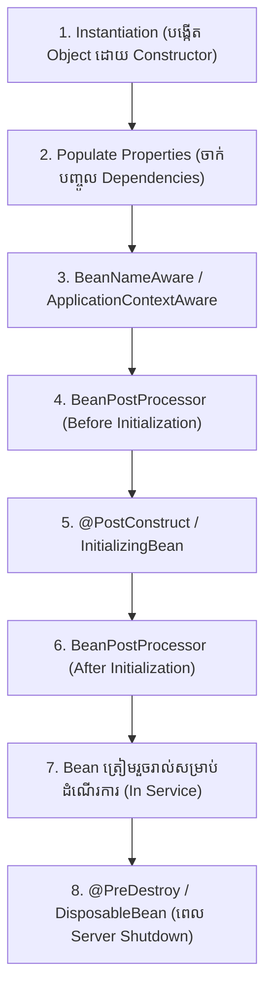

# មេរៀនទី ៤: វដ្តជីវិតរបស់ Spring Bean (Spring Bean Lifecycle)

> 🌐 **ភាសា / Language:** 🇰🇭 **[ភាសាខ្មែរ (Khmer)](README.kh.md)** | 🇬🇧 [English](README.md)  
> 🧭 **រុករក:** [📚 មាតិកា Module](../README.kh.md) | [← មេរៀនមុន](../03-beanfactory-vs-applicationcontext/README.kh.md) | [មេរៀនបន្ទាប់ →](../05-singleton-and-prototype-scopes/README.kh.md)

## មាតិកា (Table of Contents)

- [1. ដំណាក់កាលនៃវដ្តជីវិតរបស់ Spring Bean](#1-ដំណាក់កាលនៃវដ្តជីវិតរបស់-spring-bean)
- [2. វិធីកំណត់ Initialization និង Destruction Callbacks](#2-វិធីកំណត់-initialization-និង-destruction-callbacks)
- [3. កូដគំរូជាមួយ `@PostConstruct` និង `@PreDestroy`](#3-កូដគំរូជាមួយ-postconstruct-និង-predestroy)
- [4. សង្ខេប](#4-សង្ខេប)

---

## 1. ដំណាក់កាលនៃវដ្តជីវិតរបស់ Spring Bean



---

## 2. វិធីកំណត់ Initialization និង Destruction Callbacks

Spring ផ្តល់ ៣ វិធីក្នុងការចាប់ Callback ពេល Bean កើត និងពេល Bean ស្លាប់៖
1. **JSR-250 Annotations (ណែនាំបំផុត):** `@PostConstruct` និង `@PreDestroy`
2. **Spring Interfaces:** `InitializingBean` (`afterPropertiesSet()`) និង `DisposableBean` (`destroy()`)
3. **Custom Methods ក្នុង `@Bean`:** `@Bean(initMethod = "init", destroyMethod = "cleanup")`

---

## 3. កូដគំរូជាមួយ `@PostConstruct` និង `@PreDestroy`

```java
package com.example.demo.service;

import jakarta.annotation.PostConstruct;
import jakarta.annotation.PreDestroy;
import org.springframework.stereotype.Service;

@Service
public class CacheWarmupService {

    @PostConstruct
    public void onStartup() {
        System.out.println("🚀 Bean បានបង្កើតរួចរាល់! កំពុង Pre-load ទិន្នន័យចូល Cache...");
    }

    @PreDestroy
    public void onShutdown() {
        System.out.println("🛑 Server កំពុងបិទ! កំពុង Flush ទិន្នន័យ និងបិទ Connection...");
    }
}
```

---

## 4. សង្ខេប

- `@PostConstruct` ដំណើរការភ្លាមៗក្រោយពេល Dependencies ទាំងអស់ត្រូវបាន Inject រួច។
- `@PreDestroy` ដំណើរការនៅពេល ApplicationContext បិទ ដើម្បី Clean up ធនធាន។


---
## 🧭 ការរុករកមេរៀន (Lesson Navigation)

| ថយក្រោយ (Previous) | មាតិកា Module (Index) | បន្ទាប់ (Next) |
| :--- | :---: | :--- |
| [← ការប្រៀបធៀប BeanFactory vs ApplicationContext](../03-beanfactory-vs-applicationcontext/README.kh.md) | [📚 បញ្ជីមេរៀន Module](../README.kh.md) | [ →](../05-singleton-and-prototype-scopes/README.kh.md) |
