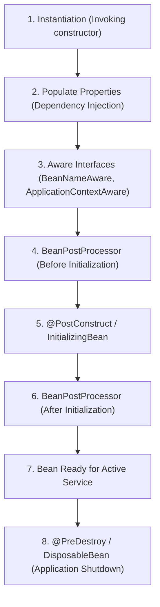

# Lesson 4: Spring Bean Lifecycle Deep Dive

> 🌐 **Language / ភាសា:** 🇬🇧 **[English](README.md)** | 🇰🇭 [ភាសាខ្មែរ (Khmer)](README.kh.md)  
> 🧭 **Navigation:** [📚 Module Index](../README.md) | [← Previous Lesson](../03-beanfactory-vs-applicationcontext/README.md) | [Next Lesson →](../05-singleton-and-prototype-scopes/README.md)

## Table of Contents

- [1. Complete Lifecycle Phases of a Spring Bean](#1-complete-lifecycle-phases-of-a-spring-bean)
- [2. Callback Registration Strategies](#2-callback-registration-strategies)
- [3. Production Code with `@PostConstruct` and `@PreDestroy`](#3-production-code-with-postconstruct-and-predestroy)
- [4. Summary](#4-summary)

---

## 1. Complete Lifecycle Phases of a Spring Bean



---

## 2. Callback Registration Strategies

Spring supports 3 mechanisms to hook into initialization and destruction lifecycles:
1. **Jakarta Annotations (Standard):** `@PostConstruct` and `@PreDestroy`
2. **Spring Marker Interfaces:** `InitializingBean` and `DisposableBean`
3. **Declarative Method Attributes:** `@Bean(initMethod = "init", destroyMethod = "cleanup")`

---

## 3. Production Code with `@PostConstruct` and `@PreDestroy`

```java
package com.example.demo.service;

import jakarta.annotation.PostConstruct;
import jakarta.annotation.PreDestroy;
import org.springframework.stereotype.Service;

@Service
public class CacheWarmupService {

    @PostConstruct
    public void onStartup() {
        System.out.println("🚀 Bean initialized! Pre-loading static caches into memory...");
    }

    @PreDestroy
    public void onShutdown() {
        System.out.println("🛑 Application shutting down! Releasing connection sockets...");
    }
}
```

---

## 4. Summary

- `@PostConstruct` fires immediately after property population and dependency injection complete.
- `@PreDestroy` triggers prior to context destruction to ensure graceful resource deallocation.


---
## 🧭 Lesson Navigation

| Previous Lesson | Module Index | Next Lesson |
| :--- | :---: | :--- |
| [← BeanFactory vs ApplicationContext Comparison](../03-beanfactory-vs-applicationcontext/README.md) | [📚 Module Index](../README.md) | [ →](../05-singleton-and-prototype-scopes/README.md) |
