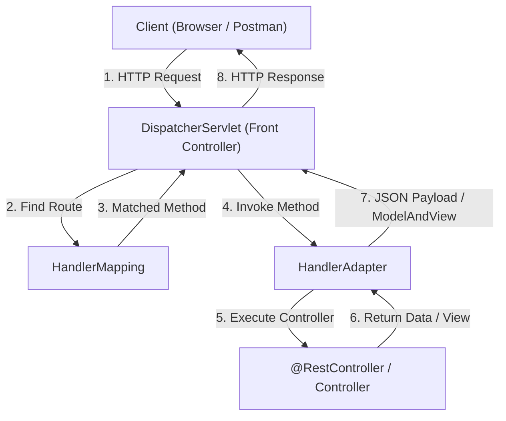

# មេរៀនទី ៩: 09-dispatcherservlet

> 🌐 **ភាសា / Language:** 🇰🇭 **[ភាសាខ្មែរ (Khmer)](README.kh.md)** | 🇬🇧 [English](README.md)  
> 🧭 **រុករក:** [📚 មាតិកា Module](../README.kh.md) | [← មេរៀនមុន](../08-spring-autowiring/README.kh.md) | [មេរៀនបន្ទាប់ →](../10-build-tools-maven-gradle/README.kh.md)

## មាតិកា (Table of Contents)

- [1. ស្ថាបត្យកម្ម Front Controller Pattern](#1-ស្ថាបត្យកម្ម-front-controller-pattern)
- [2. ដំណើរការលំហូរ Request ទាំងមូលក្នុង DispatcherServlet](#2-ដំណើរការលំហូរ-request)
- [3. សមាសធាតុសំខាន់ៗ (HandlerMapping, HandlerAdapter, ViewResolver)](#3-សមាសធាតុសំខាន់ៗ)
- [4. សង្ខេប](#4-សង្ខេប)

---

## 1. ស្ថាបត្យកម្ម Front Controller Pattern

**`DispatcherServlet`** គឺជាបេះដូង និងជាច្រកទ្វារតែមួយគត់ (Front Controller) ដែលទទួលរាល់ HTTP Requests ទាំងអស់ដែលផ្ញើមកកាន់ Spring Web Application។

---

## 2. សមាសធាតុសំខាន់ៗ

1. **`HandlerMapping`:** ពិនិត្យមើល URL Path (ឧ. `/api/v1/users`) ដើម្បីរកមើលថាតើ Controller និង Method ណាដែលត្រូវទទួល។
2. **`HandlerAdapter`:** ទទួលខុសត្រូវក្នុងការហៅ Method ពិតប្រាកដ និងចាក់បញ្ចូល Argument (`@PathVariable`, `@RequestBody`)។
3. **`HttpMessageConverter` (Jackson):** បម្លែង Return Object ទៅជា JSON String ដោយផ្ទាល់។

---

## 3. សង្ខេប

- `DispatcherServlet` គ្រប់គ្រងលំហូរ HTTP Request ទាំងមូលក្នុង Spring MVC / Spring Boot។

---
## 🧭 ការរុករកមេរៀន (Lesson Navigation)

| ថយក្រោយ (Previous) | មាតិកា Module (Index) | បន្ទាប់ (Next) |
| :--- | :---: | :--- |
| [← ការប្រើប្រាស់ Autowiring ជាមួយ @Autowired](../08-spring-autowiring/README.kh.md) | [📚 បញ្ជីមេរៀន Module](../README.kh.md) | [ការប្រើប្រាស់ Build Tools ជាមួយ Spring (Maven & Gradle) →](../10-build-tools-maven-gradle/README.kh.md) |
