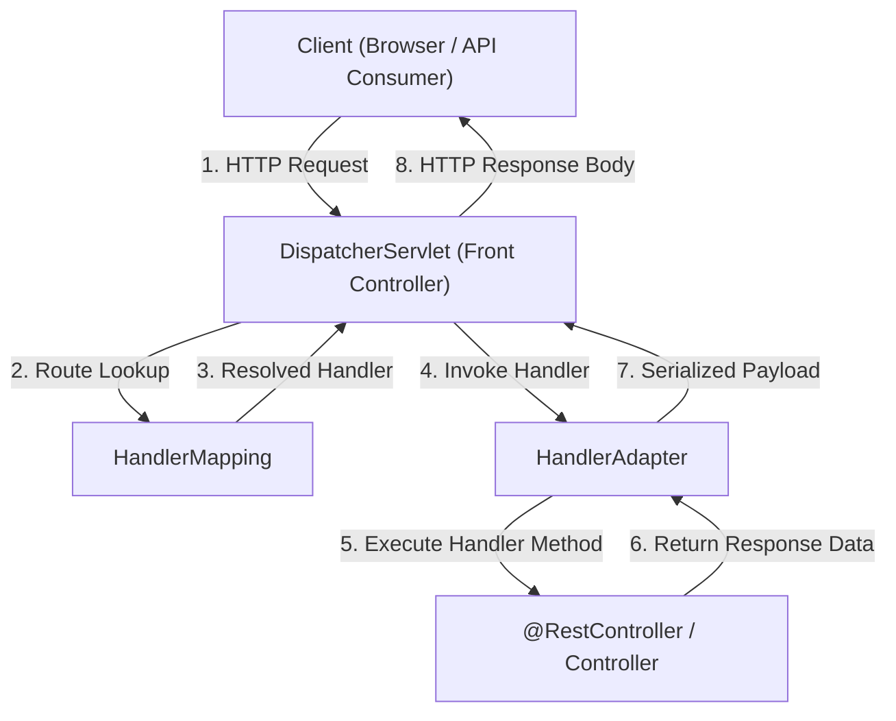

# Lesson 9: 09-dispatcherservlet

> 🌐 **Language / ភាសា:** 🇬🇧 **[English](README.md)** | 🇰🇭 [ភាសាខ្មែរ (Khmer)](README.kh.md)  
> 🧭 **Navigation:** [📚 Module Index](../README.md) | [← Previous Lesson](../08-spring-autowiring/README.md) | [Next Lesson →](../10-build-tools-maven-gradle/README.md)

## Table of Contents

- [1. The Front Controller Architectural Pattern](#1-the-front-controller-architectural-pattern)
- [2. Complete Request Lifecycle in DispatcherServlet](#2-complete-request-lifecycle)
- [3. Core Collaborators (HandlerMapping, HandlerAdapter)](#3-core-collaborators)
- [4. Summary](#4-summary)

---

## 1. The Front Controller Architectural Pattern

**`DispatcherServlet`** serves as the central front controller gateway intercepting all inbound HTTP requests in Spring Web applications.

---

## 2. Core Collaborators

1. **`HandlerMapping`:** Evaluates incoming request URIs against mapped `@RequestMapping` routes.
2. **`HandlerAdapter`:** Handles parameter resolution (`@PathVariable`, `@RequestBody`) and invokes the target controller method.
3. **`HttpMessageConverter` (Jackson):** Serializes Java return objects into JSON response streams.

---

## 3. Summary

- `DispatcherServlet` acts as the single point of entry coordinating HTTP request lifecycles.

---
## 🧭 Lesson Navigation

| Previous Lesson | Module Index | Next Lesson |
| :--- | :---: | :--- |
| [← Autowiring in Spring with @Autowired](../08-spring-autowiring/README.md) | [📚 Module Index](../README.md) | [Build Tools in Spring: Maven and Gradle →](../10-build-tools-maven-gradle/README.md) |
