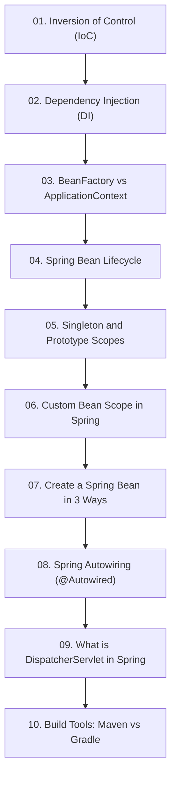

# Module 2: គោលគំនិតគ្រឹះនៃ Spring Core (Spring Core Concepts)

## 📖 សេចក្តីផ្តើមអំពី Module

សិក្សាស៊ីជម្រៅអំពីយន្តការស្នូលរបស់ Spring Framework រួមមាន Inversion of Control (IoC), Dependency Injection, Bean Scopes, Bean Lifecycle, និង DispatcherServlet។

---

## 🗺️ ផែនទីសិក្សាប្រចាំ Module (Learning Roadmap)

---

## 📚 បញ្ជីមេរៀនក្នុង Module (10 Lessons)

| មេរៀន (Lesson) | ប្រធានបទ (Topic) | ការពិពណ៌នា (Description) |
| :---: | :--- | :--- |
| **01** | [Inversion of Control (IoC)](01-inversion-of-control/README.md) | ស្វែងយល់អំពីគោលការណ៍ IoC និង IoC Container |
| **02** | [Dependency Injection (DI)](02-dependency-injection/README.md) | ការអនុវត្ត Dependency Injection ជាក់ស្តែងក្នុង Java |
| **03** | [BeanFactory vs ApplicationContext](03-beanfactory-vs-applicationcontext/README.md) | ការប្រៀបធៀបប្រភេទ Container ទាំងពីររបស់ Spring |
| **04** | [Spring Bean Lifecycle](04-spring-bean-lifecycle/README.md) | ដំណាក់កាលទាំង ៧ នៃវដ្តជីវិតរបស់ Spring Bean |
| **05** | [Singleton and Prototype Scopes](05-singleton-and-prototype-scopes/README.md) | ការយល់ដឹងអំពី Singleton (default) និង Prototype Scope |
| **06** | [Custom Bean Scope in Spring](06-custom-bean-scope/README.md) | របៀបបង្កើត Scope ផ្ទាល់ខ្លួនតាមតម្រូវការអាជីវកម្ម |
| **07** | [Create a Spring Bean in 3 Ways](07-create-spring-bean-3-ways/README.md) | វិធីទាំង ៣ ក្នុងការបង្កើត Bean (XML, Java Config, Component Scan) |
| **08** | [Spring Autowiring (@Autowired)](08-spring-autowiring/README.md) | យន្តការចាក់បញ្ចូល Bean ដោយស្វ័យប្រវត្តិតាម Type/Name |
| **09** | [What is DispatcherServlet in Spring](09-dispatcherservlet/README.md) | ស្ថាបត្យកម្ម Front Controller និងការគ្រប់គ្រង Web Request |
| **10** | [Build Tools: Maven vs Gradle](10-build-tools-maven-gradle/README.md) | ការគ្រប់គ្រង Dependencies, Plugins, និង Lifecycle ក្នុង Maven & Gradle |

---

## 🧭 ការរុករក (Navigation)

| ថយក្រោយ (Previous) | មាតិកាចម្បង (Main Index) | បន្ទាប់ (Next Module) |
| :--- | :---: | :--- |
| [Module 1: Getting Started](../01-getting-started-with-spring-boot/README.md) | [📚 មាតិកា Spring Boot](../README.md) | [Module 3: Core Features →](../03-spring-boot-core-features/README.md) |
