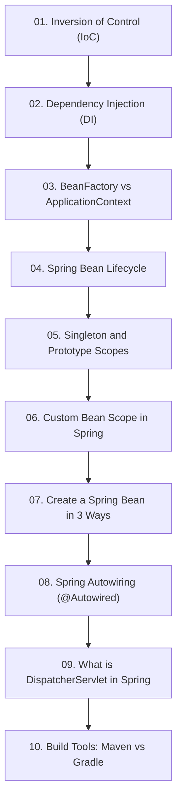

# Module 2: Spring Core Concepts & Fundamentals

> 🌐 **Language / ភាសា:** 🇰🇭 [ភាសាខ្មែរ (Khmer)](README.kh.md) | 🇬🇧 **[English](README.md)**

## 📖 Module Overview

Deep dive into Spring's architectural engine: Inversion of Control (IoC), Dependency Injection (DI), Bean lifecycles, Bean scopes, Autowiring, and DispatcherServlet.

---

## 🗺️ Module Learning Roadmap

---

## 📚 Lessons in This Module (10 Lessons)

| Lesson | Topic | Description |
| :---: | :--- | :--- |
| **01** | [Inversion of Control (IoC)](01-inversion-of-control/README.md) | Understanding the Inversion of Control paradigm |
| **02** | [Dependency Injection (DI)](02-dependency-injection/README.md) | Practical Dependency Injection in enterprise Java |
| **03** | [BeanFactory vs ApplicationContext](03-beanfactory-vs-applicationcontext/README.md) | Comparing Spring's lightweight BeanFactory and rich ApplicationContext |
| **04** | [Spring Bean Lifecycle](04-spring-bean-lifecycle/README.md) | The complete lifecycle phases of a managed Spring Bean |
| **05** | [Singleton and Prototype Scopes](05-singleton-and-prototype-scopes/README.md) | Deep dive into Singleton (default) vs Prototype bean scopes |
| **06** | [Custom Bean Scope in Spring](06-custom-bean-scope/README.md) | Creating custom bean scopes in Spring |
| **07** | [Create a Spring Bean in 3 Ways](07-create-spring-bean-3-ways/README.md) | 3 ways to declare beans: XML, Java @Bean, and @Component scan |
| **08** | [Spring Autowiring (@Autowired)](08-spring-autowiring/README.md) | Automated dependency wiring with @Autowired and @Qualifier |
| **09** | [What is DispatcherServlet in Spring](09-dispatcherservlet/README.md) | DispatcherServlet: Front Controller pattern and HTTP routing |
| **10** | [Build Tools: Maven vs Gradle](10-build-tools-maven-gradle/README.md) | Build automation tools: Maven POM vs Gradle DSL |

---

## 🧭 Navigation

| Previous | Main Index | Next Module |
| :--- | :---: | :--- |
| [Module 1: Getting Started](../01-getting-started-with-spring-boot/README.md) | [📚 Spring Boot Home](../README.md) | [Module 3: Core Features →](../03-spring-boot-core-features/README.md) |
