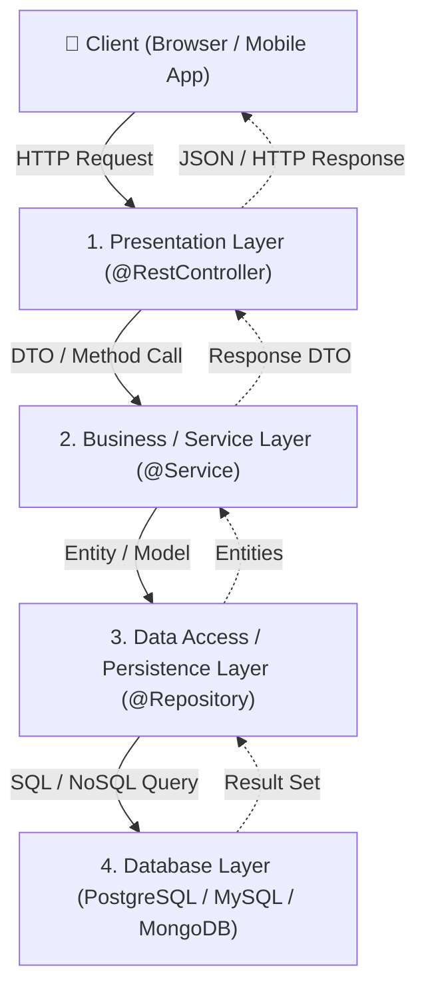

# មេរៀនទី ១: ស្ថាបត្យកម្មខាងក្នុងរបស់ Spring Boot (Spring Boot Architecture)

> 🌐 **ភាសា / Language:** 🇰🇭 **[ភាសាខ្មែរ (Khmer)](README.kh.md)** | 🇬🇧 [English](README.md)  
> 🧭 **រុករក:** [📚 មាតិកា Module](../README.kh.md) | [← មេរៀនមុន](../../02-spring-core-concept/10-build-tools-maven-gradle/README.kh.md) | [មេរៀនបន្ទាប់ →](../02-spring-boot-annotations/README.kh.md)

## មាតិកា (Table of Contents)

- [1. ទិដ្ឋភាពទូទៅនៃស្ថាបត្យកម្ម Spring Boot](#1-ទិដ្ឋភាពទូទៅនៃស្ថាបត្យកម្ម-spring-boot)
- [2. ស្រទាប់ស្ថាបត្យកម្មទាំង ៤ (The 4 Architectural Layers)](#2-ស្រទាប់ស្ថាបត្យកម្មទាំង-៤-the-4-architectural-layers)
- [3. លំហូរនៃការដំណើរការ Request (Request Execution Flow)](#3-លំហូរនៃការដំណើរការ-request-request-execution-flow)
- [4. តារាងតួនាទីនៃស្រទាប់នីមួយៗ](#4-តារាងតួនាទីនៃស្រទាប់នីមួយៗ)

---

## 1. ទិដ្ឋភាពទូទៅនៃស្ថាបត្យកម្ម Spring Boot

Spring Boot ប្រើប្រាស់ស្ថាបត្យកម្មបែប **Layered Architecture** (ស្ថាបត្យកម្មតាមស្រទាប់) ផ្អែកលើគំរូ MVC (Model-View-Controller)។ គោលបំណងចម្បងនៃការរៀបចំជាស្រទាប់ គឺអនុវត្តតាមគោលការណ៍ **Separation of Concerns (SoC)** ដោយធានាថាស្រទាប់នីមួយៗមានការទទួលខុសត្រូវដាច់ដោយឡែកពីគ្នា ងាយស្រួលសរសេរ Unit Test និងពង្រីកប្រព័ន្ធ (Scalable)។

---

## 2. ស្រទាប់ស្ថាបត្យកម្មទាំង ៤ (The 4 Architectural Layers)

### 1. Presentation Layer (ស្រទាប់បង្ហាញ និងទទួលសំណើ)
- ទទួលខុសត្រូវលើការស្តាប់ និងទទួលរាល់ HTTP Requests (GET, POST, PUT, DELETE) ពីខាងក្រៅ។
- ប្រើប្រាស់ `@RestController` ឬ `@Controller` ជាមួយ `@RequestMapping`។
- មិនត្រូវសរសេរ Business Logic ឬ SQL Query នៅក្នុងស្រទាប់នេះឡើយ — តួនាទីរបស់វាគឺផ្ទៀងផ្ទាត់ Request Input (`@Valid`) រួចបញ្ជូនបន្តទៅកាន់ Service Layer។

### 2. Business Logic / Service Layer (ស្រទាប់អាជីវកម្ម)
- ជាបេះដូងនៃកម្មវិធី ផ្ទុកនូវរាល់ Business Rules, ការគណនា, និងការគ្រប់គ្រងលក្ខខណ្ឌអាជីវកម្ម។
- ប្រើប្រាស់ `@Service` annotation។
- គ្រប់គ្រង **Transactions** តាមរយៈ `@Transactional` ធានាសុចរិតភាពទិន្នន័យ (ACID properties)។

### 3. Data Access / Persistence Layer (ស្រទាប់ទាញយកទិន្នន័យ)
- ទទួលខុសត្រូវលើការទាក់ទងជាមួយ Database ដោយផ្ទាល់ ដូចជាការ Create, Read, Update, Delete (CRUD)។
- ប្រើប្រាស់ `@Repository` annotation ឬ Spring Data JPA Interfaces (`JpaRepository`, `CrudRepository`)។
- បំប្លែងទិន្នន័យពី Table Rows ទៅជា Java Entities (`@Entity`)។

### 4. Database Layer (ប្រព័ន្ធមូលដ្ឋានទិន្នន័យ)
- ជាកន្លែងផ្ទុកទិន្នន័យជាក់ស្តែង (Relational DB ដូចជា PostgreSQL, MySQL ឬ NoSQL ដូចជា MongoDB, Redis)។

---

## 3. លំហូរនៃការដំណើរការ Request (Request Execution Flow)

នៅពេលមាន HTTP Request មកកាន់ Spring Boot App៖
1. **Embedded Tomcat Server** ទទួល Request រួចបញ្ជូនទៅកាន់ **`DispatcherServlet`** (Front Controller របស់ Spring)។
2. `DispatcherServlet` សួរទៅកាន់ **`HandlerMapping`** ដើម្បីរកមើលថាតើ `@RestController` ណាដែលត្រូវទទួលខុសត្រូវលើ URL នេះ។
3. **Controller** ហៅ **Service Layer** ដើម្បីដំណើរការ Business Rules។
4. **Service** ហៅ **Repository Layer** ដើម្បី Query ទិន្នន័យពី Database។
5. **Database** បញ្ជូនលទ្ធផលត្រឡប់មកវិញតាមលំដាប់លំដោយរហូតដល់ Controller។
6. **HttpMessageConverter (Jackson)** បំប្លែង Java Object នោះទៅជា **JSON Response** ផ្ញើត្រឡប់ទៅ Client វិញ។

---

## 4. តារាងតួនាទីនៃស្រទាប់នីមួយៗ

| ស្រទាប់ (Layer) | Annotation ចម្បង | តួនាទីស្នូល | អ្វីដែលមិនគួរធ្វើ |
| :--- | :--- | :--- | :--- |
| **Presentation** | `@RestController` | ទទួល Request & Return JSON | កុំសរសេរ Database Query ផ្ទាល់ |
| **Business** | `@Service` | គ្រប់គ្រង Logic & Transactions | កុំទទួលយក HTTP Servlet Objects ផ្ទាល់ |
| **Persistence** | `@Repository` | ធ្វើការ CRUD ជាមួយ Database | កុំសរសេរ Business Rules ក្នុង Query |

---
## 🧭 ការរុករកមេរៀន (Lesson Navigation)

| ថយក្រោយ (Previous) | មាតិកា Module (Index) | បន្ទាប់ (Next) |
| :--- | :---: | :--- |
| [← ការប្រើប្រាស់ Build Tools ជាមួយ Spring (Maven & Gradle)](../../02-spring-core-concept/10-build-tools-maven-gradle/README.kh.md) | [📚 បញ្ជីមេរៀន Module](../README.kh.md) | [Spring Boot Annotations សំខាន់ៗ (Core Spring Boot Annotations) →](../02-spring-boot-annotations/README.kh.md) |
