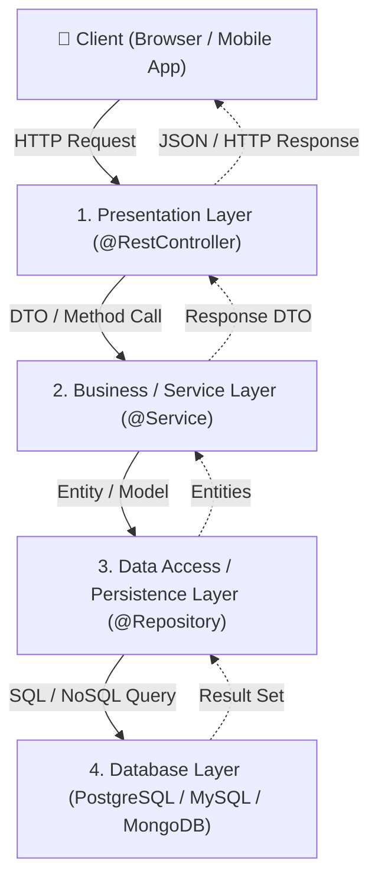

# Lesson 1: Spring Boot Internal Architecture and Execution Flow

> 🌐 **Language / ភាសា:** 🇬🇧 **[English](README.md)** | 🇰🇭 [ភាសាខ្មែរ (Khmer)](README.kh.md)  
> 🧭 **Navigation:** [📚 Module Index](../README.md) | [← Previous Lesson](../../02-spring-core-concept/10-build-tools-maven-gradle/README.md) | [Next Lesson →](../02-spring-boot-annotations/README.md)

## Table of Contents

- [1. Overview of Spring Boot Architecture](#1-overview-of-spring-boot-architecture)
- [2. The 4 Architectural Layers](#2-the-4-architectural-layers)
- [3. Request Execution Flow](#3-request-execution-flow)
- [4. Layer Responsibility Matrix](#4-layer-responsibility-matrix)

---

## 1. Overview of Spring Boot Architecture

Spring Boot adopts a classic **Layered Architecture** rooted in the MVC (Model-View-Controller) design pattern. This adheres strictly to the **Separation of Concerns (SoC)** principle, ensuring each subsystem handles a discrete responsibility, maximizing testability and maintainability.

---

## 2. The 4 Architectural Layers

### 1. Presentation Layer (Controllers)
- Intercepts incoming HTTP requests (GET, POST, PUT, DELETE) and produces responses.
- Uses `@RestController` or `@Controller` with `@RequestMapping`.
- Never contains business calculations or raw database access; strictly performs input validation (`@Valid`) and delegates down.

### 2. Business / Service Layer
- Houses domain logic, business rules, workflows, and transaction boundaries.
- Uses `@Service` annotation.
- Manages transaction consistency via `@Transactional`.

### 3. Data Access / Persistence Layer (Repositories)
- Abstracts communication with database systems via CRUD operations.
- Uses `@Repository` or Spring Data JPA interfaces (`JpaRepository`).
- Maps tabular database records to Java entities (`@Entity`).

### 4. Database Layer
- Physical data storage (relational engines like PostgreSQL/MySQL or NoSQL stores like MongoDB/Redis).

---

## 3. Request Execution Flow

When an HTTP client initiates a request:
1. **Embedded Tomcat** intercepts the raw request socket and routes it to the **`DispatcherServlet`** (Front Controller).
2. The `DispatcherServlet` queries **`HandlerMapping`** to identify the matching `@RestController` method.
3. The **Controller** delegates domain operations to the **Service Layer**.
4. The **Service** calls the **Repository Layer** for data persistence.
5. The database returns results back up the chain.
6. The Jackson **`HttpMessageConverter`** serializes the returned Java POJO into **JSON**, sending it back to the client with the appropriate HTTP status code.

---

## 4. Layer Responsibility Matrix

| Layer | Primary Annotation | Core Role | Anti-pattern to Avoid |
| :--- | :--- | :--- | :--- |
| **Presentation** | `@RestController` | Request routing & JSON serialization | Writing raw SQL queries |
| **Business** | `@Service` | Domain rules & transactions | Interfacing directly with `HttpServletRequest` |
| **Persistence** | `@Repository` | Data retrieval & mapping | Embedding complex business rules |

---
## 🧭 Lesson Navigation

| Previous Lesson | Module Index | Next Lesson |
| :--- | :---: | :--- |
| [← Build Tools in Spring: Maven and Gradle](../../02-spring-core-concept/10-build-tools-maven-gradle/README.md) | [📚 Module Index](../README.md) | [Core Spring Boot Annotations →](../02-spring-boot-annotations/README.md) |
