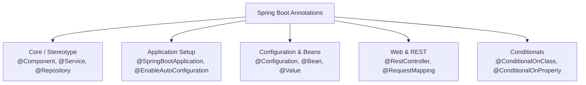

# មេរៀនទី ២: Spring Boot Annotations សំខាន់ៗ (Core Spring Boot Annotations)
> 🧭 **រុករក:** [📚 មាតិកា Module](../README.md) | [← មេរៀនមុន](../01-spring-boot-architecture/README.md) | [មេរៀនបន្ទាប់ →](../03-auto-configuration/README.md)

> 📂 **កូដគំរូជាក់ស្តែង (Runnable Example Project):**  
> 👉 **គម្រោងពេញលេញ:** [Bookstore REST API (@RestController, @Service, @Repository)](../../examples/01-rest-api-crud)  
> 📄 **File កូដជាក់ស្តែង:** [`BookController.java`](../../examples/01-rest-api-crud/src/main/java/com/example/bookstore/controller/BookController.java) | [`BookService.java`](../../examples/01-rest-api-crud/src/main/java/com/example/bookstore/service/BookService.java) | [`BookRepository.java`](../../examples/01-rest-api-crud/src/main/java/com/example/bookstore/repository/BookRepository.java)


---

## មាតិកា (Table of Contents)
1. [សេចក្តីផ្តើមអំពី Spring Boot Annotations](#សេចក្តីផ្តើមអំពី-spring-boot-annotations)
2. [Annotation ស្នូលបំផុត: @SpringBootApplication](#annotation-ស្នូលបំផុត-springbootapplication)
3. [Stereotype Annotations (@Component, @Service, @Repository, @Controller)](#stereotype-annotations)
4. [Configuration & Bean Annotations (@Configuration, @Bean)](#configuration--bean-annotations)
5. [Dependency Injection & Conditional Annotations](#dependency-injection--conditional-annotations)
6. [តារាងសង្ខេប Annotations ទូទៅ](#តារាងសង្ខេប-annotations-ទូទៅ)
7. [សេចក្តីសន្និដ្ឋាន & Best Practices](#សេចក្តីសន្និដ្ឋាន--best-practices)

---

## សេចក្តីផ្តើមអំពី Spring Boot Annotations
នៅក្នុង Java Spring Boot, **Annotations** គឺជាទម្រង់ Metadata ពិសេសដែលផ្តល់ព័ត៌មានទៅកាន់ Spring Framework អំពីរបៀបគ្រប់គ្រង ដំណើរការ និង instantiate class, method ឬ variable ដោយមិនចាំបាច់សរសេរ XML Configuration ស្មុគស្មាញឡើយ។



---

## Annotation ស្នូលបំផុត: @SpringBootApplication

`@SpringBootApplication` គឺជា Meta-Annotation ដ៏មានឥទ្ធិពលបំផុតដែលបូកបញ្ចូល Annotation ធំៗចំនួន ៣៖
1. `@SpringBootConfiguration`: កំណត់ថា class នេះជាប្រភពនៃ Bean Definitions (ដូចទៅនឹង `@Configuration`)។
2. `@EnableAutoConfiguration`: ប្រាប់អោយ Spring Boot បើកយន្តការ Auto-Configuration ស្វ័យប្រវត្តផ្អែកលើ classpath dependencies។
3. `@ComponentScan`: ប្រាប់អោយ Spring ស្វែងរក (scan) រាល់ Classes ដែលមាន `@Component`, `@Service`, `@Repository`, `@Controller` នៅក្នុង Package បច្ចុប្បន្ន និង Sub-packages ទាំងអស់។

```java
package com.example.demo;

import org.springframework.boot.SpringApplication;
import org.springframework.boot.autoconfigure.SpringBootApplication;

@SpringBootApplication
public class DemoApplication {
    public static void main(String[] args) {
        SpringApplication.run(DemoApplication.class, args);
    }
}
```

---

## Stereotype Annotations

Spring ផ្តល់នូវ Stereotype Annotations ដើម្បីកំណត់តួនាទី (Role) ច្បាស់លាស់នៃស្រទាប់នីមួយៗ (Architectural Layers):

| Annotation | កម្រិតស្រទាប់ (Layer) | ការពិពណ៌នា |
| :--- | :--- | :--- |
| `@Component` | Generic | កំណត់ Class ណាមួយថាជា Spring-managed component (Bean) |
| `@Service` | Business/Service Layer | កំណត់ Service Class ដែលផ្ទុក Business Logic និង Transaction Management |
| `@Repository` | Data/DAO Layer | កំណត់ Database Access Class (បកប្រែ SQLException ទៅ DataAccessException ដោយស្វ័យប្រវត្តិ) |
| `@Controller` | Presentation Layer | កំណត់ Spring MVC Controller ដែល return HTML View |
| `@RestController` | REST API Layer | បន្សំរវាង `@Controller` + `@ResponseBody` សម្រាប់ return JSON/XML ដោយផ្ទាល់ |

### ឧទាហរណ៍ជាក់ស្តែង:
```java
@Service
public class OrderService {
    private final OrderRepository orderRepository;

    public OrderService(OrderRepository orderRepository) {
        this.orderRepository = orderRepository;
    }

    public Order createOrder(Order order) {
        // Business logic here
        return orderRepository.save(order);
    }
}
```

---

## Configuration & Bean Annotations

នៅពេលដែលយើងចង់បង្កើត Bean សម្រាប់ Third-party Library (ដែលយើងមិនអាចដាក់ `@Component` លើ class គេបាន) យើងត្រូវប្រើ `@Configuration` និង `@Bean`៖

```java
@Configuration
public class AppConfig {

    @Bean
    public ModelMapper modelMapper() {
        return new ModelMapper();
    }
}
```

---

## Dependency Injection & Conditional Annotations

### 1. `@Autowired` និង `@Qualifier`
ប្រើសម្រាប់ Inject Bean ចូលទៅកាន់ Class ផ្សេងទៀត៖
```java
@Service
public class NotificationService {
    private final MessageSender sender;

    public NotificationService(@Qualifier("emailSender") MessageSender sender) {
        this.sender = sender;
    }
}
```

### 2. `@Value`
ប្រើសម្រាប់ទាញយកតម្លៃពី file `application.properties` ឬ `application.yml`៖
```java
@Component
public class AppInfo {
    @Value("${app.name:DefaultApp}")
    private String appName;

    @Value("${app.timeout:5000}")
    private int timeout;
}
```

### 3. Conditional Annotations (ឧទាហរណ៍ `@ConditionalOnProperty`)
```java
@Configuration
@ConditionalOnProperty(name = "feature.cache.enabled", havingValue = "true")
public class CacheConfig {
    // ដំណើរការលុះត្រាតែ feature.cache.enabled=true
}
```

---

## តារាងសង្ខេប Annotations ទូទៅ

| Annotation | គោលបំណង | ទីតាំងដាក់ |
| :--- | :--- | :--- |
| `@SpringBootApplication` | Entry point របស់កម្មវិធី Spring Boot | Main Application Class |
| `@Component` | ចុះឈ្មោះ Class ជា Bean | Class Level |
| `@Service` | កំណត់ Business Logic Layer | Class Level |
| `@Repository` | កំណត់ Data Access Layer | Class Level |
| `@RestController` | បង្កើត REST Web Service API | Class Level |
| `@Autowired` | Injection Dependency | Constructor, Field, Setter |
| `@Value` | Inject តម្លៃពី Properties | Field, Method Parameter |
| `@PostConstruct` | កូដដែលដំណើរការក្រោយពេល Bean បង្កើតរួចរាល់ | Method Level |
| `@PreDestroy` | កូដដែលដំណើរការមុនពេល Bean ត្រូវបានកម្ទេចចោល | Method Level |

---

## សេចក្តីសន្និដ្ឋាន & Best Practices
- **ប្រើប្រាស់ Constructor Injection ជានិច្ច** ជំនួស Field Injection (`@Autowired` នៅលើ Field)។
- កំណត់តួនាទី Layer អោយបានច្បាស់លាស់ ដោយប្រើ `@Service` និង `@Repository` ជំនួស `@Component` ធម្មតា។
- ប្រើ `@Value` ឬ `@ConfigurationProperties` ដើម្បីអោយ Configuration មានសុវត្ថិភាព និងងាយស្រួលគ្រប់គ្រង។

---

## 🧭 ការរុករកមេរៀន (Lesson Navigation)

| ថយក្រោយ (Previous) | មាតិកា Module (Index) | បន្ទាប់ (Next) |
| :--- | :---: | :--- |
| [← ស្ថាបត្យកម្មខាងក្នុងរបស់ Spring Boot (Spring Boot Architecture)](../01-spring-boot-architecture/README.md) | [📚 បញ្ជីមេរៀន Module](../README.md) | [យន្តការកំណត់រចនាសម្ព័ន្ធស្វ័យប្រវត្តិ (Auto-Configuration Deep Dive) →](../03-auto-configuration/README.md) |
