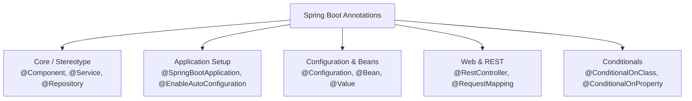

# Lesson 2: Core Spring Boot Annotations

> 🌐 **Language / ភាសា:** 🇬🇧 **[English](README.md)** | 🇰🇭 [ភាសាខ្មែរ (Khmer)](README.kh.md)  
> 🧭 **Navigation:** [📚 Module Index](../README.md) | [← Previous Lesson](../01-spring-boot-architecture/README.md) | [Next Lesson →](../03-auto-configuration/README.md)

> 📂 **Runnable Example Project:**  
> 👉 **Complete Project:** [Bookstore REST API (@RestController, @Service, @Repository)](../../examples/01-rest-api-crud)  
> 📄 **Source Code Files:** [`BookController.java`](../../examples/01-rest-api-crud/src/main/java/com/example/bookstore/controller/BookController.java) | [`BookService.java`](../../examples/01-rest-api-crud/src/main/java/com/example/bookstore/service/BookService.java) | [`BookRepository.java`](../../examples/01-rest-api-crud/src/main/java/com/example/bookstore/repository/BookRepository.java)


---

## Table of Contents
1. [Introduction to Spring Boot Annotations](#introduction-to-spring-boot-annotations)
2. [The Core Annotation: @SpringBootApplication](#the-core-annotation-springbootapplication)
3. [Stereotype Annotations (@Component, @Service, @Repository, @Controller)](#stereotype-annotations)
4. [Configuration & Bean Annotations (@Configuration, @Bean)](#configuration--bean-annotations)
5. [Dependency Injection & Conditional Annotations](#dependency-injection--conditional-annotations)
6. [Summary Reference Table](#summary-reference-table)
7. [Conclusion & Best Practices](#conclusion--best-practices)

---

## Introduction to Spring Boot Annotations
In Spring Boot, **Annotations** are metadata tags attached to classes, methods, or variables to tell the framework how to register, configure, and wire dependencies without writing cumbersome XML boilerplate.



---

## The Core Annotation: @SpringBootApplication

`@SpringBootApplication` is a meta-annotation that bundles three critical annotations:
1. `@SpringBootConfiguration`: Declares that the class provides Spring configuration beans (equivalent to `@Configuration`).
2. `@EnableAutoConfiguration`: Instructs Spring Boot to automatically configure beans based on dependencies found on the classpath.
3. `@ComponentScan`: Tells Spring to scan for classes annotated with `@Component`, `@Service`, `@Repository`, `@Controller` within the current package and all sub-packages.

```java
package com.example.demo;

import org.springframework.boot.SpringApplication;
import org.springframework.boot.autoconfigure.SpringBootApplication;

@SpringBootApplication
public class DemoApplication {
    public static void main(String[] args) {
        SpringApplication.run(DemoApplication.class, args);
    }
}
```

---

## Stereotype Annotations

Spring provides stereotype annotations to clearly define the architectural responsibilities of classes:

| Annotation | Target Layer | Description |
| :--- | :--- | :--- |
| `@Component` | Generic | Marks any class as a Spring-managed component (Bean) |
| `@Service` | Business / Service Layer | Marks service classes containing business logic and transactions |
| `@Repository` | Data / DAO Layer | Marks persistence classes; translates vendor SQLExceptions to Spring DataAccessExceptions |
| `@Controller` | Presentation Layer | Spring MVC controller returning HTML view names |
| `@RestController` | REST API Layer | Combination of `@Controller` + `@ResponseBody` returning JSON/XML payloads |

### Practical Example:
```java
@Service
public class OrderService {
    private final OrderRepository orderRepository;

    public OrderService(OrderRepository orderRepository) {
        this.orderRepository = orderRepository;
    }

    public Order createOrder(Order order) {
        // Business logic here
        return orderRepository.save(order);
    }
}
```

---

## Configuration & Bean Annotations

When configuring classes from third-party libraries where source code cannot be directly annotated with `@Component`, use `@Configuration` and `@Bean`:

```java
@Configuration
public class AppConfig {

    @Bean
    public ModelMapper modelMapper() {
        return new ModelMapper();
    }
}
```

---

## Dependency Injection & Conditional Annotations

### 1. `@Autowired` and `@Qualifier`
Used to inject dependencies into classes:
```java
@Service
public class NotificationService {
    private final MessageSender sender;

    public NotificationService(@Qualifier("emailSender") MessageSender sender) {
        this.sender = sender;
    }
}
```

### 2. `@Value`
Injects values from `application.properties` or `application.yml`:
```java
@Component
public class AppInfo {
    @Value("${app.name:DefaultApp}")
    private String appName;

    @Value("${app.timeout:5000}")
    private int timeout;
}
```

### 3. Conditional Annotations (e.g., `@ConditionalOnProperty`)
```java
@Configuration
@ConditionalOnProperty(name = "feature.cache.enabled", havingValue = "true")
public class CacheConfig {
    // Only initialized when feature.cache.enabled=true
}
```

---

## Summary Reference Table

| Annotation | Purpose | Placement Target |
| :--- | :--- | :--- |
| `@SpringBootApplication` | Entry point of Spring Boot application | Main Application Class |
| `@Component` | Registers a class as a Spring Bean | Class Level |
| `@Service` | Identifies business logic layer | Class Level |
| `@Repository` | Identifies data persistence layer | Class Level |
| `@RestController` | Exposes REST web service endpoints | Class Level |
| `@Autowired` | Injects matching beans | Constructor, Field, Setter |
| `@Value` | Injects property values | Field, Parameter |
| `@PostConstruct` | Runs logic after bean initialization | Method Level |
| `@PreDestroy` | Runs logic right before bean destruction | Method Level |

---

## Conclusion & Best Practices
- **Always use Constructor Injection** over Field Injection (`@Autowired` directly on fields).
- Select proper stereotype annotations (`@Service`, `@Repository`) instead of generic `@Component`.
- Use `@ConfigurationProperties` for type-safe configuration binding when handling multiple related properties.

---

## 🧭 Lesson Navigation

| Previous Lesson | Module Index | Next Lesson |
| :--- | :---: | :--- |
| [← Spring Boot Internal Architecture and Execution Flow](../01-spring-boot-architecture/README.md) | [📚 Module Index](../README.md) | [Auto-Configuration Deep Dive →](../03-auto-configuration/README.md) |
