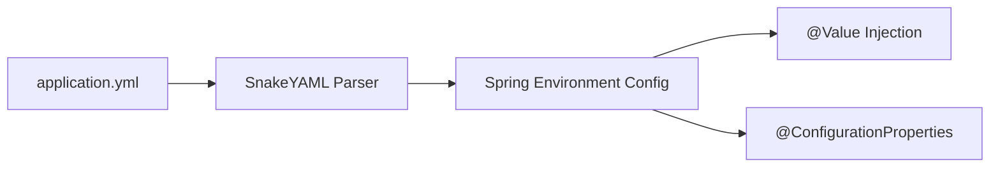

# មេរៀនទី ៦: ការកំណត់រចនាសម្ព័ន្ធជាមួយ YAML (YAML Configuration in Spring Boot)

> 🌐 **ភាសា / Language:** 🇰🇭 **[ភាសាខ្មែរ (Khmer)](README.kh.md)** | 🇬🇧 [English](README.md)  
> 🧭 **រុករក:** [📚 មាតិកា Module](../README.kh.md) | [← មេរៀនមុន](../05-application-properties/README.kh.md) | [មេរៀនបន្ទាប់ →](../07-spring-boot-actuator/README.kh.md)

> 📂 **កូដគំរូជាក់ស្តែង (Runnable Example Project):**  
> 👉 **គម្រោងពេញលេញ:** [Bookstore YAML Configuration](../../examples/01-rest-api-crud)  
> 📄 **File កូដជាក់ស្តែង:** [`application.yml`](../../examples/01-rest-api-crud/src/main/resources/application.yml)


---

## មាតិកា (Table of Contents)
1. [សេចក្តីផ្តើមអំពី YAML](#សេចក្តីផ្តើមអំពី-yaml)
2. [ការប្រៀបធៀប .properties និង .yml (.yaml)](#ការប្រៀបធៀប-properties-និង-yml-yaml)
3. [រចនាសម្ព័ន្ធ YAML Syntax នៅក្នុង Spring Boot](#រចនាសម្ព័ន្ធ-yaml-syntax-នៅក្នុង-spring-boot)
4. [ការប្រើប្រាស់ Profiles ជាមួយ Multi-document YAML](#ការប្រើប្រាស់-profiles-ជាមួយ-multi-document-yaml)
5. [Binding Configuration ទៅកាន់ Java Objects (@ConfigurationProperties)](#binding-configuration-ទៅកាន់-java-objects-configurationproperties)
6. [Best Practices និងកំហុសទូទៅ](#best-practices-និងកំហុសទូទៅ)

---

## សេចក្តីផ្តើមអំពី YAML
**YAML** (YAML Ain't Markup Language) គឺជាទម្រង់ឯកសារ Data Serialization ដែលងាយស្រួលអានដោយមនុស្ស (Human-readable)។ នៅក្នុង Spring Boot, យើងអាចប្រើប្រាស់ `application.yml` (ឬ `application.yaml`) ជំនួស `application.properties` បានយ៉ាងងាយស្រួល ដោយ Spring Boot មាន parser ស្រាប់ (SnakeYAML) នៅក្នុង classpath។



---

## ការប្រៀបធៀប .properties និង .yml (.yaml)

### ១. ទម្រង់ `application.properties` (Flat Key-Value):
```properties
server.port=8080
server.servlet.context-path=/api
spring.datasource.url=jdbc:mysql://localhost:3306/mydb
spring.datasource.username=root
spring.datasource.password=secret
spring.datasource.driver-class-name=com.mysql.cj.jdbc.Driver
```

### ២. ទម្រង់ `application.yml` (Hierarchical Tree):
```yaml
server:
  port: 8080
  servlet:
    context-path: /api

spring:
  datasource:
    url: jdbc:mysql://localhost:3306/mydb
    username: root
    password: secret
    driver-class-name: com.mysql.cj.jdbc.Driver
```

### តារាងប្រៀបធៀប:
| លក្ខណៈពិសេស | application.properties | application.yml |
| :--- | :--- | :--- |
| **ភាពងាយស្រួលក្នុងការអាន** | ស្ទួនពាក្យដដែលៗច្រើន | មានលំដាប់ថ្នាក់ឋានានុក្រម (Hierarchical) ស្អាត |
| **ការគាំទ្រ List / Arrays** | ពិបាក (`app.servers[0]=...`) | ងាយស្រួល (`- host: ...`) |
| **Multi-document Profiles** | មិនគាំទ្រល្អ | គាំទ្រយ៉ាងល្អជាមួយសញ្ញា `---` |
| **Syntax Sensitivity** | មិនខ្វល់រឿង Spaces | ប្រកាន់ខ្ជាប់ Indentation (ដាច់ខាតហាមប្រើ Tab) |

---

## រចនាសម្ព័ន្ធ YAML Syntax នៅក្នុង Spring Boot

### ១. Key-Value និង Nested Objects
```yaml
app:
  name: "E-Commerce Microservice"
  version: 1.0.0
  description: >
    ប្រព័ន្ធសេវាកម្មពាណិជ្ជកម្មអេឡិចត្រូនិច
    បង្កើតឡើងដោយ Spring Boot 3.x
```

### ២. Lists និង Arrays
```yaml
security:
  whitelist-paths:
    - /api/v1/auth/**
    - /swagger-ui/**
    - /actuator/health
```

### ៣. Maps / Key-Value Dictionaries
```yaml
app:
  currency-rates:
    USD: 1.0
    KHR: 4100.0
    THB: 35.5
```

---

## ការប្រើប្រាស់ Profiles ជាមួយ Multi-document YAML

ចាប់ពី Spring Boot 2.4+ ឡើងទៅ យើងអាចសរសេរ Multi-Profile ក្នុង file `application.yml` តែមួយដោយប្រើ delimiter `---`៖

```yaml
spring:
  application:
    name: payment-service
  profiles:
    active: dev

---
spring:
  config:
    activate:
      on-profile: dev
server:
  port: 8080
logging:
  level:
    root: DEBUG

---
spring:
  config:
    activate:
      on-profile: prod
server:
  port: 443
logging:
  level:
    root: INFO
```

---

## Binding Configuration ទៅកាន់ Java Objects (@ConfigurationProperties)

វិធីសាស្រ្តដែលល្អបំផុតក្នុងការទាញយកទិន្នន័យពី YAML គឺប្រើ **Type-safe Configuration Properties**៖

### 1. កំណត់ YAML:
```yaml
app:
  mail:
    host: smtp.example.com
    port: 587
    timeout: 5000
    auth-enabled: true
```

### 2. បង្កើត Java Record / Class:
```java
package com.example.config;

import org.springframework.boot.context.properties.ConfigurationProperties;

@ConfigurationProperties(prefix = "app.mail")
public record MailProperties(
    String host,
    int port,
    int timeout,
    boolean authEnabled
) {}
```

### 3. បើកដំណើរការនៅក្នុង Main Class ឬ Config Class:
```java
@SpringBootApplication
@ConfigurationPropertiesScan
public class DemoApplication {
    public static void main(String[] args) {
        SpringApplication.run(DemoApplication.class, args);
    }
}
```

---

## Best Practices និងកំហុសទូទៅ
- **ដាច់ខាតកុំប្រើ Tab Key សម្រាប់ Indentation**: ប្រើប្រាស់ Space ចំនួន 2 ជានិច្ច ដើម្បីជៀសវាង Syntax Parsing Error។
- **ប្រើ `@ConfigurationProperties` ជំនួស `@Value`**: នៅពេលដែល properties មានចំនួនច្រើន ឬមានរចនាសម្ព័ន្ធជាក្រុម។
- **រក្សាឈ្មោះ Key ជា Kebab-case**: ឧទាហរណ៍ `auth-enabled` ឬ `context-path` (Spring Boot ធ្វើការ Relaxed Binding ដោយស្វ័យប្រវត្ត)។

---

## 🧭 ការរុករកមេរៀន (Lesson Navigation)

| ថយក្រោយ (Previous) | មាតិកា Module (Index) | បន្ទាប់ (Next) |
| :--- | :---: | :--- |
| [← ការកំណត់រចនាសម្ព័ន្ធជាមួយ Application Properties](../05-application-properties/README.kh.md) | [📚 បញ្ជីមេរៀន Module](../README.kh.md) | [ការត្រួតពិនិត្យសុខភាពប្រព័ន្ធ និង Monitoring ជាមួយ Spring Boot Actuator →](../07-spring-boot-actuator/README.kh.md) |
